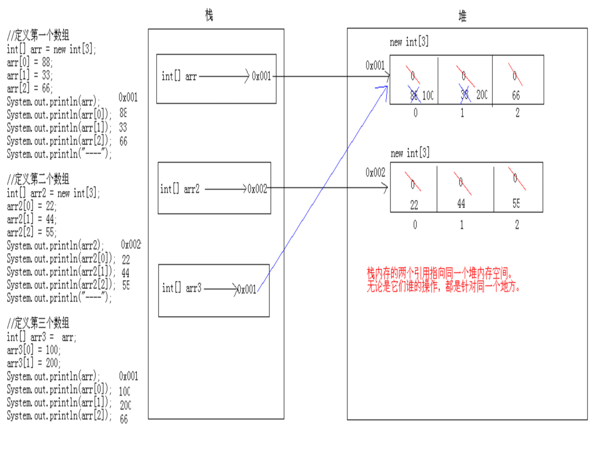
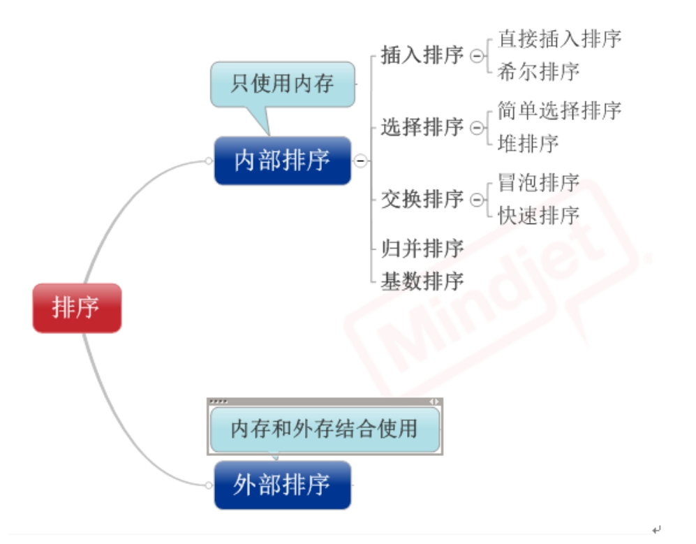
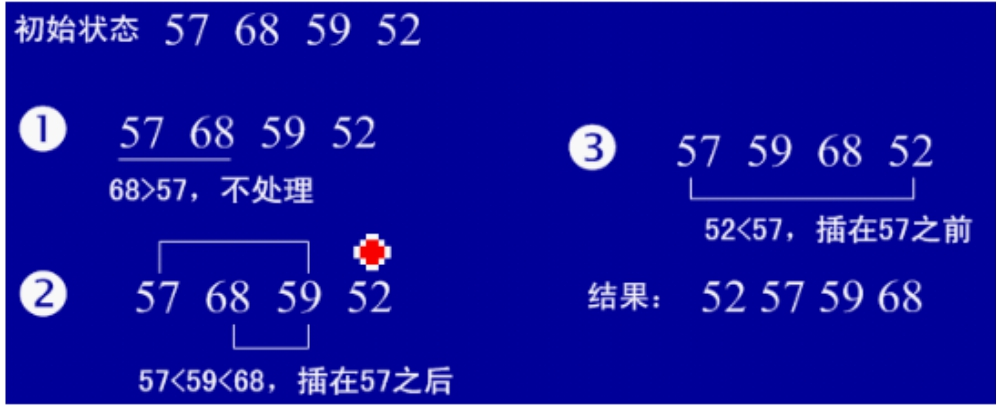
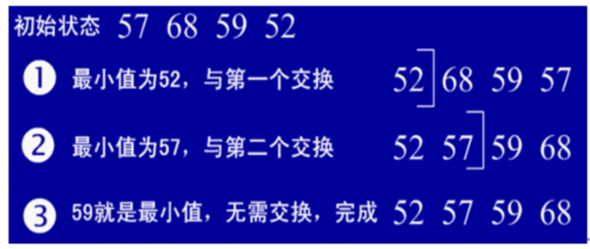
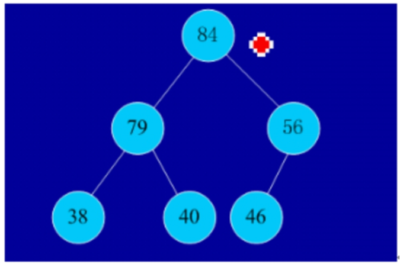
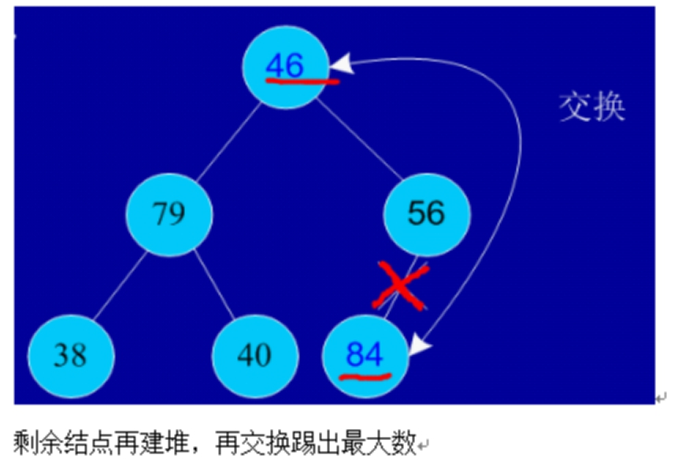
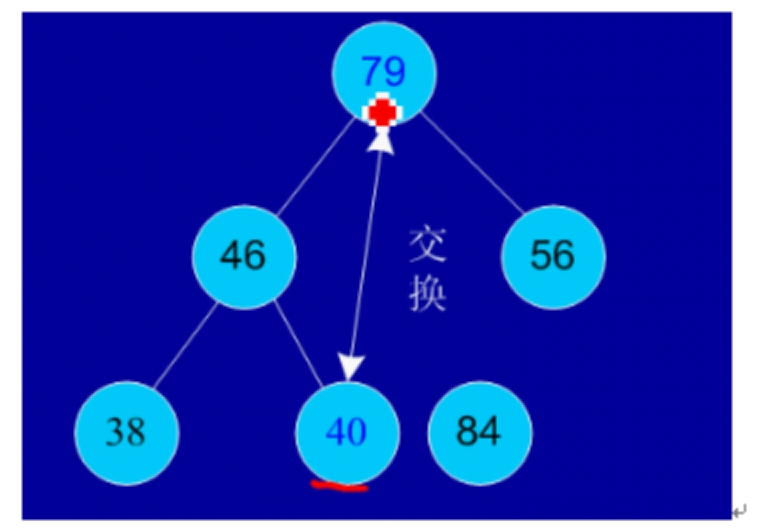
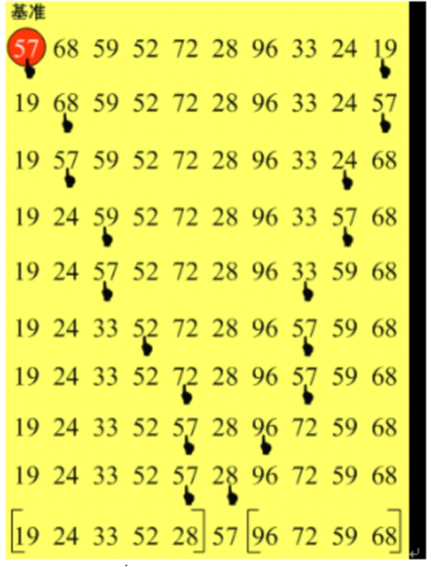
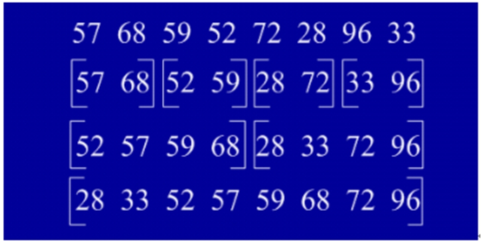

# **5-数组**

## **5.1一维数组**

### **5.1.1数组定义**

1）数组是一个变量，存储相同数据类型的一组数据。

数组是一个长度固定的数据结构，它存储多个相同类型的数值。数组直接被Java编程语言所支持，数组也是一个对象(引用数据类型)。数组是一个Object类的一个不明显的扩展。 

数组的特征： 有序、具有相同类型、通过数组名和下标确定数组中的元素。 

数组的声明：

a）数组的元素类型	数组变量名[];

b）数组的元素类型[]	数组变量名;

创建数组空间：创建数组空间可以在声明的时候进行创建，也可以先声明然后在创建空间。

数组名=new	数组元素类型[数组的长度]；

	**int**[] arr = **new** **int**[10];
	
	等同于下面的
	
	**int**[] arr;
	
	arr=**new** **int**[10];	

2）如何使用数组?

	声明数组  int[] a;
	
	分配空间 a=new int[5];
	
	赋值  a[0]=1;
	
	数据处理  a[0]=a[0]*10;

3)创建数组的3种方式

	第一种
	
	int[] a= new int[4];
	
	a[0]=1;  a[1]=2; a[2]=3;a[3]=4;
	
	第二种(简写)
	
	int[] a=new int[]{1,2,3,4};
	
	第三种（再简写）
	
	int[] a={1,2,3,4};

### **5.1.2数组的遍历**

	每个数组都有一个属性length，表示该数组可以存放元素的个数。Java环境会自定检测数组的下标是否越界。
	
	//通过for循环遍历数组中的所用元素
	
	**for** (**int** i = 0; i < arr.length; i++) {
	
		System.**out**.println(arr[i]);
	
	}


​	

	//通过增强for循环遍历
	
	**for** (**int** i : arr) {
	
		System.**out**.println(i);
	
	}
	
	增强for循环是JDK5.0的新特性，内部使用的是迭代的方法iteratoer来实现的。只可以用来遍历集合不可以对集合中的元素进行赋值。

```
import java.util.Scanner;

public class ArrayDemo {

	/**
	 * 使用数组计算平均分
	 */
	public static void main(String[] args) {
		int[] scores = new int[5];	//成绩数组
		int sum = 0;				//成绩总和
		Scanner input = new Scanner(System.in);
		System.out.println("请输入5位学员的成绩：");
		for(int i = 0; i < scores.length; i++){
			scores[i] = input.nextInt();
			sum = sum + scores[i];	//成绩累加
		}
		/*//使用foreach遍历
		for(int i = 0; i < scores.length; i++){
			scores[i] = input.nextInt();
		}
		for(int score:scores){
			sum+=score;
		}*/
		//计算并输出平均分
		System.out.println("学员的平均分是：" + (double)sum/scores.length);
	}
}
```

```
import java.util.Scanner;

public class MaxScore {

	/**
	 * 求数组最大值
	 */
	public static void main(String[] args) {
		int[] scores = new int[5];
		int max = 0;	//记录最大值
		System.out.println("请输入5位学员的成绩：");
		Scanner input = new Scanner(System.in);
		for(int i = 0; i < scores.length; i++){
			scores[i] = input.nextInt();
		}
		//计算最大值
		//使用max存储擂主初始值：第一个元素为擂主
		max = scores[0];
		//循环打擂
		for(int i = 1; i < scores.length; i++){
			if(scores[i] > max){
				max = scores[i];
			}
		}
		System.out.println("考试成绩最高分为：" + max);
	}
}
```


### **5.1.3数组元素的增加**

```
import java.util.*;

public class Insert {

	public static void main(String[] args) {
		int[] list = new int[6]; // 长度为为6的数组
		list[0] = 99;
		list[1] = 85;
		list[2] = 82;
		list[3] = 63;
		list[4] = 60;

		int index = list.length; // 保存新增成绩插入位置
		System.out.println("请输入新增成绩： ");
		Scanner input = new Scanner(System.in);
		int num = input.nextInt(); // 输入要插入的数据
		// 找到新元素的插入位置
		for (int i = 0; i < list.length; i++) {
			if (num > list[i]) {
				index = i;
				break;
			}
		}
		// 元素后移
		for (int j = list.length - 1; j > index; j--) {
			list[j] = list[j - 1]; // index下标开始的元素后移一个位置
		}
		list[index] = num;// 插入数据
		System.out.println("插入成绩的下标是：" + index);
		System.out.println("插入后的成绩信息是： ");
		for (int k = 0; k < list.length; k++) { // 循环输出目前数组中的数据
			System.out.print(list[k] + "\t");
		}

	}

}
```


### **5.1.4数组元素的修改**

### **5.1.5数组元素的删除**

### **5.1.6数组的内存分配**



## **5.2二维数组**

```java
	(1)元素是一维数组的数组。
	(2)格式：
		A:数据类型[][] 数组名 = new 数据类型[m][n];
		B:数据类型[][] 数组名 = new 数据类型[m][];
		C:数据类型[][] 数组名 = new 数据类型[][]{{...},{...},{...}};
		D:数据类型[][] 数组名 = {{...},{...},{...}};
```


### **5.2.1遍历二维数组**

```
import java.util.Scanner;

/**
 * 有5个班各5名学生某门课程的成绩，计算5个班各自的总成绩
 * */
public class FiveTotal {
	public static void main(String[] args) {
		Scanner input=new Scanner(System.in);
		int [][] array = new int[5][5]; //5个班的成绩
		//i:班级  j:各班级的学生
		for(int i=0;i<array.length;i++){
			System.out.println("**********第"+(i+1)+"个班**********");
			for(int j=0;j<array[i].length;j++){
				System.out.print("请输入第"+(j+1)+"个学生的成绩:");
				array[i][j]=input.nextInt();
				
			}
		}
		System.out.println("***********成绩统计************");
		int total; //保存总成绩
		for(int i = 0; i < array.length; i++) {
	        String str = (i+1) + "班";
	        total = 0; //每次循环到此都将其归0
	        for(int j = 0; j < array[i].length; j++) {
	        	total += array[i][j]; //成绩叠加
	        }
	        System.out.println(str+"总成绩：" + total);
		}
	}
}
```


### **5.2.2冒泡排序**

```
/*
 * 冒泡排序
 * */
public class SortNum {
	public static void main(String[] args) {
		int[] scores={16,25,9,90,23};
		for (int i = 0; i < scores.length -1 ; i++)
		{
		      for (int j = 0; j < scores.length -1 - i ; j++)
		      {
		            if (scores[j] > scores[j + 1])
		            { 
		                  // 交换元素
		                  int temp = scores[j];
		                  scores[j] = scores[j + 1];
		                  scores[j + 1] = temp;
		            }
		      }
		}
		System.out.println("冒泡排序后：");
		for(int score:scores){
			System.out.print(score+"\t");
		}
	}
}
```

### **5.2.3 八大排序**

**8种排序之间的关系:**

 

**1， 直接插入排序**

（1）基本思想：在要排序的一组数中，假设前面(n-1)[n>=2] 个数已经是排

好顺序的，现在要把第n个数插到前面的有序数中，使得这n个数

也是排好顺序的。如此反复循环，直到全部排好顺序。

（2）实例

 

（3）用java实现
```

 package com.njue;  

 

public class insertSort {  

public insertSort(){  

    inta[]={49,38,65,97,76,13,27,49,78,34,12,64,5,4,62,99,98,54,56,17,18,23,34,15,35,25,53,51};  
    
    int temp=0;  
    
    for(int i=1;i<a.length;i++){  
    
       int j=i-1;  
    
       temp=a[i];  
    
       for(;j>=0&&temp<a[j];j--){  
    
       a[j+1]=a[j];                       //将大于temp的值整体后移一个单位  
    
       }  
    
       a[j+1]=temp;  
    
    }  
    
    for(int i=0;i<a.length;i++)  
    
       System.out.println(a[i]);  

}  

}
```

**2，希尔排序（最小增量排序）**

（1）基本思想：算法先将要排序的一组数按某个增量d（n/2,n为要排序数的个数）分成若干组，每组中记录的下标相差d.对每组中全部元素进行直接插入排序，然后再用一个较小的增量（d/2）对它进行分组，在每组中再进行直接插入排序。当增量减到1时，进行直接插入排序后，排序完成。

（2）实例：

 

（3）用java实现
```

public class shellSort {  

public  shellSort(){  

    int a[]={1,54,6,3,78,34,12,45,56,100};  
    
    double d1=a.length;  
    
    int temp=0;  
    
    while(true){  
    
        d1= Math.ceil(d1/2);  
    
        int d=(int) d1;  
    
        for(int x=0;x<d;x++){  
    
            for(int i=x+d;i<a.length;i+=d){  
    
                int j=i-d;  
    
                temp=a[i];  
    
                for(;j>=0&&temp<a[j];j-=d){  
    
                a[j+d]=a[j];  
    
                }  
    
                a[j+d]=temp;  
    
            }  
    
        }  
    
        if(d==1)  
    
            break;  
    
    }  
    
    for(int i=0;i<a.length;i++)  
    
        System.out.println(a[i]);  

}  

}
```

**3.简单选择排序**

（1）基本思想：在要排序的一组数中，选出最小的一个数与第一个位置的数交换；

然后在剩下的数当中再找最小的与第二个位置的数交换，如此循环到倒数第二个数和最后一个数比较为止。

（2）实例：

 

（3）用java实现
```

public class selectSort {  

    public selectSort(){  
    
        int a[]={1,54,6,3,78,34,12,45};  
    
        int position=0;  
    
        for(int i=0;i<a.length;i++){  

 


            int j=i+1;  
    
            position=i;  
    
            int temp=a[i];  
    
            for(;j<a.length;j++){  
    
            if(a[j]<temp){  
    
                temp=a[j];  
    
                position=j;  
    
            }  
    
            }  
    
            a[position]=a[i];  
    
            a[i]=temp;  
    
        }  
    
        for(int i=0;i<a.length;i++)  
    
            System.out.println(a[i]);  
    
    }  

}
```
**4，堆排序**

（1）基本思想：堆排序是一种树形选择排序，是对直接选择排序的有效改进。

堆的定义如下：具有n个元素的序列（h1,h2,…,hn),当且仅当满足（hi>=h2i,hi>=2i+1）或（hi<=h2i,hi<=2i+1） (i=1,2,…,n/2)时称之为堆。在这里只讨论满足前者条件的堆。由堆的定义可以看出，堆顶元素（即第一个元素）必为最大项（大顶堆）。完全二叉树可以很直观地表示堆的结构。堆顶为根，其它为左子树、右子树。初始时把要排序的数的序列看作是一棵顺序存储的二叉树，调整它们的存储序，使之成为一个堆，这时堆的根节点的数最大。然后将根节点与堆的最后一个节点交换。然后对前面(n-1)个数重新调整使之成为堆。依此类推，直到只有两个节点的堆，并对它们作交换，最后得到有n个节点的有序序列。从算法描述来看，堆排序需要两个过程，一是建立堆，二是堆顶与堆的最后一个元素交换位置。所以堆排序有两个函数组成。一是建堆的渗透函数，二是反复调用渗透函数实现排序的函数。

（2）实例：

初始序列：46,79,56,38,40,84

建堆：

 

交换，从堆中踢出最大数

 

 

依次类推：最后堆中剩余的最后两个结点交换，踢出一个，排序完成。

（3）用java实现
```

import java.util.Arrays;  

 

public class HeapSort {  

     int a[]={49,38,65,97,76,13,27,49,78,34,12,64,5,4,62,99,98,54,56,17,18,23,34,15,35,25,53,51};  
    
    public  HeapSort(){  
    
        heapSort(a);  
    
    }  
    
    public  void heapSort(int[] a){  
    
        System.out.println("开始排序");  
    
        int arrayLength=a.length;  
    
        //循环建堆  
    
        for(int i=0;i<arrayLength-1;i++){  
    
            //建堆  

 


      buildMaxHeap(a,arrayLength-1-i);  
    
            //交换堆顶和最后一个元素  
    
            swap(a,0,arrayLength-1-i);  
    
            System.out.println(Arrays.toString(a));  
    
        }  
    
    }  

 
```
```java

    private  void swap(int[] data, int i, int j) {  
    
        // TODO Auto-generated method stub  
    
        int tmp=data[i];  
    
        data[i]=data[j];  
    
        data[j]=tmp;  
    
    }  
    
    //对data数组从0到lastIndex建大顶堆  
    
    private void buildMaxHeap(int[] data, int lastIndex) {  
    
        // TODO Auto-generated method stub  
    
        //从lastIndex处节点（最后一个节点）的父节点开始  
    
        for(int i=(lastIndex-1)/2;i>=0;i--){  
    
            //k保存正在判断的节点  
    
            int k=i;  
    
            //如果当前k节点的子节点存在  
    
            while(k*2+1<=lastIndex){  
    
                //k节点的左子节点的索引  
    
                int biggerIndex=2*k+1;  
    
                //如果biggerIndex小于lastIndex，即biggerIndex+1代表的k节点的右子节点存在  
    
                if(biggerIndex<lastIndex){  
    
                    //若果右子节点的值较大  
    
                    if(data[biggerIndex]<data[biggerIndex+1]){  
    
                        //biggerIndex总是记录较大子节点的索引  
    
                        biggerIndex++;  
    
                    }  
    
                }  
    
                //如果k节点的值小于其较大的子节点的值  
    
                if(data[k]<data[biggerIndex]){  
    
                    //交换他们  
    
                    swap(data,k,biggerIndex);  
    
                    //将biggerIndex赋予k，开始while循环的下一次循环，重新保证k节点的值大于其左右子节点的值  
    
                    k=biggerIndex;  
    
                }else{  
    
                    break;  
    
                }  
    
            }
    
        }
    
    }

}
```

**5.冒泡排序**

（1）基本思想：在要排序的一组数中，对当前还未排好序的范围内的全部数，自上而下对相邻的两个数依次进行比较和调整，让较大的数往下沉，较小的往上冒。即：每当两相邻的数比较后发现它们的排序与排序要求相反时，就将它们互换。

（2）实例：

 

（3）用java实现
```

public class bubbleSort {  

public  bubbleSort(){  

     int a[]={49,38,65,97,76,13,27,49,78,34,12,64,5,4,62,99,98,54,56,17,18,23,34,15,35,25,53,51};  
    
    int temp=0;  
    
    for(int i=0;i<a.length-1;i++){  
    
        for(int j=0;j<a.length-1-i;j++){  
    
        if(a[j]>a[j+1]){  
    
            temp=a[j];  
    
            a[j]=a[j+1];  
    
            a[j+1]=temp;  
    
        }  
    
        }  
    
    }  
    
    for(int i=0;i<a.length;i++)  
    
    System.out.println(a[i]);     

}  

}
```

**6.快速排序**

（1）基本思想：选择一个基准元素,通常选择第一个元素或者最后一个元素,通过一趟扫描，将待排序列分成两部分,一部分比基准元素小,一部分大于等于基准元素,此时基准元素在其排好序后的正确位置,然后再用同样的方法递归地排序划分的两部分。

（2）实例：

 

（3）用java实现
```

public class quickSort {  

  int a[]={49,38,65,97,76,13,27,49,78,34,12,64,5,4,62,99,98,54,56,17,18,23,34,15,35,25,53,51};  

public  quickSort(){  

    quick(a);  
    
    for(int i=0;i<a.length;i++)  
    
        System.out.println(a[i]);  

}  

public int getMiddle(int[] list, int low, int high) {     

            int tmp = list[low];    //数组的第一个作为中轴     
    
            while (low < high) {     
    
                while (low < high && list[high] >= tmp) {     

 


      high--;     
    
                }     
    
                list[low] = list[high];   //比中轴小的记录移到低端     
    
                while (low < high && list[low] <= tmp) {     
    
                    low++;     
    
                }     
    
                list[high] = list[low];   //比中轴大的记录移到高端     
    
            }     
    
           list[low] = tmp;              //中轴记录到尾     
    
            return low;                   //返回中轴的位置     
    
        }    

public void _quickSort(int[] list, int low, int high) {     

            if (low < high) {     
    
               int middle = getMiddle(list, low, high);  //将list数组进行一分为二     
    
                _quickSort(list, low, middle - 1);        //对低字表进行递归排序     
    
               _quickSort(list, middle + 1, high);       //对高字表进行递归排序     
    
            }     
    
        }   

public void quick(int[] a2) {     

            if (a2.length > 0) {    //查看数组是否为空     
    
                _quickSort(a2, 0, a2.length - 1);     
    
        }     
    
       }   

}
```

**7、归并排序**

（1）基本排序：归并（Merge）排序法是将两个（或两个以上）有序表合并成一个新的有序表，即把待排序序列分为若干个子序列，每个子序列是有序的。然后再把有序子序列合并为整体有序序列。

（2）实例：

 

**（3）用java实现**
```

import java.util.Arrays;  

 

public class mergingSort {  

int a[]={49,38,65,97,76,13,27,49,78,34,12,64,5,4,62,99,98,54,56,17,18,23,34,15,35,25,53,51};  

public  mergingSort(){  

    sort(a,0,a.length-1);  
    
    for(int i=0;i<a.length;i++)  
    
        System.out.println(a[i]);  

}  

public void sort(int[] data, int left, int right) {  

    // TODO Auto-generated method stub  
    
    if(left<right){  
    
        //找出中间索引  
    
        int center=(left+right)/2;  
    
        //对左边数组进行递归  
    
        sort(data,left,center);  
    
        //对右边数组进行递归  
    
        sort(data,center+1,right);  
    
        //合并  
    
        merge(data,left,center,right);  

 


    }  

}  

public void merge(int[] data, int left, int center, int right) {  

    // TODO Auto-generated method stub  
    
    int [] tmpArr=new int[data.length];  
    
    int mid=center+1;  
    
    //third记录中间数组的索引  
    
    int third=left;  
    
    int tmp=left;  
    
    while(left<=center&&mid<=right){  

 


   //从两个数组中取出最小的放入中间数组  

        if(data[left]<=data[mid]){  
    
            tmpArr[third++]=data[left++];  
    
        }else{  
    
            tmpArr[third++]=data[mid++];  
    
        }  
    
    }  
    
    //剩余部分依次放入中间数组  
    
    while(mid<=right){  
    
        tmpArr[third++]=data[mid++];  
    
    }  
    
    while(left<=center){  
    
        tmpArr[third++]=data[left++];  
    
    }  
    
    //将中间数组中的内容复制回原数组  
    
    while(tmp<=right){  
    
        data[tmp]=tmpArr[tmp++];  
    
    }  
    
    System.out.println(Arrays.toString(data));  

}  

 

}
```

**8、基数排序**

（1）基本思想：将所有待比较数值（正整数）统一为同样的数位长度，数位较短的数前面补零。然后，从最低位开始，依次进行一次排序。这样从最低位排序一直到最高位排序完成以后,数列就变成一个有序序列。

（2）实例：

 

（3）用java实现
```

import java.util.ArrayList;  

import java.util.List;  

 

public class radixSort {  

    int a[]={49,38,65,97,76,13,27,49,78,34,12,64,5,4,62,99,98,54,101,56,17,18,23,34,15,35,25,53,51};  

public radixSort(){  

    sort(a);  
    
    for(int i=0;i<a.length;i++)  
    
        System.out.println(a[i]);  

}  

public  void sort(int[] array){     

 

            //首先确定排序的趟数;     
    
        int max=array[0];     
    
        for(int i=1;i<array.length;i++){     
    
               if(array[i]>max){     
    
               max=array[i];     
    
               }     
    
            }     

 


    int time=0;     
    
           //判断位数;     
    
            while(max>0){     
    
               max/=10;     
    
                time++;     
    
            }     

 


        //建立10个队列;     
    
            List<ArrayList> queue=new ArrayList<ArrayList>();     
    
            for(int i=0;i<10;i++){     
    
                ArrayList<Integer> queue1=new ArrayList<Integer>();   
    
                queue.add(queue1);     
    
        }     

 


            //进行time次分配和收集;     
    
            for(int i=0;i<time;i++){     

 


                //分配数组元素;     
    
               for(int j=0;j<array.length;j++){     
    
                    //得到数字的第time+1位数;   
    
                   int x=array[j]%(int)Math.pow(10, i+1)/(int)Math.pow(10, i);  
    
                   ArrayList<Integer> queue2=queue.get(x);  
    
                   queue2.add(array[j]);  
    
                   queue.set(x, queue2);  
    
            }     
    
                int count=0;//元素计数器;     
    
            //收集队列元素;     
    
                for(int k=0;k<10;k++){   
    
                while(queue.get(k).size()>0){  
    
                    ArrayList<Integer> queue3=queue.get(k);  
    
                        array[count]=queue3.get(0);     
    
                        queue3.remove(0);  
    
                    count++;  
    
              }     
    
            }     
    
          }     

 


   }    

 

}

 ```

## **5.3Arrays工具类**

### **5.3.1Arrays类排序数组**

```
import java.util.Arrays;
import java.util.Scanner;

/*
 * Arrays排序5名学员成绩
 * */
public class ArraysSortScore {
	public static void main(String[] args) {
		int[] scores=new int[5];
		Scanner input=new Scanner(System.in);
		System.out.println("请输入5名学员的成绩：");
		//获取学员成绩
		for(int i=0;i<scores.length;i++){
			scores[i]=input.nextInt();
		}
		Arrays.sort(scores);
		System.out.print("学员成绩按升序排列：");
		for(int score:scores){
			System.out.print(score+"\t");
		}
		
		System.out.print("\n学员成绩按降序排列：");
		for(int i=scores.length-1;i>=0;i--){
			System.out.print(scores[i]+"\t");
		}
	}
}
```

### **5.3.2Arrays类的常用方法**

```java
import java.util.Arrays;
public class ArraysMethod {
	public static void main(String[] args) {
		//equals(array1,array2) 的作用是：比较两个数组是否相等
		System.out.println("----equals(array1,array2)方法：----");
		int [] arr1 = {10,50,40,30};
		int [] arr2 = {10,50,40,30};
		int [] arr3 = {60,50,85};
		System.out.println(Arrays.equals(arr1, arr2)); //判断arr1与arr2的长度及元素是否相等
		System.out.println(Arrays.equals(arr1, arr3)); //判断arr1与arr3的长度及元素是否相等

		//sort(array) 的作用是：对数组array的元素进行升序排列
		System.out.println("----sort(array)方法：----");
		int [] array = new int[]{80,66,70,54,98};
		Arrays.sort(array);
		System.out.println("成绩排序后：");
		for(int i = 0; i < array.length; i++) {
			System.out.println(array[i]);
		}

		//toString(array) 的作用是：将一个数组array转换成一个字符串
		System.out.println("----toString(array)方法：----");
		int[] arr = { 10, 50, 40, 30 };
		Arrays.sort(arr); 								//将数组按升序排列
		System.out.println(Arrays.toString(arr)); 		//将数组arr转换为字符串并输出

		//fill(array,val) 的作用是：把数组array的所有元素都赋值为val
		System.out.println("----fill(array,val)方法：----");
		int[] arrs = { 10, 50, 40, 30 }; 				//初始化整型数组
		Arrays.fill(arrs, 40); 							//替换数组元素
		System.out.println(Arrays.toString(arrs)); 		//将数组arr转换为字符串并输出

		//copyOf(array,length) 的作用是：把数组array复制成一个长度为length的新数组
		System.out.println("----copyOf(array,length)方法：----");
		int[] arr11 = { 10, 50, 40, 30 };
		int[] arr22 = Arrays.copyOf(arr11, 3); 			//将arr11复制成长度为3的新数组arr22
		System.out.println(Arrays.toString(arr22));
		int[] arr33 = Arrays.copyOf(arr1, 4); 			//将arr11复制成长度为4的新数组arr33
		System.out.println(Arrays.toString(arr33));
		int[] arr44 = Arrays.copyOf(arr1, 6); 			//将arr11复制成长度为6的新数组arr44
		System.out.println(Arrays.toString(arr44));

		//binarySearch(array, val) 的作用是：查询元素值val在数组array中的下标
		System.out.println("----binarySearch(array, val)方法：----");
		int[] arrss = { 10, 50, 40, 30 };
		Arrays.sort(arrss); 							//先按升序排列
		int index=Arrays.binarySearch(arrss, 30); 		//查找30的下标
		System.out.println(index);
		index=Arrays.binarySearch(arrss, 50); 			//查找50的下标
		System.out.println(index);
	}
}
```

## **5.4数组高级篇**

### **冒泡排序**

相邻元素两两比较，大的往后放，第一次完毕，最大值出现在了最大索引处。同理，其他的元素就可以排好。


```java
/*
 * 数组排序之冒泡排序：
 * 		相邻元素两两比较，大的往后放，第一次完毕，最大值出现在了最大索引处
 */
public class ArrayDemo {
	public static void main(String[] args) {
		// 定义一个数组
		int[] arr = { 24, 69, 80, 57, 13 };
		System.out.println("排序前：");
		printArray(arr);

		/*
		// 第一次比较
		// arr.length - 1是为了防止数据越界
		// arr.length - 1 - 0是为了减少比较的次数
		for (int x = 0; x < arr.length - 1 - 0; x++) {
			if (arr[x] > arr[x + 1]) {
				int temp = arr[x];
				arr[x] = arr[x + 1];
				arr[x + 1] = temp;
			}
		}
		System.out.println("第一次比较后：");
		printArray(arr);

		// 第二次比较
		// arr.length - 1是为了防止数据越界
		// arr.length - 1 - 1是为了减少比较的次数
		for (int x = 0; x < arr.length - 1 - 1; x++) {
			if (arr[x] > arr[x + 1]) {
				int temp = arr[x];
				arr[x] = arr[x + 1];
				arr[x + 1] = temp;
			}
		}
		System.out.println("第二次比较后：");
		printArray(arr);

		// 第三次比较
		// arr.length - 1是为了防止数据越界
		// arr.length - 1 - 2是为了减少比较的次数
		for (int x = 0; x < arr.length - 1 - 2; x++) {
			if (arr[x] > arr[x + 1]) {
				int temp = arr[x];
				arr[x] = arr[x + 1];
				arr[x + 1] = temp;
			}
		}
		System.out.println("第三次比较后：");
		printArray(arr);

		// 第四次比较
		// arr.length - 1是为了防止数据越界
		// arr.length - 1 - 3是为了减少比较的次数
		for (int x = 0; x < arr.length - 1 - 3; x++) {
			if (arr[x] > arr[x + 1]) {
				int temp = arr[x];
				arr[x] = arr[x + 1];
				arr[x + 1] = temp;
			}
		}
		System.out.println("第四次比较后：");
		printArray(arr);
		*/

		// 既然听懂了，那么上面的代码就是排序代码
		// 而上面的代码重复度太高了，所以用循环改进
		// for (int y = 0; y < 4; y++) {
		// for (int x = 0; x < arr.length - 1 - y; x++) {
		// if (arr[x] > arr[x + 1]) {
		// int temp = arr[x];
		// arr[x] = arr[x + 1];
		// arr[x + 1] = temp;
		// }
		// }
		// }

		/*
		// 由于我们知道比较的次数是数组长度-1次，所以改进最终版程序
		for (int x = 0; x < arr.length - 1; x++) {
			for (int y = 0; y < arr.length - 1 - x; y++) {
				if (arr[y] > arr[y + 1]) {
					int temp = arr[y];
					arr[y] = arr[y + 1];
					arr[y + 1] = temp;
				}
			}
		}
		System.out.println("排序后：");
		printArray(arr);
		*/
		
		//由于我可能有多个数组要排序，所以我要写成方法
		bubbleSort(arr);
		System.out.println("排序后：");
		printArray(arr);
	}
	
	//冒泡排序代码
	public static void bubbleSort(int[] arr){
		for (int x = 0; x < arr.length - 1; x++) {
			for (int y = 0; y < arr.length - 1 - x; y++) {
				if (arr[y] > arr[y + 1]) {
					int temp = arr[y];
					arr[y] = arr[y + 1];
					arr[y + 1] = temp;
				}
			}
		}
	}

	// 遍历功能
	public static void printArray(int[] arr) {
		System.out.print("[");
		for (int x = 0; x < arr.length; x++) {
			if (x == arr.length - 1) {
				System.out.print(arr[x]);
			} else {
				System.out.print(arr[x] + ", ");
			}
		}
		System.out.println("]");
	}
}
```

```java
/*
 * 数组排序之选择排序：
 * 		从0索引开始，依次和后面元素比较，小的往前放，第一次完毕，最小值出现在了最小索引处
 */
public class ArrayDemo {
	public static void main(String[] args) {
		// 定义一个数组
		int[] arr = { 24, 69, 80, 57, 13 };
		System.out.println("排序前：");
		printArray(arr);

		/*
		// 第一次
		int x = 0;
		for (int y = x + 1; y < arr.length; y++) {
			if (arr[y] < arr[x]) {
				int temp = arr[x];
				arr[x] = arr[y];
				arr[y] = temp;
			}
		}
		System.out.println("第一次比较后：");
		printArray(arr);

		// 第二次
		x = 1;
		for (int y = x + 1; y < arr.length; y++) {
			if (arr[y] < arr[x]) {
				int temp = arr[x];
				arr[x] = arr[y];
				arr[y] = temp;
			}
		}
		System.out.println("第二次比较后：");
		printArray(arr);

		// 第三次
		x = 2;
		for (int y = x + 1; y < arr.length; y++) {
			if (arr[y] < arr[x]) {
				int temp = arr[x];
				arr[x] = arr[y];
				arr[y] = temp;
			}
		}
		System.out.println("第三次比较后：");
		printArray(arr);

		// 第四次
		x = 3;
		for (int y = x + 1; y < arr.length; y++) {
			if (arr[y] < arr[x]) {
				int temp = arr[x];
				arr[x] = arr[y];
				arr[y] = temp;
			}
		}
		System.out.println("第四次比较后：");
		printArray(arr);
		*/
		
		/*
		//通过观察发现代码的重复度太高，所以用循环改进
		for(int x=0; x<arr.length-1; x++){
			for(int y=x+1; y<arr.length; y++){
				if(arr[y] <arr[x]){
					int temp = arr[x];
					arr[x] = arr[y];
					 arr[y] = temp;
				}
			}
		}
		System.out.println("排序后：");
		printArray(arr);
		*/
		
		//用方法改进
		selectSort(arr);
		System.out.println("排序后：");
		printArray(arr);

	}
	
	public static void selectSort(int[] arr){
		for(int x=0; x<arr.length-1; x++){
			for(int y=x+1; y<arr.length; y++){
				if(arr[y] <arr[x]){
					int temp = arr[x];
					arr[x] = arr[y];
					 arr[y] = temp;
				}
			}
		}
	}

	// 遍历功能
	public static void printArray(int[] arr) {
		System.out.print("[");
		for (int x = 0; x < arr.length; x++) {
			if (x == arr.length - 1) {
				System.out.print(arr[x]);
			} else {
				System.out.print(arr[x] + ", ");
			}
		}
		System.out.println("]");
	}
}
```

```java
/*
 * 把字符串中的字符进行排序。
 * 		举例："dacgebf"
 * 		结果："abcdefg"
 * 
 * 分析：
 * 		A:定义一个字符串
 * 		B:把字符串转换为字符数组
 * 		C:把字符数组进行排序
 * 		D:把排序后的字符数组转成字符串
 * 		E:输出最后的字符串
 */
public class ArrayTest {
	public static void main(String[] args) {
		// 定义一个字符串
		String s = "dacgebf";

		// 把字符串转换为字符数组
		char[] chs = s.toCharArray();

		// 把字符数组进行排序
		bubbleSort(chs);

		//把排序后的字符数组转成字符串
		String result = String.valueOf(chs);
		
		//输出最后的字符串
		System.out.println("result:"+result);
	}

	// 冒泡排序
	public static void bubbleSort(char[] chs) {
		for (int x = 0; x < chs.length - 1; x++) {
			for (int y = 0; y < chs.length - 1 - x; y++) {
				if (chs[y] > chs[y + 1]) {
					char temp = chs[y];
					chs[y] = chs[y + 1];
					chs[y + 1] = temp;
				}
			}
		}
	}
}
```

### **二分查找**

```java
/*
 * 查找：
 * 		基本查找:数组元素无序(从头找到尾)
 * 		二分查找(折半查找):数组元素有序
 * 
 * 分析：
 * 		A:定义最大索引，最小索引
 * 		B:计算出中间索引
 * 		C:拿中间索引的值和要查找的值进行比较
 * 			相等：就返回当前的中间索引
 * 			不相等：
 * 				大	左边找
 * 				小	右边找
 * 		D:重新计算出中间索引
 * 			大	左边找
 * 				max = mid - 1;
 * 			小	右边找
 * 				min = mid + 1;
 * 		E:回到B
 */
public class ArrayDemo {
	public static void main(String[] args) {
		//定义一个数组
		int[] arr = {11,22,33,44,55,66,77};
		
		//写功能实现
		int index = getIndex(arr, 33);
		System.out.println("index:"+index);
		
		//假如这个元素不存在后有什么现象呢?
		index = getIndex(arr, 333);
		System.out.println("index:"+index);
	}
	
	/*
	 * 两个明确：
	 * 返回值类型：int
	 * 参数列表：int[] arr,int value
	 */
	public static int getIndex(int[] arr,int value){
		//定义最大索引，最小索引
		int max = arr.length -1;
		int min = 0;
		
		//计算出中间索引
		int mid = (max +min)/2;
		
		//拿中间索引的值和要查找的值进行比较
		while(arr[mid] != value){
			if(arr[mid]>value){
				max = mid - 1;
			}else if(arr[mid]<value){
				min = mid + 1;
			}
			
			//加入判断
			if(min > max){
				return -1;
			}
			
			mid = (max +min)/2;
		}
		
		return mid;
	}
}
```

```java
/*
 * 注意：下面这种做法是有问题的。
 * 因为数组本身是无序的，所以这种情况下的查找不能使用二分查找。
 * 所以你先排序了，但是你排序的时候已经改变了我最原始的元素索引。
 */
public class ArrayDemo2 {
	public static void main(String[] args) {
		// 定义数组
		int[] arr = { 24, 69, 80, 57, 13 };

		// 先排序
		bubbleSort(arr);
		// 后查找
		int index = getIndex(arr, 80);
		System.out.println("index:" + index);
	}

	// 冒泡排序代码
	public static void bubbleSort(int[] arr) {
		for (int x = 0; x < arr.length - 1; x++) {
			for (int y = 0; y < arr.length - 1 - x; y++) {
				if (arr[y] > arr[y + 1]) {
					int temp = arr[y];
					arr[y] = arr[y + 1];
					arr[y + 1] = temp;
				}
			}
		}
	}

	// 二分查找
	public static int getIndex(int[] arr, int value) {
		// 定义最大索引，最小索引
		int max = arr.length - 1;
		int min = 0;

		// 计算出中间索引
		int mid = (max + min) / 2;

		// 拿中间索引的值和要查找的值进行比较
		while (arr[mid] != value) {
			if (arr[mid] > value) {
				max = mid - 1;
			} else if (arr[mid] < value) {
				min = mid + 1;
			}

			// 加入判断
			if (min > max) {
				return -1;
			}

			mid = (max + min) / 2;
		}

		return mid;
	}
}
```

```java
import java.util.Arrays;

/*
 * Arrays:针对数组进行操作的工具类。比如说排序和查找。
 * 1:public static String toString(int[] a) 把数组转成字符串
 * 2:public static void sort(int[] a) 对数组进行排序
 * 3:public static int binarySearch(int[] a,int key) 二分查找
 */
public class ArraysDemo {
	public static void main(String[] args) {
		// 定义一个数组
		int[] arr = { 24, 69, 80, 57, 13 };

		// public static String toString(int[] a) 把数组转成字符串
		System.out.println("排序前：" + Arrays.toString(arr));

		// public static void sort(int[] a) 对数组进行排序
		Arrays.sort(arr);
		System.out.println("排序后：" + Arrays.toString(arr));

		// [13, 24, 57, 69, 80]
		// public static int binarySearch(int[] a,int key) 二分查找
		System.out.println("binarySearch:" + Arrays.binarySearch(arr, 57));
		System.out.println("binarySearch:" + Arrays.binarySearch(arr, 577));
	}
}
```

Arrays工具类的方法源码解析

```java
Arrays工具类的方法源码解析
public static String toString(int[] a)
public static void sort(int[] a) 底层是快速排序
public static int binarySearch(int[] a,int key)

开发原则：
	只要是对象，我们就要判断该对象是否为null。

int[] arr = { 24, 69, 80, 57, 13 };
System.out.println("排序前：" + Arrays.toString(arr));

public static String toString(int[] a) {
	//a -- arr -- { 24, 69, 80, 57, 13 }

    if (a == null)
        return "null"; //说明数组对象不存在
    int iMax = a.length - 1; //iMax=4;
    if (iMax == -1)
        return "[]"; //说明数组存在,但是没有元素。

    StringBuilder b = new StringBuilder();
    b.append('['); //"["
    for (int i = 0; ; i++) {
        b.append(a[i]); //"[24, 69, 80, 57, 13"
        if (i == iMax)
        	//"[24, 69, 80, 57, 13]"
            return b.append(']').toString();
        b.append(", "); //"[24, 69, 80, 57, "
    }
}
-----------------------------------------------------

int[] arr = {13, 24, 57, 69, 80};
System.out.println("binarySearch:" + Arrays.binarySearch(arr, 577));

public static int binarySearch(int[] a, int key) {
	//a -- arr -- {13, 24, 57, 69, 80}
	//key -- 577
    return binarySearch0(a, 0, a.length, key);
}

private static int binarySearch0(int[] a, int fromIndex, int toIndex,
                                 int key) {
    //a -- arr --  {13, 24, 57, 69, 80}
    //fromIndex -- 0
    //toIndex -- 5
    //key -- 577                           
                                 
                                 
    int low = fromIndex; //low=0
    int high = toIndex - 1; //high=4

    while (low <= high) {
        int mid = (low + high) >>> 1; //mid=2,mid=3,mid=4
        int midVal = a[mid]; //midVal=57,midVal=69,midVal=80

        if (midVal < key)
            low = mid + 1; //low=3,low=4,low=5
        else if (midVal > key)
            high = mid - 1;
        else
            return mid; // key found
    }
    return -(low + 1);  // key not found.
}
```

### **选择排序**

把0索引的元素，和索引1以后的元素都进行比较，第一次完毕，最小值出现在了0索引。同理，其他的元素就可以排好。

```java
			public static void selectSort(int[] arr) {
				for(int x=0; x<arr.length-1; x++) {
					for(int y=x+1; y<arr.length; y++) {
						if(arr[y] < arr[x]) {
							int temp = arr[x];
							arr[x] = arr[y];
							arr[y] = temp;
						}
					}
				}
			}
```


查找

```java
查找
		A:基本查找
			针对数组无序的情况
			
			public static int getIndex(int[] arr,int value) {
				int index = -1;
				
				for(int x=0; x<arr.length; x++) {
					if(arr[x] == value) {
						index = x;
						break;
					}
				}
				
				return index;
			}
		B:二分查找(折半查找)
			针对数组有序的情况(千万不要先排序，在查找)
			
			public static int binarySearch(int[] arr,int value) {
				int min = 0;
				int max = arr.length-1;
				int mid = (min+max)/2;
				
				while(arr[mid] != value) {
					if(arr[mid] > value) {
						max = mid - 1;
					}else if(arr[mid] < value) {
						min = mid + 1;
					}
					
					if(min > max) {
						return -1;
					}
					
					mid = (min+max)/2;
				}
				
				return mid;
			}
```


