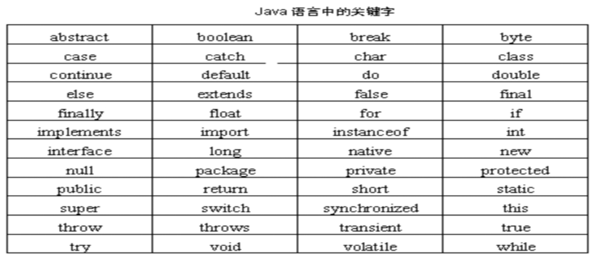
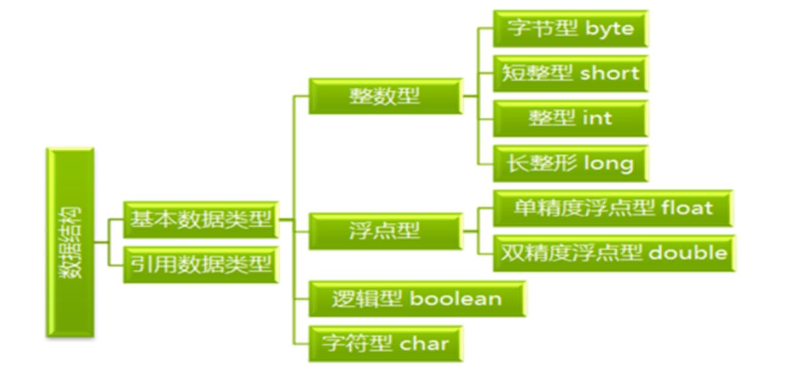
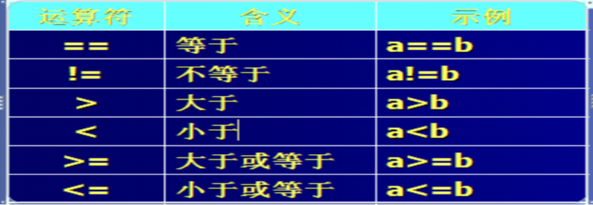
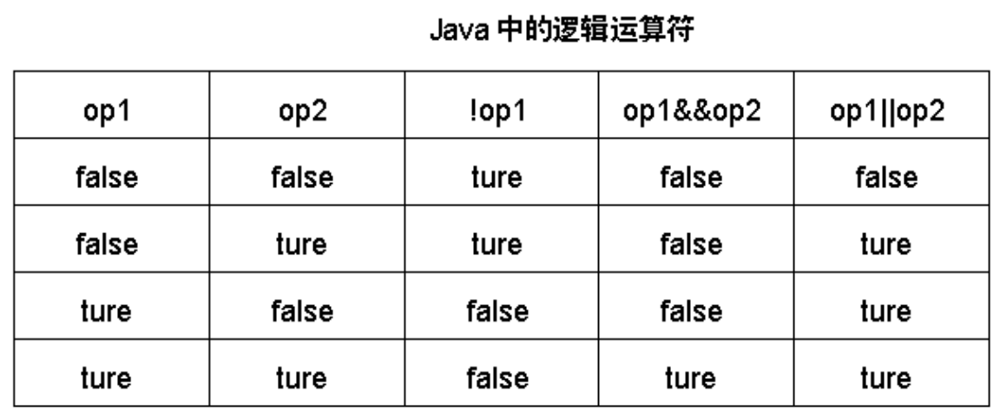

# 3 基础语法

## **3.1Java内存划分**

**1.** java定义了8中基本数据类型和引用数据类型（JDK预定义的引用数据类型和自定义的引用数据类型），java程序的执行会将内存划分为栈空间和堆空间

**2.** **栈空间**:自动分配，不需要程序员去申请

1.栈空间存取数据的效率高。 

2.栈中的数据按“先进后出”的方式管理。 

3.栈空间存储空间较小，不能存放大量的数据。

4.JVM将基本类型的数据存放在栈空间。 

**3.** **堆空间**：需要程序员去申请

1、堆空间存取数据的效率最低；

2、数据存放的位置随机分配；

3、堆空间存储数据的空间大，能存放大容量的数据。

## **3.1标识符**

由字母、数字、下划线（_）或者美元符号($)组成。

首字母以字母、下划线或者美元符号开头，不能以数字开头。

不能与关键字、布尔值和null相同。

区分大小写，没有长度限制，坚持见名知义的原则和驼峰命名法。

```java
class MakeNameDemo {
	public static void main(String[] args) {
		//正确做法
		int x = 100;
		
		//不能以数字开头
		//int 1y = 100;
		int y1 = 100;
		
		//不能是Java中的关键字
		//int public = 100;
		int Public = 100;
	}
}
```

## **3.2注释**

单行注释

```java
//单行注释
```

多行注释

```java
/*
*多行注释
*
*/
```

文档注释

```java
/**
*文档注释
*@author
*@parameter
*@return
*/
```


## **3.3常量**

在java中的常量是指在程序运行中值不变的量。

分类举例：

整型常量      123

浮点型常量 1.2f   /1.2D

布尔常量     true /  false

字符常量    ‘a’

字符串常量  "abc"

null常量     null

符号常量  final double PI=3.14

```java
class ConstantDemo {
	public static void main(String[] args) {
		//字符串常量的输出
		System.out.println("hello");
		
		//整数常量的输出
		System.out.println(100);
		
		//小数常量的输出
		System.out.println(100.10);
		
		//字符常量的输出
		System.out.println('a');
		System.out.println('A');
		System.out.println('0');
		//这个是有问题的
		//System.out.println('ab');
		
		//布尔常量的输出
		System.out.println(true);
		System.out.println(false);
	}
}
```


```java
public class TestFinal {
	public static void main(String[] args) {
		//计算圆的面积
		final double PI=3.14;
		int r=2;
		
		//PI=8;  
		double area=PI*r*r;
		System.out.println("圆的面积为："+area);
		
	}
}
```

## **3.4变量**

在java中的变量是指在程序运行中值可以改变的量，在高级语言中普遍使用变量来管理内存中的数据。

### **3.4.1变量的声明和使用**

**1.变量和字面量**

​	**public** **static** **void** main(String[] args) {

​		**int** i =100; 

​	}

代码解析：

1） i：表示变量，可变的量；

2） 100：字面量，变量中存放的具体数据；

**2.变量的命名**

(1)首字母是英文字母、$或下划线，后面由字母、数字、 $、下划线组成；	

(2)变量的命名遵循见名知义的原则。

String name = "jack";		//姓名

**int** age = 25;			//年龄

(3)Java变量名建议不用中文。 (使用中文并没有语法错误)

(4)变量名首字母建议不用大写字母。 

(5)用驼峰命名法命名多个单词组成的变量名。 

​		String userName = "admin";

(6)变量名不能使用关键字

 

PS：**有关关键字值得我们注意的地方：** 

（1）**true**、**false**和**null**为小写，而不是象在C++语言中那样为大写。 

（2）无**sizeof**运算符，因为所有数据类型的长度和表示是固定的，与平台无关，不是象在C语言中那样数据类型的长度根据不同的平台而变化。这正是Java语言的一大特点。 

（3）**goto**(保留字)和**const**不是Java编程语言中使用的关键字。 

 

**3.变量的定义（声明）：**	**类型**	**变量名1，变量名2****…****变量名n；**

​	int a;  

​	int b;

int	a,b,c;

​	**4.变量的初始化（第一次赋值）：**	**变量名=字面量**

​		字面量可以是具体数值，也可以是返回数组的表达式；

​	**5.变量的作用域：**

1、 Java用一对大括号作为语句块的范围，称为作用域。

2、作用域中的变量不能重复定义。 

3、离开作用域，变量所分配的内存空间将被JVM（GC垃圾会是机制）回收。

### 

```java

```

示例1

```
/**
*声明变量，在内存中开辟一个存储空间
*int number;
*赋值，将数据放入到存储空间内
*number=1000;
*上述合二为一,声明变量并赋值
*int number=1000;
*/

public class TestType {
	public static void main(String[] args) {
		double score = 98.5;
		String name = "张三";
		char sex = '男';
		System.out.println("本次考试成绩最高分： " + score);
		System.out.println("最高分得主： " + name);
		System.out.println("性别： " + sex);
	}
}
```

示例2


```
//实现数据的交换
public class TestChange {
	public static void main(String[] args) {
		int num1=5;
		int num2=6;
		System.out.println("交换前：");
		System.out.println("num1:"+num1);
		System.out.println("num2:"+num2);
		int temp=num1;
		num1=num2;
		num2=temp;
		System.out.println("交换后：");
		System.out.println("num1:"+num1);
		System.out.println("num2:"+num2);
	}
}
```


## **3.5数据类型**

Java是一种强类型的语言，针对每一种数据都定义了明确的数据类型。

数据类型分类：

​		A:基本数据类型

​		B:引用数据类型(类,接口,数值)




### ****3.5.1基本数据类型****

| 数据类型 |   大小    |                  取值范围                   |
| :------: | :-------: | :-----------------------------------------: |
|   byte   | 1字节8位  |                -128  ~ +127                 |
|   int    | 4字节32位 | -2147483648（-231） ~ + 2147483647（231-1） |
|  short   | 2字节16位 |    -32768 （-215） ~  + 32767 （+215-1）    |
|   long   | 8字节64位 |               -263  ~ + 263-1               |
|  float   | 4字节32位 |   1.4E-45 ~ 3.4E+38 , -1.4E-45 ~ -3.4E+38   |
|  double  | 8字节64位 | 4.9E-324 ~ 1.7E+308, -4.9E-324 ~ -1.7E+308  |
|   char   | 2字节16位 |                   0~65535                   |
| boolean  | 1字节8位  |                 true\false                  |

**学习方法：可以将基本数据类型理解为一个个已经有固定大小的盒子，而JAVA程序在执行的过程中需要将用的数据存放在指定的大小的盒子中。**

**1.整数型**

| **类型**            | **存放数据大小** | **说明**                                      |
| ------------------- | ---------------- | --------------------------------------------- |
| 字节型（**byte**）  | -2^7  ~  2^7-1   | 使用一个8位的二进制来保存，其中1位为符号位。  |
| 短整型（**short**） | -2^15  ~  2^15-1 | 使用一个16位的二进制来保存，其中1位为符号位。 |
| 整型（**int**）     | -2^31  ~  2^31-1 | 使用一个32位的二进制来保存，其中1位为符号位。 |
| 长整型（**long**）  | -2^63  ~  2^63-1 | 使用一个64位的二进制来保存，其中1位为符号位。 |

**PS：在给long类型赋值的时候，如果值大于2^31-1，那么需要在字面量后面加上L，不区分大小写，因为java中默认将输出作为int类型来计算。**

​	**2.浮点型：**

1）浮点类型用于表示小数的数据类型。 

2）浮点数原理:也就是二进制科学计数法。

3）Java的浮点类型有float和double两种。

4）Java默认浮点类型计算的结果是double类型，字面量也是double类型。

​	2.1）**float**：单精度浮点型

1）float类型共32位，1位为符号位, 指数8位, 尾数23位。

2）float的精度是23位（即能精确表达23位的数，超过就被截取了）。 

3）小数是以尾数长度来表示精确度的，比如pi=3.1415的精度是4位。

4）float存储数据的范围大于int类型，但精度比int要小，因为int的精度是31位。

5）浮点型的取值范围：

System.**out**.println(Float.**MAX_VALUE**);

System.**out**.println(Float.**MIN_VALUE**);

6）定义浮点型并初始化，字面量后面需要加上F，不区分大小写		

​		**float** f = 10.98f;		

​	2.2）**double**：双精度浮点

1）double类型，1位符号位,11位指数,52位尾数。

2）double范围远远大于long，但double精度不如long。

3）定义double类型并初始化，字面量需要加上D，不区分大小写		

​		**double** d = 98.99d;

​	**PS：注：浮点运算就是实数运算，由于计算机只能存储整数，所以实数都是约数，这样浮点运算是很慢的而且会有误差。**

​	**3.字符型：char**

1）char类型的字面量可以是一个英文字母、字符或一个汉字，并且由单引号包括。 

2）Java底层使用一个16位的整数来处理字符类型,该数值是一个字符的unicode编码值。 

​		3）unicode

a、unicode编码是全球范围内的编码方法。

b、unicode编码的英文部分与ASCII码兼容（ASCII表示范围0~128）, 同时英文字符和数字是连续编码的。 

c、Java在处理char类型的数据时，在底层是按unicode码来处理的。

d、编码是什么？计算机硬件系统只能用0和1表示数，我们人为地做了规定，某个数还可以表示一个字符。 

例如：65代表的字符是A

​		4)转义字符：”\”

转义字符是”\”，通过转义字符，可表示一些特殊的字符。 或者将本身具有特殊含义的字符的特殊含义取消。

例如: 

```
			'\n' 表示回车

​			'\t' 表示制表位字符，一个制表符表示向右跳8-10个字符

​			'\\' 表示\ 

​			'\' ' 表示单引号

​			'\"' 表示双引号
```


​	**4.布尔型：boolean**

1、什么是布尔类型 ： 		boolean类型用来表示肯定或否定两种可能。 

2、为什么使用布尔类型？		布尔类型常用在分支语句、循环语句中。

3、boolean类型的值有两个： 	true:表示肯定意义；false:表示否定意义； 

4、布尔变量的定义			boolean isPass; 

5、布尔变量的初始化			**boolean** isPass=true;       isPass=59>=60;

注意：**

​			整数默认是int类型

​			浮点数默认是double类型。

​			长整型后缀用L或者l标记。建议使用L。

​			单精度浮点数用F或者f标记。建议使用F。

```java
class DataTypeDemo {
	public static void main(String[] args) {
		//定义变量的格式：
		//数据类型 变量名 = 初始化值;
		
		//定义一个字节变量
		byte b = 10;
		System.out.println(10);
		System.out.println(b);
		
		//定义一个短整型变量
		short s = 100;
		System.out.println(s);
		
		//定义一个整型变量
		int i = 1000;
		System.out.println(i);
		
		//超过了int的范围
		//int j = 1000000000000;
		long j = 1000000000000L;
		//long j = 100L;
		System.out.println(j);
		
		//定义浮点数据变量
		float f = 12.345F;
		System.out.println(f);
		
		double d = 12.345;
		System.out.println(d);
		
		//定义字符变量
		char ch = 'a';
		System.out.println(ch);
		
		//定义布尔变量
		boolean flag = true;
		System.out.println(flag);
	}
}
```


### **3.5.2引用数据类型**

**一、** **字符串**

java中String为应用数据类型。它是一个特殊的引用数据类型，可以通过字面值的方式进行初始化

\1. 使用new关键字进行初始化

​	String str = **new** String("java");

​	System.**out**.println(str);

\2. 使用字面量的方式初始化

​	String str = "java";

​	System.**out**.println(str);

 

PS：当String类型使用字面量的方式进行初始化的时候，其可以按照基本数据类型的处理方式来处理

==运算符：用于基本数据类型的时候是比较值是否相同，用于引用数据类型是比较其内存地址

​	String a = "JAVA";

​	String b = "JAVA";

​	System.**out**.println(a==b);//true


​	String a = **new** String("JAVA");

​	String b = **new** String("JAVA");

​	System.**out**.println(a==b);//false

 

## **3.6数据类型转换**

不同的基本数据类型之间进行运算时需要进行类型转换。

**1.小类型向大类型的转换**

1) 小类型向大类型的转换会自动完成，即不需要程序员编写额外的代码，由JVM负责。提示：自动类型转换也叫"隐式类型转换"。

2) 自动转换的规则：符号位会自动扩展, 负数补1, 正数补0。

3) 自动类型转换包含以下情况：

​	(1)byte->short->int->long->float->double 

​	(2)int和char类型的数据在某些情况下可以自动相互转换。

PS：小类型向大类型转换一般情况下是安全的。当小类型的精度高于大类型时要注意精度丢失的隐患

**int** i = 0x10000001;

**float** f = i;

System.**out**.println(i);// 268435457

System.**out**.println(f);// 2.68435456E8

​	**2.大类型向小类型的转换**

1、强转类型转换-简称强转

2、强制类型转换时，要注意边界数风险问题

​		**int** i =129;

​		**byte** b = (**byte**) i;

​		System.**out**.println(i);	//129

​		System.**out**.println(b);	//-127

​	**3.int和char类型之间的转换**

Java对char类型的数据在底层是按int类型来处理的。 

​	**int--->char**

​		**int** i =97;

​		**char** c = (**char**) i;

​		System.**out**.println(i);//97

​		System.**out**.println(c);//a

​	

**char-->int**

​		**char** c = 'A';

​		**int** i = c;

​		System.**out**.println(c);//A

​		System.**out**.println(i);//65

​	字符型进行计算：

​		**char** c = 'A';

​		System.**out**.println(c+1);//66

1.自动类型转换

```java
byte b=2;
int i=b;
```

2.强制类型转换

```java
int i=10;
byte b=(byte)i;
short s=(short)i;

```

```java
class DataTypeDemo4 {
	public static void main(String[] args) {
		byte a = 3;
		int b = 4;
		
		//这个肯定没有问题
		//int c = a + b;
		
		//byte c = 7;
		//这个是有问题的
		//byte c = a + b; 
		//用强制类型转换改进
		byte c = (byte) (a + b);
		System.out.println(c);
	}
}
```

```java
思考题1：请问下面这个有没有问题
		double d = 12.345;
		float f = d;
		
	思考题2：看看下面两个定义有没有区别呢?
		float f1 = (float)12.345;
		float f2 = 12.345f;
		
		f1其实是通过一个double类型转换过来的。
		而f2本身就是一个float类型。
*/
class DataTypeDemo5 {
	public static void main(String[] args) {
		//把double赋值给float，加了强制类型转换
		double d = 12.345;
		float f = (float)d;
		
		//看看下面两个定义有没有区别呢?
		float f1 = (float)12.345;
		float f2 = 12.345F;
	}
}
```


实例演示

```java
public class TypeChange {
	public static void main(String[] args) {
		double firstAvg = 81.29; // 第一次平均分
		double secondAvg; // 第二次平均分
		int rise = 2;
		secondAvg = firstAvg + rise;
		System.out.println("第二次平均分是：" + secondAvg);

	}
}
```


## **3.7Scanner(键盘录入)**

​	(1)实际开发中，数据是变化的，为了提高程序的灵活性，我们加入键盘录入数据。

​	(2)如何实现呢?目前就记住

​		A:导包

​			import java.util.Scanner;

​			位置：在class的上边

​		B:创建对象

​			Scanner sc = new Scanner(System.in);

​		C:获取数据

​			int x = sc.nextInt();

​	(3)把三元运算符的案例加入键盘录入改进。

```java
/*
	为了让程序的数据更符合开发的数据，我们就加入了键盘录入。
	让程序更灵活一下。
	
	那么，我们如何实现键盘数据的录入呢?
		A:导包
			格式：
				import java.util.Scanner; 
			位置：
				在class上面。
		B:创建键盘录入对象
			格式：
				Scanner sc = new Scanner(System.in);
		C:通过对象获取数据	
			格式：
				int x = sc.nextInt();
*/
import java.util.Scanner;

class ScannerDemo {
	public static void main(String[] args) {
		//创建键盘录入数据对象
		Scanner sc = new Scanner(System.in);
		
		System.out.println("请你输入一个数据：");
		int x = sc.nextInt();
		
		System.out.println("你输入的数据是："+x);
	}
}
```

```java
/*
	键盘录入练习：
		键盘录入两个数据，并对这两个数据求和，输出其结果
*/
import java.util.Scanner;

class ScannerTest {
	public static void main(String[] args) {
		//键盘录入两个数据，并对这两个数据求和，输出其结果
		//创建键盘录入对象
		Scanner sc = new Scanner(System.in);
		
		System.out.println("请输入第一个数据：");
		int x = sc.nextInt();
		
		System.out.println("请输入第二个数据：");
		int y = sc.nextInt();
		
		//把键盘录入的数据进行相加即可
		int sum = (x + y);
		System.out.println("sum:"+sum);
	}
}
```

### 练习

```java
/*
	键盘录入练习：
		键盘录入两个数据，并对这两个数据求和，输出其结果
*/
import java.util.Scanner;

class ScannerTest {
	public static void main(String[] args) {
		//键盘录入两个数据，并对这两个数据求和，输出其结果
		//创建键盘录入对象
		Scanner sc = new Scanner(System.in);
		
		System.out.println("请输入第一个数据：");
		int x = sc.nextInt();
		
		System.out.println("请输入第二个数据：");
		int y = sc.nextInt();
		
		//把键盘录入的数据进行相加即可
		int sum = (x + y);
		System.out.println("sum:"+sum);
	}
}
```

```java
/*
	练习：
		键盘录入三个数据，获取这三个数据中的最大值
		键盘录入两个数据，比较这两个数据是否相等
*/
import java.util.Scanner;

class ScannerTest3 {
	public static void main(String[] args) {
		//键盘录入三个数据，获取这三个数据中的最大值
	
		//创建键盘录入对象
		Scanner sc = new Scanner(System.in);
		
		System.out.println("请输入第一个数据：");
		int a = sc.nextInt();
		
		System.out.println("请输入第二个数据：");
		int b = sc.nextInt();
		
		System.out.println("请输入第三个数据：");
		int c = sc.nextInt();
		
		//获取这三个数据中的最大值
		int temp = ((a > b)? a: b);
		int max = (temp > c? temp : c);
		System.out.println("max:"+max);
		System.out.println("------------------");
		
		//键盘录入两个数据
		System.out.println("请输入第一个数据：");
		int x = sc.nextInt();
		
		System.out.println("请输入第二个数据：");
		int y = sc.nextInt();
		
		//比较这两个数据是否相等
		boolean flag = (x == y);
		System.out.println("flag:"+flag);
	}
}
```

Scanner可以实现控制台输入数据。

```java
import java.util.Scanner;

public class TestScanner {
	public static void main(String[] args) {
		Scanner input=new Scanner(System.in);
		System.out.print("请输入您的姓名：");
		String name=input.next();
		System.out.print("请输入您的号码：");
		int num=input.nextInt();
	
		System.out.println(name+"您好！您的等待号码为："+num);
		
	}
}
```

示例

```
public class NumJudge {
	/**
	 * 判断一个数字是否为偶数
	 */
	public static void main(String[] args) {
		Scanner input=new Scanner(System.in);
		System.out.print("请输入一个数字：");
		int num=input.nextInt();
		String result=(num%2==0)?"偶数":"奇数";
		System.out.println(num+"是"+result);
	}

}

```

## **3.8运算符**

### **赋值运算符**

A:=,+=,-=,*=,/=,%=等

​		B:=叫做赋值运算符，也是最基本的赋值运算符

​			int x = 10; 把10赋值给int类型的变量x。

​		C:扩展的赋值运算符的特点

​			隐含了自动强制转换。

​			

​			面试题：

​				short s = 1;

​				s = s + 1;

​				

​				short s = 1;

​				s += 1;

​				请问上面的代码哪个有问题?

```java
/*
	赋值运算符：
		基本的赋值运算符：=
			把=右边的数据赋值给左边。
			
		扩展的赋值运算符：+=,-=,*=,/=,%=
			+= 把左边和右边做加法，然后赋值给左边。
*/
class OperatorDemo {
	public static void main(String[] args) {
		//定义一个变量
		int x = 10;
		
		//其他用法
		int a,b; 
		a = b = 10;
		System.out.println(a); 
		System.out.println(b);
		System.out.println("-----------");

		//定义一个变量
		int y = 10;
		
		y += 20;
		
		System.out.println(y);
		
	}
}
```

```java
/*
	面试题：
		short s=1;s = s+1; 
		
		short s=1;s+=1;
		上面两个代码有没有问题，如果有，那里有问题。
		
		为什么第二个木有问题呢?
			扩展的赋值运算符其实隐含了一个强制类型转换。
			
			s += 1;
			不是等价于 s = s + 1;
			而是等价于 s = (s的数据类型)(s + 1);
*/
class OperatorTest {
	public static void main(String[] args) {
		//short s = 1;
		//s = s + 1;
		//System.out.println(s);
		
		short s = 1;
		s += 1; //好像是 s = s + 1;
		System.out.println(s);
	}
}
```


### **算术运算符**

​		A:加号（+）、 减号（-）、 乘号（*）、 除号（/） 、取模（%） 、自增运算符（++） 、自减运算符（--）

​		B:+的用法

​			a:加法

​			b:正号

​			c:字符串连接符

​		C:/和%的区别

​			数据做除法操作的时候，/取得是商，%取得是余数

​		D:++和--的用法

​			a:他们的作用是自增或者自减

​			b:使用

​				**单独使用

​					放在操作数据的前面和后面效果一样。

​					a++或者++a效果一样。

​				**参与操作使用

​					放在操作数的前面：先自增或者自减，再参与操作

​						int a = 10;

​						int b = ++a;

​					放在操作数的后面：先参与操作，再自增或者自减

​						int a = 10;

​						int b = a++;

```java
/*
	运算符：
		就是对常量和变量进行操作的符号。
		
	分类：算术运算符，赋值运算符，比较运算符，逻辑运算符，位运算符，三目运算符

	算术运算符：
		+,-,*,/,%,++,--
		
	注意事项：
		A:整数相除只能得到整数。如果想得到小数，必须把数据变化为浮点数类型
		B:/获取的是除法操作的商，%获取的是除法操作的余数
*/
class OperatorDemo {
	public static void main(String[] args) {
		//定义变量
		int x = 3;  //把3赋值给int类型的变量x
		int y = 4;
		
		System.out.println(x+y);
		System.out.println(x-y);
		System.out.println(x*y);
		System.out.println(x/y); //整数相除只能得到整数
		
		//我就想得到小数，该肿么办呢?
		//只需要把操作的数据中任意的一个数据变为浮点数
		System.out.println(x*1.0/y);
		
		//%的应用
		System.out.println(x%y); //得到的是余数
	}
}
```


```java
/*
	++,--运算符的使用：
		单独使用：
			放在操作数的前面和后面效果一样。(这种用法是我们比较常见的)
		参与运算使用：
			放在操作数的前面，先自增或者自减，然后再参与运算。
			放在操作数的后面，先参与运算，再自增或者自减。
			
	作用：就是对变量进行自增1或者自减1。
*/
class OperatorDemo2 {
		public static void main(String[] args) {
			//定义两个变量
			int x = 3;
			int y = 4;
			
			//字符串的拼接
			//System.out.println("x:"+x);
			//System.out.println("y:"+y);
			
			System.out.println("x:"+x+",y:"+y);
			
			//单独使用
			//x++;
			//y--;
			++x;
			--y;
			//System.out.println(x);
			System.out.println("x:"+x+",y:"+y);
			
			//意外的类型,常量是不可以这样做的
			//System.out.println(10++);
			
			System.out.println("-------------------");
			//参与运算使用
			int a = 3;
			int b = 4;
			
			//int c = a++;
			//int d = b--;
			
			int c = ++a;
			int d = --b;
			
			System.out.println("a:"+a); //4, 4
			System.out.println("b:"+b); //3, 3
			System.out.println("c:"+c); //3, 4
			System.out.println("d:"+d); //4, 3
		   
            //先输出后自增
            int i =1;
            System.out.println(i++);
            //
            		int i = 1;
                    for (; i < 5; i++) {
                        System.out.println(i);
                    }
                    System.out.println(i);
        
        }
}
```

```java
/*
	+的用法：
		A:加法
		B:正号
		C:字符串连接符
*/
class OperatorDemo3 {
	public static void main(String[] args) {
		//加法
		System.out.println(3+4);
		
		//正号
		System.out.println(+4);
		
		System.out.println('a');
		System.out.println('a'+1); //这里是加法
		
		//字符串连接符
		System.out.println("hello"+'a'+1);
		System.out.println('a'+1+"hello");
	}
}
```

```jav
/*
	++,--的练习题
	
	第一题：
	int a = 10;
	int b = 10;
	int c = 10;

	a = b++;
	c = --a;
	b = ++a;
	a = c--;
	请分别计算出a,b,c的值
	
	第二题：
	int x = 4;
	int y = (x++)+(++x)+(x*10);
	请分别计算出x,y的值
*/
class OperatorTest {
	public static void main(String[] args) {
		int a = 10;
		int b = 10;
		int c = 10;

		a = b++; //a=10,b=11,c=10
		c = --a; //a=9,b=11,c=9
		b = ++a; //a=10,b=10,c=9
		a = c--; //a=9,b=10,c=8
		
		System.out.println("a:"+a);
		System.out.println("b:"+b);
		System.out.println("c:"+c);
		System.out.println("--------------");
		
		int x = 4;
		int y = (x++)+(++x)+(x*10);
		//4+6+60
		//x=5,6
		
		System.out.println("x:"+x);
		System.out.println("y:"+y);
	}
}
```


### **关系运算符**

​        

​		A:==,!=,>,>=,<,<=

​		B:无论运算符两端简单还是复杂最终结果是boolean类型。

​		C:千万不要把==写成了=

```
/*
	比较运算符：
		==,!=,>,>=,<,<=
		
	特点：
		无论你的操作是简单还是复杂，结果是boolean类型。
		
	注意事项：
		"=="不能写成"="。
*/
class OperatorDemo {
	public static void main(String[] args) {
		int x = 3;
		int y = 4;
		int z = 3;
	
		System.out.println(x == y);
		System.out.println(x == z);
		System.out.println((x+y) == (x+z));
		System.out.println("------------");
		
		System.out.println(x != y);
		System.out.println(x > y);
		System.out.println(x >= y);
		System.out.println(x < y);
		System.out.println(x <= y);
		System.out.println("------------");
		
		int a = 10;
		int b = 20;
		
		//boolean flag = (a == b);
		//boolean flag = (a = b); //这个是有问题的，不兼容的类型
		//System.out.println(flag);
		
		int c = (a = b); //把b赋值给a，然后把a留下来
		System.out.println(c);
	}
}
```

### **逻辑运算符**

​        

​		A:&,|,^,!,&&,||

​		B:逻辑运算符用于连接boolean类型的式子

​		C:结论

​			&:有false则false

​			|:有true则true

​			^:相同则false，不同则true。

​				情侣关系。

​			!:非true则false，非false则true

​			

​			&&:结果和&是一样的，只不过有短路效果。左边是false，右边不执行。

​			||:结果和|是一样的，只不过有短路效果。左边是true，右边不执行。

```java
/*
	逻辑运算符：
		&,|,^,!
		&&,||
		
	特点：
		逻辑运算符一般用于连接boolean类型的表达式或者值。
			
		表达式：就是用运算符把常量或者变量连接起来的符合java语法的式子。
			算术表达式：a + b
			比较表达式：a == b
			
	结论：
		&逻辑与:有false则false。
		|逻辑或:有true则true。
		^逻辑异或:相同为false，不同为true。
			举例：情侣关系。男男,男女,女男,女女
		!逻辑非:非false则true，非true则false。
			特点：偶数个不改变本身。
*/
class OperatorDemo {
	public static void main(String[] args) {
		int a = 3;
		int b = 4;
		int c = 5;
		
		//&逻辑与
		System.out.println((a > b) & (a > c)); //false & false = false
		System.out.println((a > b) & (a < c)); //false & true = false
		System.out.println((a < b) & (a > c)); //true & false = false
		System.out.println((a < b) & (a < c)); //true & true = true
		System.out.println("---------------");
		
		//|逻辑或
		System.out.println((a > b) | (a > c)); //false | false = false
		System.out.println((a > b) | (a < c)); //false | true = true
		System.out.println((a < b) | (a > c)); //true | false = true
		System.out.println((a < b) | (a < c)); //true | true = true
		System.out.println("---------------");
		
		//^逻辑异或
		System.out.println((a > b) ^ (a > c)); //false ^ false = false
		System.out.println((a > b) ^ (a < c)); //false ^ true = true
		System.out.println((a < b) ^ (a > c)); //true ^ false = true
		System.out.println((a < b) ^ (a < c)); //true ^ true = false
		System.out.println("---------------");
		
		//!逻辑非
		System.out.println(!(a > b)); //!false = true
		System.out.println(!(a < b)); //!true = false
		System.out.println(!!(a > b)); //!!false = false
		System.out.println(!!!(a > b)); //!!false = true
	}
}

```

```java
/*
	&&和&的区别? 同理||和|的区别?
		A:最终结果一样。
		B:&&具有短路效果。左边是false，右边不执行。
		
	开发中常用的逻辑运算符：
		&&,||,!
*/
class OperatorDemo2 {
	public static void main(String[] args) {
		int a = 3;
		int b = 4;
		int c = 5;
		
		//&&双与
		System.out.println((a > b) && (a > c)); //false && false = false
		System.out.println((a > b) && (a < c)); //false && true = false
		System.out.println((a < b) && (a > c)); //true && false = false
		System.out.println((a < b) && (a < c)); //true && true = true
		System.out.println("----------------");
		
		int x = 3;
		int y = 4;
		
		//boolean b1 = ((x++ == 3) & (y++ == 4));
		//boolean b1 = ((x++ == 3) && (y++ == 4));
		//boolean b1 = ((++x == 3) & (y++ == 4));
		boolean b1 = ((++x == 3) && (y++ == 4));
		System.out.println("x:"+x);
		System.out.println("y:"+y);
		System.out.println(b1);
	}
}

		int a = 1;
		int b = 2;
		int c = 3;
		//System.out.println(b++ < a++ && c++ < a++);
		//System.out.println(a + "\t" + b + "\t" + c);
		//System.out.println(b++ < a++ & c++ < a++);
		//System.out.println(a + "\t" + b + "\t" + c);
```

### **位运算符**

按位与运算符（&） 

按位或运算符（|） 

按位异或运算符（^） 

按位取反运算符（~） 

左移位运算符（<<）和右移位运算符（>>）

1．按位与运算（&）

参与运算的两个值，如果两个相应位都为1，则该位的结果为1，否则为0。

**即：0&0=0，0&1=0，1&0=0，1&1=1** 

2．按位或运算（|）

参与运算的两个值，如果两个相应位都是0，则该位结果为0，否则为1。

**即：0|0=0，0|1=1，1|0=1，1|1=1** 

3．按位异或运算（^）

参与运算的两个值，如果两个相应位的某一个是1，另一个是0，那么按位异或（^）在该位的结果为1。也就是说如果两个相应位相同，输出位为0，否则为1。

**即：0^0=0，0^1=1，1^0=1，1^1=0** 

4．按位取反运算（~）

按位取反运算（~）属于一元运算符，它只对一个自变量进行操作（其他所有运算符都是二元运算符）。按位取反生成与输入位的相反的值——若输入0，则输出1；输入1，则输出0。

**即：~0=1，~1=0** 

5．左移位运算符（<<）

运算符<<执行一个左移位。作左移位运算时，，高位溢出，低位补零，右边的空位补0。在不产生溢出的情况下，数据左移1位相当于乘以2。例如：

**int a=64,b;** 		**b=a<<1;**		**//b=128** 

6．右移位运算符（>>与>>>）

运算符>>执行一个右移位（带符号），操作数的构成二进制位右移若干位，地位溢出舍弃，高位补充原来高位的值。（右移一位相当于除2取商） 

例如：

**int a=16,b;** 		**b=a>>2;**	 	**//b=4** 

- ^的特殊用法:一个数据针对另一个数据位异或两次，该数不变

- 面试题

  a:请实现两个变量的交换

  ​				**采用第三方变量

  ​				**用位异或运算符

  ​					左边a,b,a

  ​					右边a^b

  ​			b:请用最有效率的方式计算出2乘以8的结果

  ​				2<<3

```java
/*
	位运算符：
		&,|,^,~
		<<,>>,>>>
		
	注意：
		要做位运算，首先要把数据转换为二进制。
*/
class OperatorDemo {
	public static void main(String[] args) {
		//&,|,^,~
		
		int a = 3;
		int b = 4;
		
		System.out.println(3 & 4);
		System.out.println(3 | 4);
		System.out.println(3 ^ 4);
		System.out.println(~3);
	}
}
/*
	分析：因为是位运算，所以我们必须先把数据换算成二进制。
	
	3的二进制：11
		00000000 00000000 00000000 00000011
	4的二进制：100
		00000000 00000000 00000000 00000100
	
	&位与运算：有0则0。
		00000000 00000000 00000000 00000011
	   &00000000 00000000 00000000 00000100
		-----------------------------------
		00000000 00000000 00000000 00000000
		结果是：0
		
	|位或运算：有1则1。
		00000000 00000000 00000000 00000011
	   |00000000 00000000 00000000 00000100
		-----------------------------------
		00000000 00000000 00000000 00000111
		结果是：7
		
	^位异或运算：相同则0，不同则1。
		00000000 00000000 00000000 00000011
	   &00000000 00000000 00000000 00000100
		-----------------------------------
		00000000 00000000 00000000 00000111
		结果是：7
		
	~按位取反运算符：0变1，1变0
		00000000 00000000 00000000 00000011
	   ~11111111 11111111 11111111 11111100 (补码)
	   
	   补码：11111111 11111111 11111111 11111100
	   反码：11111111 11111111 11111111 11111011
	   原码：10000000 00000000 00000000 00000100
		结果是：-4
*/
```

  ```java
/*
	^的特点：一个数据对另一个数据位异或两次，该数本身不变。
*/
class OperatorDemo2 {
	public static void main(String[] args) {
		int a = 10;
		int b = 20;
		
		System.out.println(a ^ b ^ b); //10
		System.out.println(a ^ b ^ a); //20
	}
}

  ```

```java
/*
	<<:左移	左边最高位丢弃，右边补齐0
	>>:右移	最高位是0，左边补齐0；最高为是1，左边补齐1
	>>>:无符号右移 无论最高位是0还是1，左边补齐0
	
	面试题：
		请用最有效率的方式写出计算2乘以8的结果?
			2 * 8
			
			2 << 3

*/
class OperatorDemo3 {
	public static void main(String[] args) {
		//<< 把<<左边的数据乘以2的移动次幂
		System.out.println(3 << 2); //3*2^2 = 3*4 = 12;
	
		//>> 把>>左边的数据除以2的移动次幂
		System.out.println(24 >> 2); //24 / 2^2 = 24 / 4 = 6
		System.out.println(24 >>> 2);
		
		System.out.println(-24 >> 2); 
		System.out.println(-24 >>> 2);
	}
}
/*
	计算出3的二进制：11
		00000000 00000000 00000000 00000011
	(00)000000 00000000 00000000 0000001100
		
	>>的移动：	
	计算出24的二进制：11000
		原码：10000000 00000000 00000000 00011000
		反码：11111111 11111111 11111111 11100111
		补码：11111111 11111111 11111111 11101000
		
		11111111 11111111 11111111 11101000
		1111111111 11111111 11111111 111010(00) 补码
		
		补码：1111111111 11111111 11111111 111010
		反码：1111111111 11111111 11111111 111001
		原码：1000000000 00000000 00000000 000110
		
		结果：-6
		
	>>>的移动：
		计算出24的二进制：11000
		原码：10000000 00000000 00000000 00011000
		反码：11111111 11111111 11111111 11100111
		补码：11111111 11111111 11111111 11101000
		
		11111111 11111111 11111111 11101000
		0011111111 11111111 11111111 111010(00)
		
		结果：
*/
```

```java
/*
	面试题：
		请自己实现两个整数变量的交换
		注意：以后讲课的过程中，我没有明确指定数据的类型，默认int类型。
*/
class OperatorTest {
	public static void main(String[] args) {
		int a = 10;
		int b = 20;
		
		System.out.println("a:"+a+",b:"+b);
		
		//方式1：使用第三方变量(开发中用的)
		/*
		int c = a;
		a = b;
		b = c;
		System.out.println("a:"+a+",b:"+b);
		System.out.println("------------");
		*/
		
		//方式2：用位异或实现(面试用)
		//左边：a,b,a
		//右边：a ^ b
		/*
		a = a ^ b;
		b = a ^ b; //a ^ b ^ b = a
		a = a ^ b; //a ^ b ^ a = b
		System.out.println("a:"+a+",b:"+b);
		*/
		
		//方式3：用变量相加的做法
		/*
		a = a + b; //a=30
		b = a - b; //b=10
		a = a - b; //a=20
		System.out.println("a:"+a+",b:"+b);
		*/
		
		//方式4：一句话搞定
		b = (a+b) - (a=b); //b=30-20=10,a=20
		System.out.println("a:"+a+",b:"+b);
	}
}
```

### **三目运算符**

​		A:格式

​			比较表达式?表达式1:表达式2;

​		B:执行流程：

​			首先计算比较表达式的值，看是true还是false。

​			如果是true，表达式1就是结果。

​			如果是false，表达式2就是结果。

​		C:案例：

​			a:比较两个数据是否相等

​			b:获取两个数据中的最大值

​			c:获取三个数据中的最大值

```java
/*
	单目运算符：~3
	双目运算符：3 + 4

	三目运算符：
		格式：比较表达式?表达式1:表达式2;
		
		比较表达式:结果是一个boolean类型。
		
		执行流程：
			根据比较表达式的计算返回一个true或者false。
			如果是true，就把表达式1作为结果。
			如果是false，就把表达式2作为结果。
*/
class OperatorDemo {
	public static void main(String[] args) {
		int x = 100;
		int y = 200;
		
		int z = ((x > y)? x: y);
		
		//int z = ((x < y)? x: y);
		
		//int z = ((x == y)? x: y);
		
		//报错
		//int z = ((x = y)? x : y);
		
		System.out.println("z:"+z);
	}
}
```

```java
/*
	练习：
		获取两个整数中的最大值
		获取三个整数中的最大值
		比较两个整数是否相同
*/
class OperatorTest {
	public static void main(String[] args) {
		//获取两个整数中的最大值
		int x = 100;
		int y = 200;
		
		int max = (x > y? x: y);
		System.out.println("max:"+max);
		System.out.println("--------");
		
		//获取三个整数中的最大值
		int a = 10;
		int b = 30;
		int c = 20;
		
		//分两步：
		//A:先比较a,b的最大值
		//B:拿a,b的最大值在和c进行比较
		int temp = ((a > b)? a: b);
		//System.out.println(temp);
		int max1 = (temp > c? temp: c);
		System.out.println("max1:"+max1);
		
		//一步搞定
		//int max2 = (a > b)?((a > c)? a: c):((b > c)? b: c);
		//这种做法不推荐。
		//int max2 = a > b?a > c? a: c:b > c? b: c;
		//System.out.println("max2:"+max2);
		System.out.println("--------");
		
		//比较两个整数是否相同
		int m = 100;
		int n = 200;
		
		//boolean flag = (m == n)? true: false;
		boolean flag = (m == n);
		System.out.println(flag);
	}
}
```


