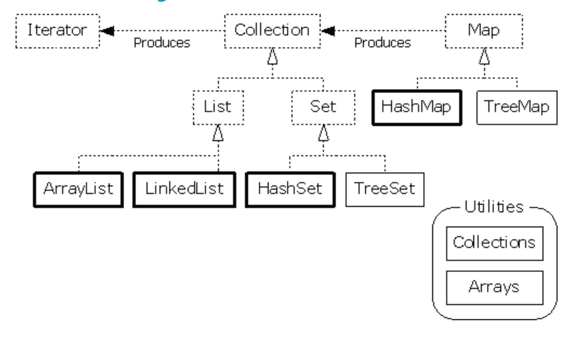
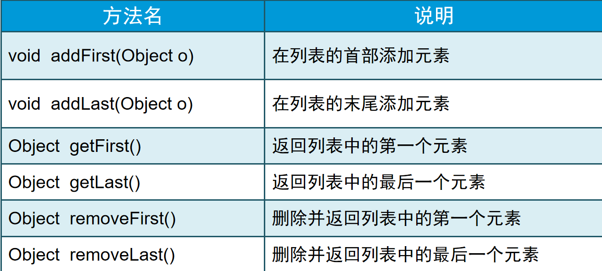

# 1-Java集合

Java集合框架提供了一套性能优良、使用方便的接口和类，它们位于java.util包中。



## **1.1Collection**

Collection 接口存储一组不唯一，无序的对象。

Collection接口有下面两个基本方法

**boolean  add(Object  obj)**

**Iterator  iterator()**

 	add方法用于将对象添加给集合。如果添加对象后，该集合确实发生了变化，那么该方法返回true；如果该集合没有变化，则返回false。例如，如果你试图将一个对象添加给一个集合，而该集合中已经有该对象了，那么add请求将被拒绝，因为该集合拒绝纳入重复的对象

iterator方法用于返回一个实现了Iterator接口的类的对象。 Iterator类型的对象称为迭代子对象，它专门用于访问集合中的各个元素

## **具体的集合**

**Java库提供了下面10个具体的集合类：LinkedList、ArrayList 、HashSet 、TreeSet 、HashMap 、TreeMap 、Vector 、Stack** 、HashTable、Properties

### **1.1.1List接口**

List 接口存储一组不唯一，有序（插入顺序）的对象。常用的实现类：ArrayList、LinkedList等

List是有序的Collection，使用此接口能够精确的控制每个元素插入的位置。用户能够使用索引（元素在List中的位置，类似于数组下标）来访问List中的元素，这类似于Java的数组。

和下面要提到的Set不同，List允许有相同的元素。 除了具有Collection接口必备的iterator()方法外，List还提供一个listIterator()方法，返回一个ListIterator接口，和标准的Iterator接口相比，ListIterator多了一些add()之类的方法，允许添加，删除，设定元素，还能向前或向后遍历。
实现List接口的常用类有LinkedList，ArrayList，Vector和Stack

#### **ArrayList类**

ArrayList实现了长度可变的数组，在内存中分配连续的空间，遍历元素和随机访问元素的效率比较高。

**链接列表是一个有序集合，将每个对象存放在独立的链接中，每个链接中还存放着序列中下一个链接的索引。在****java****中，所有的链接列表实际上是双重链接的，即每个链接中还存放着对它的前面的链接的索引链接列表适合于处理数据序列中数据数目不定，且频繁进行插入和删除操作的问题－－插入或删除一个元素时，只需要更新其它元素的索引即可，不必移动元素的位置，效率很高。**

**ListIterator****（列表迭代子）接口中定义了许多方法用于访问链接列表****LinkedList****，****LinkedList 类中有一个listIterator****方法，可以返回一个****ListIterator****对象****:**

**ListIterator  iter=list. listIterator();**

**Object  oldValue=iter. next();**

**Iter. set(newValue);**

**链接列表不支持快速随机访问。如果你想查看列表中的第****n****个元素，你必须从头开始查看，然后跳过前面的****n-1****个元素**

**如果你需要随机访问某个集合的话，请使用数组或者****ArrayList****，而不要使用****LinkedList** **。**

**常用方法**

| 方法名                       | 说明                                                         |
| :--------------------------- | :----------------------------------------------------------- |
| boolean add(Object o)        | 在列表的末尾顺序添加元素，起始索引位置从0开始                |
| void add(int index,Object o) | 在指定的索引位置添加元素，索引位置必须介于0和列表中元素个数之间 |
| int size()                   | 返回列表中的元素个数                                         |
| Object get(int index)        | 返回指定索引位置处的元素。取到的元素是Object类型             |
| boolean contains(Object o)   | 判断列表中是否存在指定元素                                   |
| boolean remove(Object o)     | 从列表中删除元素                                             |
| Object remove(int index)     | 从列表中删除指定位置元素，起始索引位置从0开始                |

```java
/*
 * 需求：List集合存储字符串并遍历。
 */
public class ListDemo {
	public static void main(String[] args) {
		// 创建集合对象
		List list = new ArrayList();

		// 创建字符串并添加字符串
		list.add("hello");
		list.add("world");
		list.add("java");

		// 遍历集合
		Iterator it = list.iterator();
		while (it.hasNext()) {
			String s = (String) it.next();
			System.out.println(s);
		}
	}
}
```

```java
/*
 * List集合的特点：
 * 		有序(存储和取出的元素一致)，可重复的。
 */
public class ListDemo2 {
	public static void main(String[] args) {
		// 创建集合对象
		List list = new ArrayList();

		// 存储元素
		list.add("hello");
		list.add("world");
		list.add("java");
		list.add("javaee");
		list.add("android");
		list.add("javaee");
		list.add("android");

		// 遍历集合
		Iterator it = list.iterator();
		while (it.hasNext()) {
			String s = (String) it.next();
			System.out.println(s);
		}
	}
}
```

**存储自定义对象并遍历**

```java
//定义新闻类
public class News {
	
	public int id;			//新闻id编号
	public String title;	//新闻标题
	public String author;	//新闻作者
	
	//无参构造器
	public News() {}
	//含参构造器
	public News(int id,String title,String author ) {
		this.id=id;
		this.title=title;
		this.author=author;
	}
	
	public int getId() {
		return id;
	}
	public void setId(int id) {
		this.id = id;
	}
	
	public String getTitle() {
		return title;
	}
	public void setTitle(String title) {
		this.title = title;
	}
	public String getAuthor() {
		return author;
	}
	public void setAuthor(String author) {
		this.author = author;
	}
}
```

```java
import java.util.ArrayList;
import java.util.Iterator;
import java.util.List;
//测试类
public class MyTest {
	public static void main(String[] args) {
		// TODO Auto-generated method stub
		//创建2条新闻
		News car =new News(1,"汽车","小李");
		News art =new News(2,"艺术","小王");
		
		//将新闻保存到List容器中
		List list=new ArrayList();
		
		//add(Object o)返回的是boolean类型
		list.add(car);
		list.add(art);
		
		System.out.println("++++++++++++++++++++++++++");
		
		//增强for遍历出集合
		for(Object o: list) {
			News n=(News)o;
			System.out.println(n.id+n.title+n.author);
		}
		System.out.println("++++++++++++++++++++++++++");
		
		// 循环遍历
		for(int i=0;i<list.size();i++) {
			//通过索引取到对应的元素
			News n=(News)list.get(i);
			System.out.println(n.id+n.title+n.author);
		}
		System.out.println("++++++++++++++++++++++++++");
		
		//iterator迭代器进行遍历
		Iterator ite= list.iterator();		
		while(ite.hasNext()) {
			News n=(News)ite.next();
			System.out.println(n.id+n.title+n.author);
		}
	}
}
```

```java
/*
 * List集合的特有功能：
 * A:添加功能
 * 		void add(int index,Object element):在指定位置添加元素
 * B:获取功能
 * 		Object get(int index):获取指定位置的元素
 * C:列表迭代器
 * 		ListIterator listIterator()：List集合特有的迭代器
 * D:删除功能
 * 		Object remove(int index)：根据索引删除元素,返回被删除的元素
 * E:修改功能
 * 		Object set(int index,Object element):根据索引修改元素，返回被修饰的元素
 */
public class ListDemo {
	public static void main(String[] args) {
		// 创建集合对象
		List list = new ArrayList();

		// 添加元素
		list.add("hello");
		list.add("world");
		list.add("java");

		// void add(int index,Object element):在指定位置添加元素
		// list.add(1, "android");//没有问题
		// IndexOutOfBoundsException
		// list.add(11, "javaee");//有问题
		// list.add(3, "javaee"); //没有问题
		// list.add(4, "javaee"); //有问题

		// Object get(int index):获取指定位置的元素
		// System.out.println("get:" + list.get(1));
		// IndexOutOfBoundsException
		// System.out.println("get:" + list.get(11));

		// Object remove(int index)：根据索引删除元素,返回被删除的元素
		// System.out.println("remove:" + list.remove(1));
		// IndexOutOfBoundsException
		// System.out.println("remove:" + list.remove(11));

		// Object set(int index,Object element):根据索引修改元素，返回被修饰的元素
		System.out.println("set:" + list.set(1, "javaee"));

		System.out.println("list:" + list);
	}
}
```

#### **LinkedList类**

LinkedList采用链表存储方式，插入、删除元素时效率比较高。

**常用方法**



**demo**

```java
//定义新闻类
public class News {
	
	public int id;			//新闻id编号
	public String title;	//新闻标题
	public String author;	//新闻作者
	
	//无参构造器
	public News() {}
	//含参构造器
	public News(int id,String title,String author ) {
		this.id=id;
		this.title=title;
		this.author=author;
	}
	
	public int getId() {
		return id;
	}
	public void setId(int id) {
		this.id = id;
	}
	
	public String getTitle() {
		return title;
	}
	public void setTitle(String title) {
		this.title = title;
	}
	public String getAuthor() {
		return author;
	}
	public void setAuthor(String author) {
		this.author = author;
	}
}
```

```java
import java.util.Iterator;
import java.util.LinkedList;

public class MyTest {
	
	public static void main(String[] args) {
		//创建一个LinkedList实例
		LinkedList list =new LinkedList();
		
		//创建news对象
		News car= new News(1,"car","lucy");
		News games=new News(2,"games","leilei");
		News art= new News(3,"art","lili");
		
		//将news对象添加到list容器中
		list.addFirst(car);
		list.add(games);
		list.addLast(art);
		
		//遍历出LinkedList中的元素
		Iterator it=list.iterator();
		while(it.hasNext()) {
			News n=(News)it.next();
			System.out.println(n.id+n.title+n.author);
		}
		
		//普通for循环
		for(int i=0;i<list.size();i++) {
			News n=(News)list.get(i);
			System.out.println(n.id+n.title+n.author);
		}
		//增强for循环
		for(Object o:list) {
			News n=(News)o;
			System.out.println(n.id+n.title+n.author);
		}
		//删除首条
		News firstNews=(News)list.removeFirst();
		System.out.println("被删除的头条新闻"+firstNews.title);
		
		//删除尾条
		News lastNews=(News)list.removeLast();
		System.out.println("被删除的尾条新闻"+lastNews.title);
		
		//剩余新闻条数
		System.out.println("剩余新闻条数"+list.size());
		
	}

}
```

#### **Vector类**

​			底层数据结构是数组，查询快，增删慢。

​			线程安全，效率低。

Vector非常类似ArrayList，但是Vector是同步的。由Vector创建的Iterator，虽然和ArrayList创建的Iterator是同一接口，但是，因为Vector是同步的，当一个Iterator被创建而且正在被使用，另一个线程改变了Vector的状态（例如，添加或删除了一些元素），这时调用Iterator的方法时将抛出ConcurrentModificationException，因此必须捕获该异常。
Vector是一个“旧的”集合类。它与ArrayList类一样，封装了一个动态的Object[]数组。
二者最大的区别在于：Vector类的所有方法都是同步方法，而ArrayList类的方法都是非同步方法；
第二个区别在于：Vector类的方法要比ArrayList类的方法多，在某些情况下使用起来比ArrayList类方便，创建了一个Vector对象后，可以往其中随意地插入不同的类的对象，既不需顾及类型也不需预先选定向量的容量，并可方便地进行查找。对于预先不知或不愿预先定义数组大小，并需频繁进行查找、插入和删除工作的情况，可以考虑使用Vector ，Vector 常用于保存从数据库中读取的记录。

### **1.1.2Set接口**

Set 接口存储一组唯一，无序的对象。

• Set接口是Collection接口的子接口。

• Set类型的集合具有以下特点：

– 不允许包含相同的元素

– 至多有一个null元素

– 无序

#### Hashset

```java
/*
 * 无序(存储顺序和取出顺序不一致),唯一
 * HashSet：它不保证 set 的迭代顺序；特别是它不保证该顺序恒久不变。
 * 注意：虽然Set集合的元素无序，但是，作为集合来说，它肯定有它自己的存储顺序，
 * 而你的顺序恰好和它的存储顺序一致，这代表不了有序，你可以多存储一些数据，就能看到效果。
 */
public class SetDemo {
	public static void main(String[] args) {
		// 创建集合对象
		Set<String> set = new HashSet<String>();

		// 创建并添加元素
		set.add("hello");
		set.add("java");
		set.add("world");
		set.add("java");
		set.add("world");

		// 增强for
		for (String s : set) {
			System.out.println(s);
		}
	}
}
```

```java
/*
 * HashSet:存储字符串并遍历
 * 问题：为什么存储字符串的时候，字符串内容相同的只存储了一个呢?
 * 通过查看add方法的源码，我们知道这个方法底层依赖 两个方法：hashCode()和equals()。
 * 步骤：
 * 		首先比较哈希值
 * 		如果相同，继续走，比较地址值或者走equals()
 * 		如果不同,就直接添加到集合中	
 * 按照方法的步骤来说：	
 * 		先看hashCode()值是否相同
 * 			相同:继续走equals()方法
 * 				返回true：	说明元素重复，就不添加
 * 				返回false：说明元素不重复，就添加到集合
 * 			不同：就直接把元素添加到集合
 * 如果类没有重写这两个方法，默认使用的Object()。一般来说不同相同。
 * 而String类重写了hashCode()和equals()方法，所以，它就可以把内容相同的字符串去掉。只留下一个。
 */
public class HashSetDemo {
	public static void main(String[] args) {
		// 创建集合对象
		HashSet<String> hs = new HashSet<String>();

		// 创建并添加元素
		hs.add("hello");
		hs.add("world");
		hs.add("java");
		hs.add("world");

		// 遍历集合
		for (String s : hs) {
			System.out.println(s);
		}
	}
}
```

```java
import java.util.HashSet;

/*
 * HashSet集合存储自定义对象并遍历。如果对象的成员变量值相同即为同一个对象
 * 
 * 注意了：
 * 		你使用的是HashSet集合，这个集合的底层是哈希表结构。
 * 		而哈希表结构底层依赖:hashCode()和equals()方法。
 * 		如果你认为对象的成员变量值相同即为同一个对象的话，你就应该重写这两个方法。
 * 		如何重写呢?不同担心，自动生成即可。
 */
public class DogDemo {
	public static void main(String[] args) {
		// 创建集合对象
		HashSet<Dog> hs = new HashSet<Dog>();

		// 创建狗对象
		Dog d1 = new Dog("秦桧", 25, "红色", '男');
		Dog d2 = new Dog("高俅", 22, "黑色", '女');
		Dog d3 = new Dog("秦桧", 25, "红色", '男');
		Dog d4 = new Dog("秦桧", 20, "红色", '女');
		Dog d5 = new Dog("魏忠贤", 28, "白色", '男');
		Dog d6 = new Dog("李莲英", 23, "黄色", '女');
		Dog d7 = new Dog("李莲英", 23, "黄色", '女');
		Dog d8 = new Dog("李莲英", 23, "黄色", '男');

		// 添加元素
		hs.add(d1);
		hs.add(d2);
		hs.add(d3);
		hs.add(d4);
		hs.add(d5);
		hs.add(d6);
		hs.add(d7);
		hs.add(d8);

		// 遍历
		for (Dog d : hs) {
			System.out.println(d.getName() + "---" + d.getAge() + "---"
					+ d.getColor() + "---" + d.getSex());
		}
	}
}


class Dog {
	private String name;
	private int age;
	private String color;
	private char sex;

	public Dog() {
		super();
	}

	public Dog(String name, int age, String color, char sex) {
		super();
		this.name = name;
		this.age = age;
		this.color = color;
		this.sex = sex;
	}

	public String getName() {
		return name;
	}

	public void setName(String name) {
		this.name = name;
	}

	public int getAge() {
		return age;
	}

	public void setAge(int age) {
		this.age = age;
	}

	public String getColor() {
		return color;
	}

	public void setColor(String color) {
		this.color = color;
	}

	public char getSex() {
		return sex;
	}

	public void setSex(char sex) {
		this.sex = sex;
	}

	@Override
	public int hashCode() {
		final int prime = 31;
		int result = 1;
		result = prime * result + age;
		result = prime * result + ((color == null) ? 0 : color.hashCode());
		result = prime * result + ((name == null) ? 0 : name.hashCode());
		result = prime * result + sex;
		return result;
	}

	@Override
	public boolean equals(Object obj) {
		if (this == obj)
			return true;
		if (obj == null)
			return false;
		if (getClass() != obj.getClass())
			return false;
		Dog other = (Dog) obj;
		if (age != other.age)
			return false;
		if (color == null) {
			if (other.color != null)
				return false;
		} else if (!color.equals(other.color))
			return false;
		if (name == null) {
			if (other.name != null)
				return false;
		} else if (!name.equals(other.name))
			return false;
		if (sex != other.sex)
			return false;
		return true;
	}

}
```

```java
import java.util.LinkedHashSet;

/*
 * LinkedHashSet:底层数据结构由哈希表和链表组成。
 * 哈希表保证元素的唯一性。
 * 链表保证元素有素。(存储和取出是一致)
 */
public class LinkedHashSetDemo {
	public static void main(String[] args) {
		// 创建集合对象
		LinkedHashSet<String> hs = new LinkedHashSet<String>();

		// 创建并添加元素
		hs.add("hello");
		hs.add("world");
		hs.add("java");
		hs.add("world");
		hs.add("java");

		// 遍历
		for (String s : hs) {
			System.out.println(s);
		}
	}
}
```

```java

```

#### TreeSet

Treeset中的数据是自动排好序的，不允许放入null值 . TreeSet 方法保证元素唯一性的方式： 就是参考比较方法的结果是否为 0，如果 return 0，视为两个对象重复，不存。

```java
public class TestTreeSet {
public static void main(String[] args) {
	
	Set<Object> set = new TreeSet<Object>();
	
	set.add(1);
	set.add("A");
	set.add(null);//java.lang.ClassCastException
	System.out.println(set);
	
}
```

TreeSet是依靠TreeMap来实现的。
TreeSet是一个有序集合，TreeSet中元素将按照升序排列，缺省是按照自然顺序进行排列，意味着TreeSet中元素要实现Comparable接口。
我们可以在构造TreeSet对象时，传递实现了Comparator接口的比较器对象。

**TreeSet 集合排序有两种方式， Comparable 和 Comparator 区别：**
1：让元素自身具备比较性，需要元素对象实现 Comparable 接口，覆盖 compareTo 方法。
2：让集合自身具备比较性，需要定义一个实现了 Comparator 接口的比较器，并覆盖 compare 方法，并将该类对象作为实际参数传递给 TreeSet 集合的构造函数。第二种方式较为灵活。

```java
/**

- 实现Comparable接口重写compareTo方法

- @author Administrator
  *
   */
  public class User implements Comparable<User> {

  private String name;

  private int age;

  public User(String name, int age) {
  	this.name = name;
  	this.age = age;
  }

  @Override
  public int compareTo(User o) {
  	if (o.name.compareTo(this.name) > 0)
  		return -1;
  	if (o.name.compareTo(this.name) < 0)
  		return 1;
  	if (o.age > this.age)
  		return -1;
  	if (o.age < this.age)
  		return 1;
  	return 0;
  }

  @Override
  public String toString() {
  	return "User [name=" + name + ", age=" + age + "]";
  }

}

/**

- 实现Comparator接口，在创建TreeSet对象的时候调用参数类型是Comparator的构造器

- @author Administrator
  *
   */
  public class MyComparator implements Comparator<User> {

  @Override
  public int compare(User o1, User o2) {
  	if (o1.getName().compareTo(o2.getName()) > 0)
  		return 1;
  	if (o1.getName().compareTo(o2.getName()) < 0)
  		return -1;
  	if (o1.getAge() > o2.getAge())
  		return 1;
  	if (o1.getAge() < o2.getAge())
  		return -1;
  	return 0;
  }

}
```


**常用方法**

**demo**

```java
import java.util.HashSet;
import java.util.Set;
public class MyTest {
	public static void main(String[] args) {
		// Set容器中存放的不重复的元素
		Set set =new HashSet();
		
		String s1=new String("java");
		
		String s2="java";
		
		//String s3=new String("Java");
		
		set.add(s1);
		set.add(s2);
		//set.add(s3);
		
		System.out.println("条数"+set.size());

	}

}
```

**练习**

集合的嵌套遍历？

```java
/*
 * 集合的嵌套遍历
 * 需求：
 * 		我们班有学生，每一个学生是不是一个对象。所以我们可以使用一个集合表示我们班级的学生。ArrayList<Student>
 * 		但是呢，我们旁边是不是还有班级，每个班级是不是也是一个ArrayList<Student>。
 * 		而我现在有多个ArrayList<Student>。也要用集合存储，怎么办呢?
 * 		就是这个样子的：ArrayList<ArrayList<Student>>
 */
public class ArrayListDemo {
	public static void main(String[] args) {
		// 创建大集合
		ArrayList<ArrayList<Student>> bigArrayList = new ArrayList<ArrayList<Student>>();

		// 创建第一个班级的学生集合
		ArrayList<Student> firstArrayList = new ArrayList<Student>();
		// 创建学生
		Student s1 = new Student("唐僧", 30);
		Student s2 = new Student("孙悟空", 29);
		Student s3 = new Student("猪八戒", 28);
		Student s4 = new Student("沙僧", 27);
		Student s5 = new Student("白龙马", 26);
		// 学生进班
		firstArrayList.add(s1);
		firstArrayList.add(s2);
		firstArrayList.add(s3);
		firstArrayList.add(s4);
		firstArrayList.add(s5);
		// 把第一个班级存储到学生系统中
		bigArrayList.add(firstArrayList);

		// 创建第二个班级的学生集合
		ArrayList<Student> secondArrayList = new ArrayList<Student>();
		// 创建学生
		Student s11 = new Student("诸葛亮", 30);
		Student s22 = new Student("刘备", 28);
		Student s33 = new Student("张飞", 26);
		// 学生进班
		secondArrayList.add(s11);
		secondArrayList.add(s22);
		secondArrayList.add(s33);
		// 把第二个班级存储到学生系统中
		bigArrayList.add(secondArrayList);

		// 创建第三个班级的学生集合
		ArrayList<Student> thirdArrayList = new ArrayList<Student>();
		// 创建学生
		Student s111 = new Student("宋江", 40);
		Student s222 = new Student("吴用", 35);
		Student s333 = new Student("李逵", 30);
		Student s444 = new Student("武松", 22);
		// 学生进班
		thirdArrayList.add(s111);
		thirdArrayList.add(s222);
		thirdArrayList.add(s333);
		thirdArrayList.add(s444);
		// 把第三个班级存储到学生系统中
		bigArrayList.add(thirdArrayList);

		// 遍历集合
		for (ArrayList<Student> array : bigArrayList) {
			for (Student s : array) {
				System.out.println(s.getName() + "---" + s.getAge());
			}
		}
	}
 /****************************如下为实体类**********************************/
    
class Student {
	private String name;
	private int age;

	public Student() {
		super();
	}

	public Student(String name, int age) {
		super();
		this.name = name;
		this.age = age;
	}

	public String getName() {
		return name;
	}

	public void setName(String name) {
		this.name = name;
	}

	public int getAge() {
		return age;
	}

	public void setAge(int age) {
		this.age = age;
	}

}
```

产生10个1-20之间的随机数，要求随机数不能重复？

```java
/*
 * 获取10个1-20之间的随机数，要求不能重复
 * 
 * 用数组实现，但是数组的长度是固定的，长度不好确定。
 * 所以我们使用集合实现。
 * 
 * 分析：
 * 		A:创建产生随机数的对象
 * 		B:创建一个存储随机数的集合。
 * 		C:定义一个统计变量。从0开始。
 * 		D:判断统计遍历是否小于10
 * 			是:先产生一个随机数，判断该随机数在集合中是否存在。
 * 					如果不存在:就添加，统计变量++。
 * 					如果存在:就不搭理它。
 * 			否：不搭理它
 * 		E:遍历集合
 */
public class RandomDemo {
	public static void main(String[] args) {
		// 创建产生随机数的对象
		Random r = new Random();

		// 创建一个存储随机数的集合。
		ArrayList<Integer> array = new ArrayList<Integer>();

		// 定义一个统计变量。从0开始。
		int count = 0;

		// 判断统计遍历是否小于10
		while (count < 10) {
			//先产生一个随机数
			int number = r.nextInt(20) + 1;
			
			//判断该随机数在集合中是否存在。
			if(!array.contains(number)){
				//如果不存在:就添加，统计变量++。
				array.add(number);
				count++;
			}
		}
		
		//遍历集合
		for(Integer i : array){
			System.out.println(i);
		}
	}
```

键盘录入多个数据，以0结束，并在控制台输入最大值？

```java
/*
 * 键盘录入多个数据，以0结束，要求在控制台输出这多个数据中的最大值
 * 分析：
 * 		A:创建键盘录入数据对象
 * 		B:键盘录入多个数据,我们不知道多少个，所以用集合存储
 * 		C:以0结束,这个简单，只要键盘录入的数据是0，我就不继续录入数据了
 * 		D:把集合转成数组
 * 		E:对数组排序
 * 		F:获取该数组中的最大索引的值
 */
public class ArrayListDemo {
	public static void main(String[] args) {
		// 创建键盘录入数据对象
		Scanner sc = new Scanner(System.in);

		// 键盘录入多个数据,我们不知道多少个，所以用集合存储
		ArrayList<Integer> array = new ArrayList<Integer>();

		// 以0结束,这个简单，只要键盘录入的数据是0，我就不继续录入数据了
		while (true) {
			System.out.println("请输入数据：");
			int number = sc.nextInt();
			if (number != 0) {
				array.add(number);
			} else {
				break;
			}
		}

		// 把集合转成数组
		// public <T> T[] toArray(T[] a)
		Integer[] i = new Integer[array.size()];
		// Integer[] ii = array.toArray(i);
		array.toArray(i);
		// System.out.println(i);
		// System.out.println(ii);

		// 对数组排序
		// public static void sort(Object[] a)
		Arrays.sort(i);

		// 获取该数组中的最大索引的值
		System.out.println("数组是：" + arrayToString(i) + "最大值是:"
				+ i[i.length - 1]);
	}

	public static String arrayToString(Integer[] i) {
		StringBuilder sb = new StringBuilder();

		sb.append("[");
		for (int x = 0; x < i.length; x++) {
			if (x == i.length - 1) {
				sb.append(i[x]);
			} else {
				sb.append(i[x]).append(", ");
			}
		}
		sb.append("]");

		return sb.toString();
	}
}
```


## **1.2Map**

Map接口存储一组键值对象，提供key到value的映射.

Map以按键/数值对的形式存储数据，和数组非常相似，在数组中存在的索引，它们本身也是对象；

|--HashMap： 底层是哈希表数据结构，是线程不同步的。可以存储 null 键， null 值。替代了 Hashtable.
|--Hashtable： 底层是哈希表数据结构，是线程同步的。不可以存储 null 键， null 值。
|--TreeMap： 底层是二叉树结构，可以对 map 集合中的键进行指定顺序的排序。

Map 集合存储和 Collection 有着很大不同：
Collection 一次存一个元素； Map 一次存一对元素。
Collection 是单列集合； Map 是双列集合。
Map 中的存储的一对元素：一个是键，一个是值， 键与值之间有对应(映射)关系。
特点：要保证 map 集合中键的唯一性。

1，添加。
put(key,value)：当存储的键相同时，新的值会替换老的值，并将老值返回。如果键没有重复，返回 null。
void putAll(Map);


2，删除。
void clear()：清空
value remove(key) ：删除指定键。


3，判断。
boolean isEmpty()：
boolean containsKey(key)：是否包含 key
boolean containsValue(value) ：是否包含 value


4，取出。
int size()：返回长度
value get(key) ：通过指定键获取对应的值。如果返回 null，可以判断该键不存在。当然有特殊情况，就是在 hashmap 集合中，是可以存储 null 键 null 值的。Collection values()： 获取 map 集合中的所有的值。


5，想要获取 map 中的所有元素：

原理： map 中是没有迭代器的， collection 具备迭代器，只要将 map 集合转成 Set 集合，可以使用迭代器了。之所以转成 set，是因为 map 集合具备着键的唯一性，其实 set 集合就来自于 map， set 集合底层其实用的就是map 的方法。
★ 把 map 集合转成 set 的方法：
Set keySet();
Set entrySet();//取的是键和值的映射关系。
Entry 就是 Map 接口中的内部接口；
为什么要定义在 map 内部呢？ entry 是访问键值关系的入口，是 map 的入口，访问的是 map 中的键值对。

### **HashMap类**

**demo**

```java
import java.util.HashMap;
import java.util.Map;
public class MyTest {

	public static void main(String[] args) {
		
		// 使用hashMap进行存储元素key-value;
		Map m=new HashMap();
		//向map容器中存放元素
		m.put("CN", "中国");
		m.put("FR", "法国");
		m.put("US", "美国");
		m.put("EN", "英国");
		//如何获得容器中的各个元素 ，通过key 获得value
		String cnValue=(String) m.get("CN");
		System.out.println("国家为："+cnValue);
		
		String frValue=(String)m.get("FR");
		System.out.println("国家为"+frValue);
		
		String usValue=(String)m.get("US");
		System.out.println("国家为"+usValue);
		
		String enValue=(String)m.get("EN");
		System.out.println("国家为"+enValue);
		
		//显示集合中元素的个数
		System.out.println("map中元素的个数"+m.size());
		
		//判断是否包含FR  键
		boolean b=m.containsKey("FR");
		System.out.println(b);
		String s=(String)m.remove("FR");
		System.out.println(s);
		System.out.println(m.containsKey("FR"));
		
		//显示键集 和值集 和键值集
		System.out.println(m.keySet());
		System.out.println(m.values());
		System.out.println(m);
		
		//清空map容器
		m.clear();
		if(m.isEmpty()) {
			System.out.println("已经清空");
		}
	
	}

}
```

### **练习**

1、根据学生的英文名找到学生对象？

```java
public class Student {
	private String name; // 学员姓名
	private String sex; // 学员性别
	public Student() {
	}
	public Student(String name, String sex) {
		this.name = name;
		this.sex = sex;
	}
	public String getName() {
		return name;
	}
	public void setName(String name) {
		this.name = name;
	}
	public String getSex() {
		return sex;
	}
	public void setSex(String sex) {
		this.sex = sex;
	}
}
```

```java
import java.util.HashMap;
import java.util.Map;
public class HashMapDemo {

	public static void main(String[] args) {
		// 1、创建学员对象
		Student student1 = new Student("李明", "男");
		Student student2 = new Student("刘丽", "女");
		// 2、创建保存“键-值对”的集合对象
		Map students = new HashMap();
		// 3、把英文名称与学员对象按照“键-值对”的方式存储在HashMap中
		students.put("Jack", student1);
		students.put("Rose", student2);
		// 4、打印键集
		/*System.out.println("键集："+students.keySet());
		// 5、打印值集
		System.out.println("值集："+students.values());
		// 6、打印键-值对集合
		System.out.println("键-值对集合:"+students);*/

		String key = "Jack";
		// 7、判断是否存在”Jack”这个键
		if(students.containsKey(key)){
		    // 8、如果存在，根据键获取相应的值
			Student  student = (Student)students.get(key);
			System.out.println(key+"对应的学员姓名是："+student.getName()+"；性别是："+student.getSex());
		}
	}

}
```

2、对题目1进行修改，使用泛型？


## **1.3Collections类**

Java集合框架将针对不同数据结构算法的实现都保存在工具类中。

Collections类定义了一系列用于操作集合的静态方法。

### **常用方法**

```java
import java.util.ArrayList;
import java.util.Collections;
import java.util.List;
public class CollectionsDemo {
	public static void main(String[] args) {
		//创建集合
		List<String> list = new ArrayList<String>();
		//增加10个不同单词
		list.add("this");
		list.add("is");
		list.add("collection");
		list.add("test");
		list.add("and");
		list.add("we");
		list.add("can");
		list.add("learn");
		list.add("how");
		list.add("to");
		//打印输出集合中最大元素和最小元素   
		String strMax = (String) Collections.max(list);
		String strMin = (String) Collections.min(list);
		System.out.println("最大值："+strMax);
		System.out.println("最小值："+strMin);
		//按升序打印输出集合中所有元素   
		Collections.sort(list);
		System.out.println("集合升序");
		for(int i=0;i<list.size();i++)
		{
			System.out.println(list.get(i));
		}
		System.out.println(Collections.binarySearch(list, "this"));
		//按降序打印输出集合中所有元素
		Collections.reverse(list);
		System.out.println("集合降序");
		for(int i=0;i<list.size();i++)
		{
			System.out.println(list.get(i));
		}
	}

}
```

### **对自定义类进行排序**

```java
public class Student implements Comparable{
	private int number=0; 			//学号
	private String name=""; 		//学生姓名
	private String gender="";	 	//性别
	public int getNumber(){
		return number;
	}
	public void setNumber(int number){
		this.number=number;
	}
	public String getName(){
		return name;
	}
	public void setName(String name){
		this.name=name;
	}
	public String getGender(){
		return gender;
	}
	public void setGender(String gender){
		this.gender=gender;
	}
	public int compareTo(Object obj){
		Student student=(Student)obj;
		if(this.number==student.number){  
			return 0;			//如果学号相同，那么两者就是相等的
		}else if(this.number>student.getNumber()){ 
			return 1;			//如果这个学生的学号大于传入学生的学号
		}else{ 
			return -1;			//如果这个学生的学号小于传入学生的学号
		}
	}
}

```

```java
import java.util.ArrayList;
import java.util.Collections;
import java.util.Iterator;
public class CollectionsDemo {
	public static void main(String[] args) {
		Student student1=new Student();
	    student1.setNumber(5);
	    Student student2=new Student();
	    student2.setNumber(2);
	    Student student3=new Student();
	    student3.setNumber(1);
	    Student student4=new Student();
	    student4.setNumber(4);
	    ArrayList<Student> list=new ArrayList<Student>();
	    list.add(student1);
	    list.add(student2);
	    list.add(student3);
	    list.add(student4);
	    System.out.println("-------排序前-------");
	    Iterator<Student> iterator=list.iterator();
	    while(iterator.hasNext()){
	        Student stu=iterator.next();
	        System.out.println(stu.getNumber());
	    }
	    //使用Collections的sort方法对list进行排序
	    System.out.println("-------排序后-------");
	    Collections.sort(list); 
	    iterator=list.iterator();
	    while(iterator.hasNext()){
	        Student stu=iterator.next();
	        System.out.println(stu.getNumber());
	    } 
	}
}
```


