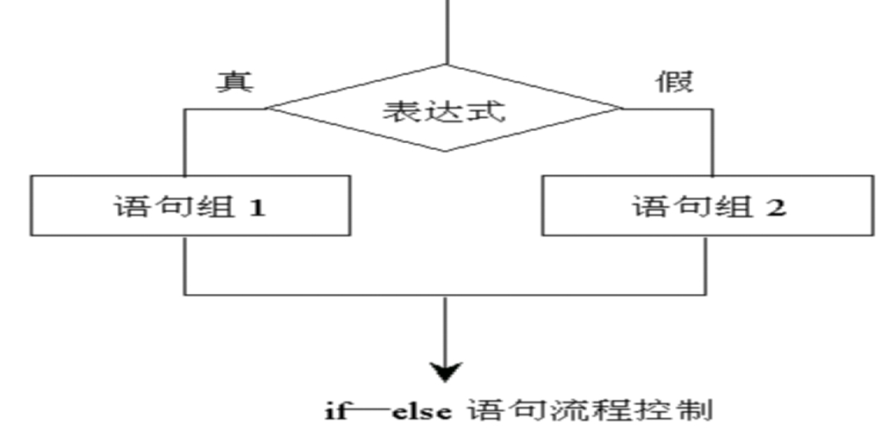
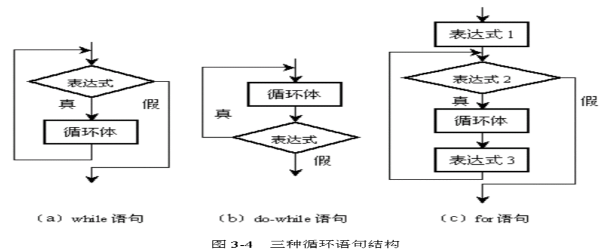

# **4-流程控制**

流程控制用来控制程序中各语句的执行顺序。

## **4.1顺序结构**

从上往下，依次执行。

```java
/*
	流程控制语句：可以控制程序的执行流程。
	
	分类：
		顺序结构
		选择结构
		循环结构
		
	顺序结构：
		从上往下，依次执行。
*/
class ShunXuJieGouDemo {
	public static void main(String[] args) {
		System.out.println("程序开始了");
		
		System.out.println("我爱Java");
		
		System.out.println("程序结束了");
	}
}
```


## **4.2选择结构**

### **简单if结构**


i. if语句

​		**if**(返回boolean值的条件表达式){

​			语句组;

​		}

示例1

```
import java.util.Scanner;

public class GetPrize {
	public static void main(String[] args) {
		Scanner input = new Scanner(System.in); 
        System.out.print("输入张浩的Java成绩: "); //提示要输入Java成绩
        int score =  input.nextInt(); 	//从控制台获取Java成绩
        if ( score > 90 ) {    			//判断是否大于90分
             System.out.println("老师说:不错，奖励一个iPhone5！");
        }
	}
}
```

示例2

```
import java.util.Scanner;

public class GetPrize2 {
	public static void main(String[] args) {
		Scanner input = new Scanner(System.in); 
        System.out.print("输入张浩的Java成绩: "); //提示要输入Java成绩
        int score1 =  input.nextInt(); 	//从控制台获取Java成绩
        System.out.print("输入张浩的音乐成绩: "); //提示要输入音乐成绩
        int score2 =  input.nextInt(); 	//从控制台获取音乐成绩
        if ((score1>90 && score2>80) || (score1==100 && score2>70)) {
             System.out.println("老师说:不错，奖励一个iPhone5！");
        }
	}
}

```

### **if-else结构**

if-else语句

 

​		**if**(条件表达式){

​			语句组1

​		}**else** {

​			语句组2

​	}

```java
import java.util.Scanner;

public class SimpleIfElse {
	public static void main(String[] args) {
		Scanner input = new Scanner(System.in); 
        System.out.print("输入张浩的Java成绩: "); //提示要输入Java成绩
        int score =  input.nextInt(); 	//从控制台获取Java成绩
        if ( score > 90 ) {
            System.out.println("老师说:不错，奖励一个iPhone5！");
        }else{
        	System.out.println("老师说:惩罚蹲5分钟马步！");
        }
	}
}

```

### **多重if结构**

```
import java.util.Scanner;

public class ScoreAssess {
	public static void main(String[] args) {
		Scanner input = new Scanner(System.in); 
        System.out.print("请输入考试成绩: "); //提示要输入考试成绩
        int score =  input.nextInt(); 	//从控制台获取成绩
	    if (score >= 80) { // 考试成绩>=80
			System.out.println("良好");
		} else if (score >= 60) { // 80>考试成绩>=60
			System.out.println("中等");
		} else { // 考试成绩<60
			System.out.println("差");
		}
	}
}
```


### **嵌套if结构**

```java
import java.util.*;
public class RunningMatch {
	public static void main(String[] args) {
		Scanner input = new Scanner(System.in);
		System.out.print("请输入比赛成绩（s）：");
		double score = input.nextDouble();
		System.out.print("请输入性别：");
		String gender = input.next();
		if(score<=10){
			if(gender.equals("男")){
				System.out.println("进入男子组决赛！");
			}else if(gender.equals("女")){
				System.out.println("进入女子组决赛！");
			}
		}else{
			System.out.println("淘汰！");
		}
	}
}
```

### **switch结构**

switch语句（又称开关语句）是和case语句一起使用的，其功能是根据某个表达式的值在多个case引导的多个分支语句中选择一个来执行。它的一般格式如下： 

​		**switch** (key) {

​		**case** value:

​			语句块1;

​			**break**;

​			……

​		**default**:

​			**break**;

​	}

​	案例：

​		**int** i = 3;

​		**switch** (i) {

​		**case** 1:

​			System.**out**.println(1);

​			**break**;

​		**case** 2:

​			System.**out**.println(2);

​			**break**;

​		**default**:

​			System.**out**.println("default");

​			**break**;

​		}

​	

• default语句是可选的，它接受除上面接受值的其他值，通俗的讲，就是谁也不要的都归它。 

• case后面可以跟多个语句，这些语句可以不用大括号括起来。

**•** **switch后面括号中表达式的值必须是符合****byte，char，short，int****类型的常量表达式,jdk1.7以后可以使用****String****，而不能用浮点类型或****long****类型。** 

• 一个switch语句可以代替多个if—else语句组成的分支结构，而switch语句从思路上显得更清晰 

```java
/*
	switch语句的注意事项：
		A:case后面只能是常量，不能是变量，而且，多个case后面的值不能出现相同的
		B:default可以省略吗?
			可以省略，但是不建议，因为它的作用是对不正确的情况给出提示。
			特殊情况：
				case就可以把值固定。
				A,B,C,D
		C:break可以省略吗?
			可以省略，但是结果可能不是我们想要的。
			会出现一个现象：case穿透。
			最终我们建议不要省略
		D:default一定要在最后吗?
			不是，可以在任意位置。但是建议在最后。
		E:switch语句的结束条件
			a:遇到break就结束了
			b:执行到末尾就结束了
*/
public class Compete2 {
	public static void main(String[] args) {
		int mingCi = 1;  //名次
        switch (mingCi){
            case 1:
                System.out.println("参观麻省理工大学计算机学院组织1个月夏令营");
                break;
            case 2:
                System.out.println("奖励hp笔记本一部");
                break;
            case 3:
                System.out.println("奖励移动硬盘一部");
                break;
            default:
                System.out.println("没有任何奖励");
        }
	}
}

```


## **4.3循环结构**



### **while循环**

语法：

​			初始化语句;

​			while(判断条件语句){

​			

​				循环体语句;

​				控制条件语句;

​			}

在循环刚开始时，会计算一次“条件表达式”的值。当条件为假时，将不执行循环体，直接跳转到循环体外，执行循环体外的后续语句；当条件为真时，便执行循环体。每执行完一次循环体，都会重新计算一次条件表达式，当条件为真时，便继续执行循环体，直到条件为假才结束循环。

```
public class WhileDemo1 {

	/*
	 * while打印100遍
	 */
	public static void main(String[] args) {
		int i = 1;
		while(i <= 100){
			System.out.println("第" +i+ "遍写：好好学习，天天向上！");
			i++;
		}
	}
}

```

```
import java.util.Scanner;

public class WhileDemo {

	/*
	 * 如何使用while循环
	 */
	public static void main(String[] args) {
	    int count = 1;
            while(count <= 50){
                System.out.println("打印第" +count+ "份试卷");
                count++;
            }
        }
}
```

```
public class WhileDemo {

	/*
	 * 如何使用while循环
	 */
	public static void main(String[] args) {
		String answer;	//标识是否合格
		Scanner input = new Scanner(System.in);
		System.out.print("合格了吗?(y/n)：");
		answer = input.next();
		while(!"y".equals(answer)){
			System.out.println("上午阅读教材！");
			System.out.println("下午上机编程！\n");
			System.out.print("合格了吗?(y/n)：");
			answer = input.next();
		}
		System.out.println("完成学习任务！");
	}
}
```


### **do-while循环**

**语法：**

​			初始化语句;

​			do {

​				循环体语句;

​				控制条件语句;

​			}while(判断条件语句);

do-while循环与while循环的不同在于：它先执行循环中的语句，然后再判断条件是否为真，如果为真则继续循环；如果为假，则终止循环。因此，do-while循环至少要执行一次循环语句。 

**注意：while()后一定要加“；”** 

​	案例：循环输出1=100；

​		**int** i =1;

​		**do** {

​			System.*out*.println(i);

​			i++;

​		} **while** (i<=100);

```
import java.util.Scanner;

public class DoWhileDemo {

	/*
	 * 如何使用do-while循环
	 */
	public static void main(String[] args) {
		Scanner input = new Scanner(System.in);
		String answer = "";		//标识是否合格
		do{
			System.out.println("上机编写程序！");
			System.out.print("合格了吗?(y/n)");
			answer = input.next();
			System.out.println("");
		}while(!"y".equals(answer));
		System.out.println("恭喜你通过了测试！");
	}
}
```

PS：while循环和do-while循环的区别

while循环只有当条件表达式为true的时候才会进入循环体，do-while循环首先执行一次循环体中的内容，无论条件表达式是否为true；

### **for循环**

**语法**

​			for(初始化语句;判断条件语句;控制条件语句){

​				循环体语句;

​			}

​			

​			执行流程：

​				a:执行初始化语句

​				b:执行判断条件语句

​					如果这里是true，就继续

​					如果这里是false，循环就结束

​				c:执行循环体语句

​				d:执行控制条件语句

​				e:回到b

**增强for循环(JDK5.0之后的新特性) **

可以用来处理数组中的每个元素(其它类型的集合也可以)，而不需要指定下标；

​		**for** (类型 变量 : 集合) {

​			

​		}

​	类型：值集合中保存的数据的数据类型；

​	变量：表示集合中的每一个元素；

​	集合：需要处理的集合对象；

```java
/*
需求：请在控制台输出10次"HelloWorld"
*/
class ForDemo {
	public static void main(String[] args) {
		//最原始的做法
		System.out.println("HelloWorld");
		System.out.println("HelloWorld");
		System.out.println("HelloWorld");
		System.out.println("HelloWorld");
		System.out.println("HelloWorld");
		System.out.println("HelloWorld");
		System.out.println("HelloWorld");
		System.out.println("HelloWorld");
		System.out.println("HelloWorld");
		System.out.println("HelloWorld");
		System.out.println("----------");
		
		//这种做法不好,代码的重复度太高。
		//所以呢，我们用循环改进
		for(int x=1;x<=10;x++) {
			System.out.println("HelloWorld");
		}
	}
}
```

```java
/*
	需求：
		A:求1-100之和。
		B:求出1-100之间偶数和
		C:求出1-100之间奇数和(自己做)
*/
class ForDemo4 {
	public static void main(String[] args) {
		//求1-100之和。
		int sum1 = 0;
		
		for(int x=1; x<=100; x++) {
			sum1 +=x;
		}
		
		System.out.println("1-100之和是："+sum1);
		System.out.println("------------------");
		
		//求出1-100之间偶数和
		//方式1
		int sum2 = 0;
		
		for(int x=1; x<=100; x++) {
			if(x%2 == 0) {
				sum2 += x;
			}
		}
		
		System.out.println("1-100偶数之和是："+sum2);
		System.out.println("------------------");
		
		//方式2
		int sum3 = 0;
		
		for(int x=0; x<=100; x+=2) {
				sum3 += x;
		}
		
		System.out.println("1-100偶数之和是："+sum3);
		System.out.println("------------------");
	}
}
```

```java
/*
	需求：求5的阶乘。
	
	什么是阶乘呢?
		n! = n*(n-1)! 规则
		n! = n*(n-1)*(n-2)*...*3*2*1
		
	求和思想。
	求阶乘思想。
*/
class ForDemo5 {
	public static void main(String[] args) {
		//定义最终结果变量
		int jc = 1;
		
		//这里的x其实可以直接从2开始
		//for(int x=1; x<=5; x++) 
		
		for(int x=2; x<=5; x++) {
			jc *=x;
		}
		
		System.out.println("1-5的阶乘是："+jc);
	}
}
```

```java
/*
	需求：在控制台输出所有的”水仙花数”
	分析：
		我们都不知道什么叫"水仙花数"，你让我怎么做呢?
		
		所谓的水仙花数是指一个三位数，其各位数字的立方和等于该数本身。
		举例：153就是一个水仙花数。
		153 = 1*1*1 + 5*5*5 + 3*3*3 = 1 + 125 + 27 = 153

		A:三位数其实是告诉了我们范围。
		B:通过for循环我们就可以实现获取每一个三位数
		  但是麻烦是如何获取这个三位数的个,十,百位上的数据
		  
		  我们如何获取一个数据的个,十,百呢?
			假设有个一个数据:153
			ge:	153%10 = 3
			shi: 153/10%10 = 5
			bai：153/10/10%10 = 1
			qian：x/10/10/10%10
			wan:  x/10/10/10/10%10
			...

		C:让ge*ge*ge+shi*shi*shi+bai*bai*bai和该数据比较
		  如果相同，就把该数据在控制台输出。
*/
class ForDemo6 {
	public static void main(String[] args) {
		//三位数其实是告诉了我们范围。
		for(int x=100; x<1000; x++) {
			int ge = x%10;
			int shi = x/10%10;
			int bai = x/10/10%10;
			
			//让ge*ge*ge+shi*shi*shi+bai*bai*bai和该数据比较
			if(x == (ge*ge*ge+shi*shi*shi+bai*bai*bai)) {
				//如果相同，就把该数据在控制台输出。
				System.out.println(x);
			}
		}
	}
}
```

练习

```java
/*
	练习：
		请在控制台输出满足如下条件的五位数
		个位等于万位
		十位等于千位
		个位+十位+千位+万位=百位
		
	分析：
		A:五位数就告诉了我们范围。
		B:分解每一个五位数的个，十，百，千，万位上的数据
		C:按照要求进行判断即可
*/
class ForDemo7 {
	public static void main(String[] args) {
		//五位数就告诉了我们范围。
		for(int x=10000; x<100000; x++) {
			//分解每一个五位数的个，十，百，千，万位上的数据
			int ge = x%10;
			int shi = x/10%10;
			int bai  = x/10/10%10;
			int qian = x/10/10/10%10;
			int wan = x/10/10/10/10%10;
			
			//按照要求进行判断即可
			if((ge==wan) && (shi==qian) && (ge+shi+qian+wan==bai)) {
				System.out.println(x);
			}
		}
	}
}
```


```java
/*
	需求：统计”水仙花数”共有多少个
	
	分析：
		A:首先必须知道什么是水仙花数
			所谓的水仙花数是指一个三位数，其各位数字的立方和等于该数本身。
			举例：153就是一个水仙花数。
			153 = 1*1*1 + 5*5*5 + 3*3*3 = 1 + 125 + 27 = 153
		B:定义统计变量，初始化值是0
		C:三位数告诉了我们范围，用for循环就可以搞定
		D:获取每一个三位数的个，十，百的数据
		E:按照要求进行判断
		F:如果满足要求就计数。
*/
class ForDemo8 {
	public static void main(String[] args) {
		//定义统计变量，初始化值是0
		int count = 0;
		
		//三位数告诉了我们范围，用for循环就可以搞定
		for(int x=100; x<1000; x++) {
			//获取每一个三位数的个，十，百的数据
			int ge = x%10;
			int shi = x/10%10;
			int bai = x/10/10%10;
			
			//按照要求进行判断
			if(x == (ge*ge*ge+shi*shi*shi+bai*bai*bai)) {
				//如果满足要求就计数。
				count++;
			}
		}
		
		System.out.println("水仙花数共有"+count+"个");
	}
}
```

```java
/*
	需求：请统计1-1000之间同时满足如下条件的数据有多少个：
			对3整除余2
			对5整除余3
			对7整除余2

	分析：
		A:定义统计变量,初始化值是0
		B:1-1000之间是一个范围，用for很容易就可以实现。
		C:每个数据要同时满足如下要求
			x%3==2
			x%5==3
			x%7==2
		D:如果满足条件，统计数据++即可，最后输出统计变量
*/
class ForDemo9 {
	public static void main(String[] args) {
		//定义统计变量,初始化值是0
		int count = 0;
	
		//1-1000之间是一个范围，用for很容易就可以实现。
		for(int x=1; x<=1000; x++) {
			/*
				每个数据要同时满足如下要求
				x%3==2
				x%5==3
				x%7==2
			*/
			if(x%3==2 && x%5==3 && x%7==2) {
				count++;
				System.out.println(x);
			}
		}
		
		//输出数据
		System.out.println("满足这样条件的数据共有："+count+"个");
	}
}
```


```
import java.util.*;
public class AverageScore{
	/**
	 * 统计80分以上学生比例
	 */
    public static void main(String[] args){
    	int score;             //每门课的成绩
     	int sum = 0;           //成绩之和
     	double avg = 0.0;      //平均分
    	Scanner input = new Scanner(System.in);
    	System.out.print("输入学生姓名: ");
    	String name = input.next(); 	
        for(int i = 0; i < 5; i++){  	//循环5次录入5门课成绩
    	     System.out.print("请输入5门功课中第" + (i+1) + "门课的成绩： ");
    	     score = input.nextInt();  	//录入成绩
    	     sum = sum + score;        	//计算成绩和
    	}
    	avg = (double)sum / 5;                  //计算平均分
    	System.out.println(name + "的平均分是：" + avg);
    }
}

```

```
import java.util.*;
public class SumTable {
	/**
	 * 输入整数，输出其加法表
	 */
    public static void main(String[] args){
        int i, j;
        Scanner input = new Scanner(System.in);
        System.out.print("请输入一个值： ");
        int val = input.nextInt();
        System.out.println("根据这个值可以输出以下加法表： ");
        for(i = 0, j = val; i <= val; i++, j--){
            System.out.println(i + " + " + j + " = " + (i+j));
        }
    }
}

```

### **多重循环**

```
/*
 * 打印平行四边形
 * */
public class PrintParallelogram {
	public static void main(String[] args) {
		//外层循环，执行五次，每次输出一行*
		for (int i = 1; i <= 5; i++) {
			for (int j = 1; j <= 5 - i; j++) {
				System.out.print(" ");
			}
			//内层循环，执行五次，每次输出一个*
			for (int j = 1;j<=5;j++){
				System.out.print("*");
			}
			
			System.out.println();
		}
	}
}
```

```
/*
 * 打印矩形
 * */
public class PrintRect {
	public static void main(String[] args) {
		//外层循环，执行五次，每次输出一行*
		for (int i = 1; i <= 5; i++) {
			//内层循环，执行五次，每次输出一个*
			for (int j = 1;j<=5;j++){
				System.out.print("*");
			}
			System.out.println();
		}
	}
}
```

```
/*
 * 打印等腰三角形
 * */
public class PrintSJX {
	public static void main(String[] args) {
		//外层循环，执行五次，每次输出一行*
		for (int i = 1; i <= 5; i++) {
			for(int j=1;j<=5-i;j++){
				System.out.print(" ");
			}
			//内层循环，执行五次，每次输出一个*
			for (int j = 1;j<=2*i-1;j++){
				System.out.print("*");
			}
			
			System.out.prinln();
		}
	}
}
```

```
/*
 * 打印菱形
 * */
public class PrintLX {
	public static void main(String[] args) {
		//外层循环，执行五次，每次输出一行*
		for (int i = 1; i <= 5; i++) {
			for(int j=1;j<=5-i;j++){
				System.out.print(" ");
			}
			//内层循环，执行五次，每次输出一个*
			for (int j = 1;j<=2*i-1;j++){
				System.out.print("*");
			}
			
			System.out.println();
		}
		for (int i = 1; i <= 4; i++) {
			for(int j=1;j<=i;j++){
				System.out.print(" ");
			}
			//内层循环，执行五次，每次输出一个*
			for (int j = 1;j<=7-2*(i-1);j++){
				System.out.print("*");
			}
			
			System.out.println();
		}
	}
}
```

```
/*
 * 打印9*9乘法表
 */
public class Multiplication {

	public static void main(String[] args) {
	    int i, j;  // 循环变量
        for (i = 1; i <= 9; i++){  // 外层循环控制被乘数        
            for (j = 1; j <= i; j++){  // 内层循环控制乘数            
            	System.out.print(i+"*"+j+"="+(i*j)+"\t");                
            }
            System.out.println();  // 打印一行后换行           
        }
	}
}
```


### **练习**

使用三种方式计算100以内偶数之和

```java
public class EvenSum {

	/*
	 * 计算100以内偶数之和
	 * 思考：还有没有其他方式？
	 */
	public static void main(String[] args) {
		//使用while
		/*int sum = 0;	//当前之和
		int num = 2;	//加数
		while(num <= 100){
			sum = sum + num;	//累加
			num = num + 2;
		}
		System.out.println("100以内的偶数之和为：" + sum);*/
		
		//使用do-while
		/*int sum = 0;	//当前之和
		int num = 2;	//加数
		do{
			sum = sum + num;	//累加
			num = num + 2;
		}while(num <= 100);
		System.out.println("100以内的偶数之和为：" + sum);*/
		
		//使用for
		int sum = 0;	//当前之和
		for(int num=2;num<=100;num=num+2){
			sum = sum + num;	//累加
		}
		System.out.println("100以内的偶数之和为：" + sum);
	}
}
```


## **4.5跳转语句**

### **break语句**

​        A:用在循环和switch语句中，离开此应用场景无意义。

​		B:作用

​			a:跳出单层循环

​			b:跳出多层循环，需要标签语句的配合

```java
/**
 * break 中止当前循环
 */
public class TestBreak {
	public static void main(String[] args) {
		int sum = 0; // 和
		for (int i = 1; i <= 10; i++) {
			sum = sum + i; // 累加
			if (sum > 20) {
				System.out.print("当前数是:" + i);
				break;
			}
		}
	}
}
```

```java
/*
	break:中断的意思
	使用场景：
		A:switch语句中
		B:循环语句中。
			(循环语句中加入了if判断的情况)
		注意：离开上面的两个场景，无意义。
		
	如何使用呢?
		A:跳出单层循环
		B:跳出多层循环
			要想实现这个效果，就必须知道一个东西。带标签的语句。
			格式：
				标签名: 语句
*/
class BreakDemo {
	public static void main(String[] args) {
		//在 switch 或 loop 外部中断
		//break;
		
		//跳出单层循环
		for(int x=0; x<10; x++) {
			if(x == 3) {
				break;
			}
			System.out.println("HelloWorld");
		}
		
		System.out.println("over");
		System.out.println("-------------");
		
		wc:for(int x=0; x<3; x++) {
			nc:for(int y=0; y<4; y++) {
				if(y == 2) {
					//break nc;
					break wc;
				}
				System.out.print("*");
			}
			System.out.println();
		}
	}
}
```


示例

```java
import java.util.Scanner;

public class BreakDemo {
	/**
	 * 循环录入学生成绩，输入负数则退出
	 */
	  public static void main(String[] args) {
	       int score;    					//每门课的成绩
	       int sum = 0;  					//成绩之和
	       int avg;      					//平均分
	       boolean isNegative = false;    	//是否为负数
	       Scanner input = new Scanner(System.in);
	       System.out.print("输入学生姓名: ");
	       String name = input.next(); 	    //输入姓名
	       for(int i = 0; i < 5; i++){ 	    //循环5次录入5门课成绩  
	            System.out.print("请输入第" + (i+1) + "门课的成绩： ");
	            score = input.nextInt();
	            if(score < 0){			   //输入负数
	    		        isNegative = true;
	    		        break;
	    	       }
	            sum = sum + score;    	   //累加求和
	       }
	       if(isNegative){
	            System.out.println("抱歉，分数录入错误，请重新进行录入！");
	       }else{
	            avg = sum / 5;             //计算平均分
	            System.out.println(name + "的平均分是：" + avg);
	       }
	  }
	}
```


### **continue语句**

​		A:用在循环中，离开此应用场景无意义。

​		B:作用

​			a:跳出单层循环的一次，可以继续下一次

```java
/**
 * 中止本次循环，进入下一次循环
 */
public class TestContinue {
	public static void main(String[] args) {
		int sum = 0; // 定义一个变量，进行累加
		for (int i = 1; i <= 10; i++) {
			if (i % 2 == 1) {
				continue;// 如果i为奇数,结束本次循环，进行下一次循环
			}
			sum = sum + i;
		}
		System.out.print("1--10之间的偶数和是:" + sum);
	}
}
```

示例

```java
import java.util.Scanner;
public class ContinueDemo {
	/**
	 * 统计80分以上学生比例
	 */
	public static void main(String[] args) {
		int score; 		// 成绩
		int total; 		// 班级总人数
		int num = 0; 	// 成绩大于或等于80分的人数
		Scanner input = new Scanner(System.in);
		System.out.print("输入班级总人数: ");
		total = input.nextInt(); 	// 输入班级总数
		for (int i = 0; i < total; i++) {
			System.out.print("请输入第" + (i + 1) + "位学生的成绩： ");
			score = input.nextInt();
			if (score < 80) {
				continue;
			}
			num++;
		}
		System.out.println("80分以上的学生人数是： " + num);
		double rate = (double) num / total * 100;
		System.out.println("80分以上的学生所占的比例为：" + rate + "%");
	}
}
```


### **return语句**

​		A:用于结束方法的，后面还会在继续讲解和使用。

​		B:一旦遇到return,程序就不会在继续往后执行。

```java
/*
	return:返回
	
	其实它的作用不是结束循环的，而是结束方法的。
*/
class ReturnDemo {
	public static void main(String[] args) {
		for(int x=0; x<10; x++) {
			if(x == 2) {
				System.out.println("退出");
				//break;
				//continue;
				return;
			}
			
			System.out.println(x);
		}
		
		System.out.println("over");
	}
}
```


### **练习**

1.输出九九表

```java
/*
 * 打印9*9乘法表
 */
public class Multiplication {

	public static void main(String[] args) {
	    int i, j;  // 循环变量
        for (i = 1; i <= 9; i++){  // 外层循环控制被乘数        
            for (j = 1; j <= i; j++){  // 内层循环控制乘数            
            	System.out.print(i+"*"+j+"="+(i*j)+"\t");                
            }
            System.out.println();  // 打印一行后换行           
        }
	}
}
```


2.打印数列

```java
public class ForEx {
	public static void main(String[] args){
		for(int i = 100;
				i >= 5;
				i=i-5){
			System.out.print(i+" ");
		}
		
/*		int i = 100;
		while(i>=5){
//			System.out.print(i+" ");
			i-=5;
		}*/
//		int i = 100;
//		do{
//			System.out.print(i+" ");
//			i-=5;
//		}while(i>=5);
	}
}
```


3.输出星期数

```java
public class ShowDate {
	public static void main(String[] args){
		//定义变量
		int inputNum = -1;  //记录用户输入
		Scanner input = new Scanner(System.in);
		String date = "";  //记录星期几
		//循环询问用户输入的数字
		do{
			//询问用户输入的数字：
			System.out.print("请输入数字（1~7），输入0结束：");
			inputNum = input.nextInt();
			//分支：根据用户输入的内容，显示相应星期几
			switch(inputNum){
			case 1:
				//System.out.println("星期一");
				date = "星期一";
				break;
			case 2:
				//System.out.println("星期二");
				date = "星期二";
				break;
			case 3:
				System.out.println("星期三");
				date = "星期三";
				break;
			case 4:
				//System.out.println("星期四");
				date = "星期四";
				break;
			case 5:
				//System.out.println("星期五");
				date = "星期五";
				break;
			case 6:
				//System.out.println("星期六");
				date = "星期六";
				break;
			case 7:
				//System.out.println("星期日");
				date = "星期日";
				break;
			case 0:
				break;
			default:
				System.out.println("您的输入有误！");	
				break;
			}
			if(inputNum>=1 && inputNum<=7){
			System.out.println(date);
			}
			
		}while(inputNum != 0);
		System.out.println("程序结束！");
	}
}
```


4.打印数字三角形

```java
/*
 * 打印等腰三角形
 * */
public class PrintSJX {
	public static void main(String[] args) {
		//外层循环，执行五次，每次输出一行*
		for (int i = 1; i <= 5; i++) {
			for(int j=1;j<=5-i;j++){
				System.out.print(" ");
			}
			//内层循环，执行五次，每次输出一个*
			for (int j = 1;j<=2*i-1;j++){
				System.out.print(i);
			}
			
			System.out.println();
		}
	}
}
```

5.

```java
//打印矩形
public class PintPic1 {
	public static void main(String[] args) {
		for(int i=1;i<=5;i++){
			for(int j=1;j<=5;j++){
				System.out.print("*");
			}
			System.out.println();
		}
	}
}
```

6

```java
//打印平行四边形
public class PintPic2 {
	public static void main(String[] args) {
		for(int i=1;i<=5;i++){
			for(int j=1;j<=5-i;j++){
				System.out.print(" ");
			}
			for(int j=1;j<=5;j++){
				System.out.print("*");
			}
			System.out.println();
		}
	}
}

```

7

```java
//打印等腰三角形
public class PintPic3 {
	public static void main(String[] args) {
		for(int i=1;i<=5;i++){
			for(int j=1;j<=5-i;j++){
				System.out.print(" ");
			}
			for(int j=1;j<=2*i-1;j++){
				System.out.print("*");
			}
			System.out.println();
		}
	}
}

```

8.

```java
//打印菱形
public class PintPic4 {
	public static void main(String[] args) {
		for(int i=1;i<=5;i++){
			for(int j=1;j<=5-i;j++){
				System.out.print(" ");
			}
			for(int j=1;j<=2*i-1;j++){
				System.out.print("*");
			}
			System.out.println();
		}
		for(int i=1;i<=4;i++){
			for(int j=1;j<=i;j++){
				System.out.print(" ");
			}
			for(int j=1;j<=2*(5-i)-1;j++){
				System.out.print("*");
			}
			System.out.println();
		}
	}
}
```

9.

```java
//打印数字菱形
public class PintPic5 {
	public static void main(String[] args) {
		for(int i=1;i<=5;i++){
			for(int j=1;j<=5-i;j++){
				System.out.print(" ");
			}
			for(int j=1;j<=2*i-1;j++){
				System.out.print(5-i);
			}
			System.out.println();
		}
		for(int i=1;i<=4;i++){
			for(int j=1;j<=i;j++){
				System.out.print(" ");
			}
			for(int j=1;j<=2*(5-i)-1;j++){
				System.out.print(i);
			}
			System.out.println();
		}
	}
}
```

10

```java
//打印空心菱形
public class PintPic6 {
	public static void main(String[] args) {
		for(int i=1;i<=5;i++){
			for(int j=1;j<=5-i;j++){
				System.out.print(" ");
			}
			for(int j=1;j<=2*i-1;j++){
				if(j==1 || j==2*i-1){
					System.out.print("*");
				}else{
					System.out.print(" ");
				}
			}
			System.out.println();
		}
		for(int i=1;i<=4;i++){
			for(int j=1;j<=i;j++){
				System.out.print(" ");
			}
			for(int j=1;j<=2*(5-i)-1;j++){
				if(j==1 || j==2*(5-i)-1){
					System.out.print("*");
				}else{
					System.out.print(" ");
				}
			}
			System.out.println();
		}
	}
}
```

11

```
/*
 * 编写Java程序，实现输出1~100中所有不能被7整除的数，并求其和。当累加和大于4000时，记录当前数，跳出循环。
要求：每输出4个数换行显示。
 * */
public class Test {
	public static void main(String[] args) {
		int sum = 0;
		int i = 0;
		for(int num = 1;num<100;num++){
			if(num%7!=0){
				System.out.print(num+"\t");
				i++;
				if(i==4){
					System.out.println();
					i=0;
				}
				sum += num;
				if(sum>4000){
					System.out.println("\n当前数："+num);
					break;
				}
			}
		}
		System.out.println("总和："+sum);
	}

}
```

# 

