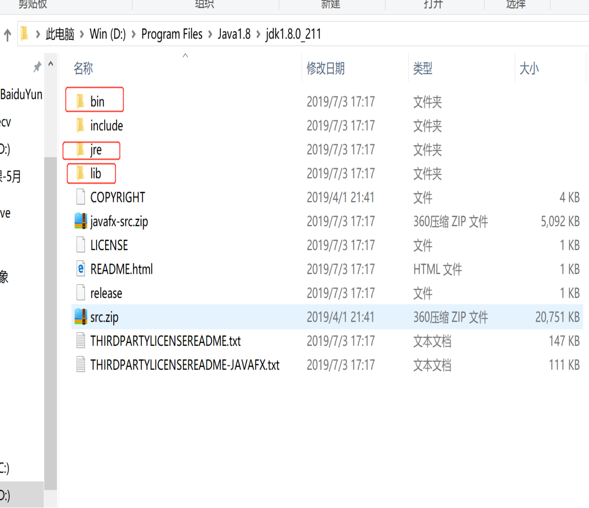
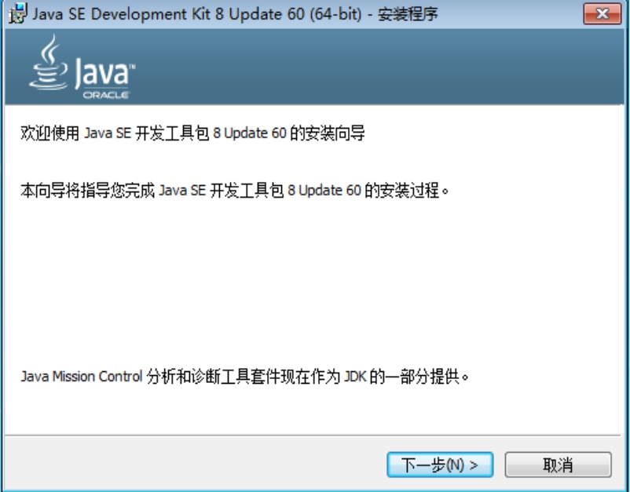
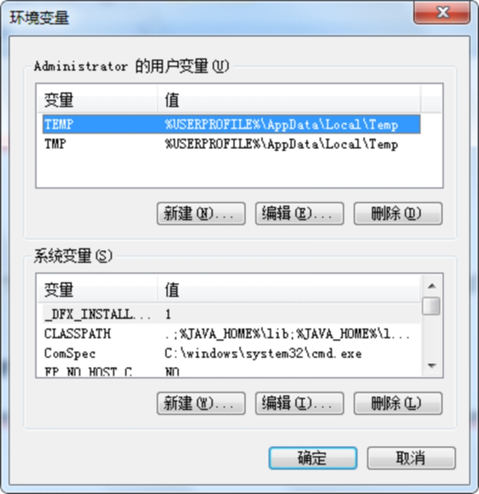

## 开发环境的搭建与配置**

### **2.2.1 JDK定义**

Java Development Kit的缩写：它是Java开发工具包。它提供了编译、运行Java程序所需的各种工具和资源。

### **2.2.3 JDK目录结构**

    bin目录：存放编译、运行java的可执行文件。
    lib目录：存放java的类库文件。
    jre目录：存放java运行环境文件。



### **2.2.4 JDK安装步骤**

JDK的安装环境变量的配置

确认操作系统：我的电脑  ---- 右键查看属性

 

下载JDK版本：根据操作系统下载对应的JDK

 


​	1）安装版：




 


 

2）解压版

解压到指定路径，**注意不要使用中文路径**；

3）临时环境变量

打开命令行：windows键+r

输入set命令：				**显示所有环境变量**

输入set  path 命令：			**显示path变量值**

输入set  test=abc			**新增环境变量值为abc**

输入set  test=				**删除环境变量**

输入set path=%path%;D:\Program Files\jdk1.7.0_17\bin		**在path变量的值上面追加****D:\Program Files\jdk1.7.0_17\bin**

​	输入java –version			**查看JDK版本**

​	输入javac					**查看环境变量是否可用**

​	PS：临时环境变量只对当前窗口有效。

4）永久环境变量

1、java_home

右击“我的电脑”，选择“属性”，点击“高级”选项卡，选择“环境变量”。进入如下对话框：

 

在系统变量栏，点击“新建”按钮，弹出如下对话框：

 

在变量名处填写java_home，变量值填写 (JDK的路径)，然后点击确定，这样java_home变量就	配置完成了。

2、classpath

可以参考java_home的配置过程，需要新建一个系统变量，不过classpath的变量名是classpath，变量 值是 **.;%JAVA_HOME%\lib;%JAVA_HOME%\lib\tools.jar**  (要加.表示当前路径)。

3、path

path变量在系统变量中已存在，要修改path变量只需要选中path变量，点击编辑即可。在变量值中加入 如下内容：

 **%JAVA_HOME%\bin;%JAVA_HOME%\jre\bin**。建议把 JDK bin 的路径放在原有 path 的最前面。因为在%SystemRoot%\system32 中还有一个 java.exe/javaw.exe，这是 Windows 操作系统自带的那个JRE， 如果我们自己装的话就不要用他默认的那个JRE 了，可以用我们自己装的。如果把 JDK bin 的 path 放在最前面的话会优先使用。

```
    1  下载jdk安装包
	2  安装成功后，记住安装路径
	3  配置环境变量path
	4  doc命令检测：  java -vesion 查版本号
```


## 