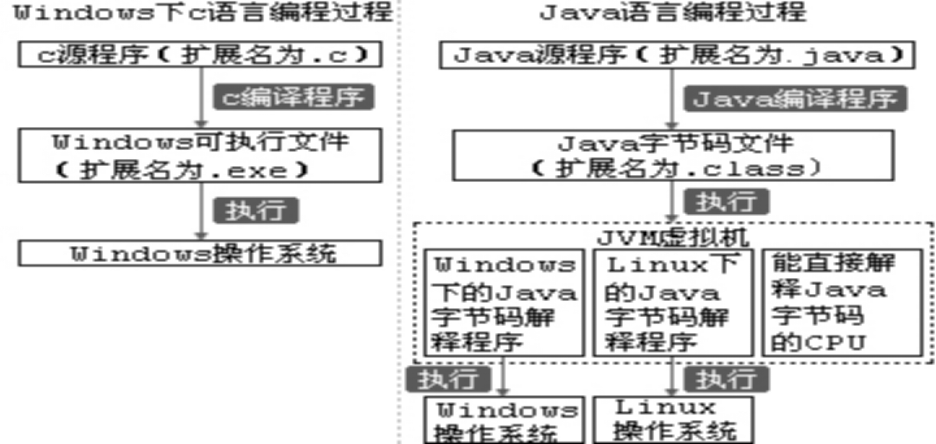
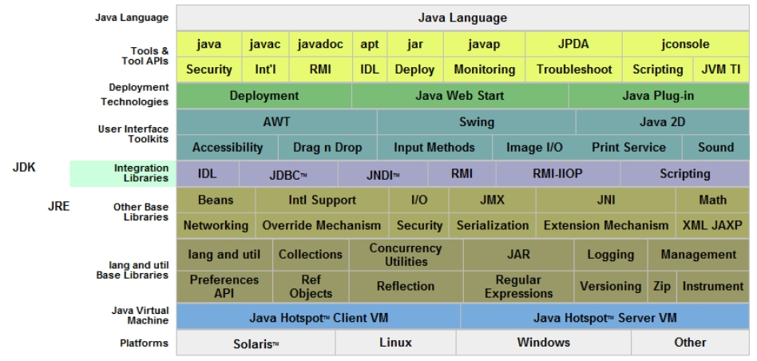
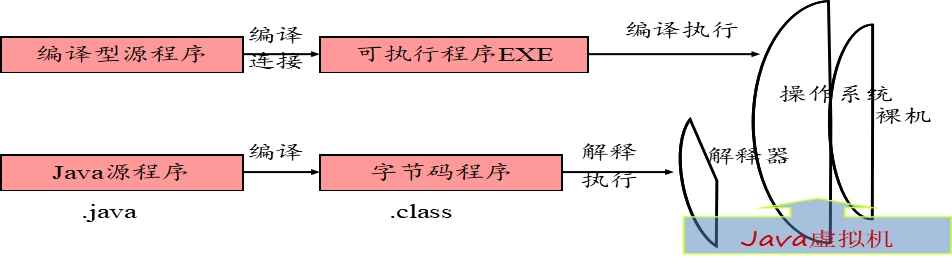
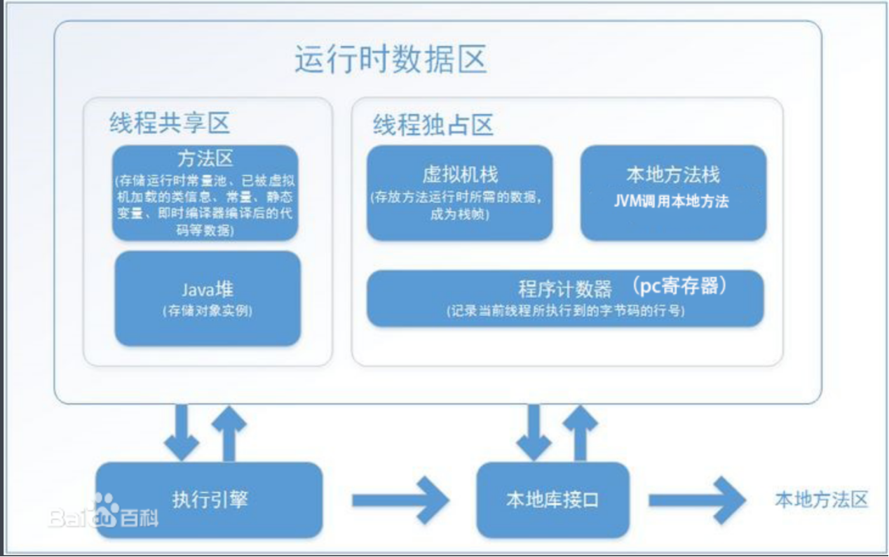

##  Java虚拟机与跨平台原理

1.“**一次编译，到处运行**”的原理

 


2.JDK（Java Development Kit）：java开发工具包

由以下图形可以看出：JDK包含了JRE（java程序文件的可运行环境），JRE（Java SE Runtime Environment）包含了JVM（Java  Virtual  Machine），JVM包含了客户机和主机，而我们的java程序是运行在JVM中的。

 

​	3.提供的运行时环境

​		JVM虚拟机的三大任务：1、加载代码、2校验代码、3执行代码



 

```
JVM是什么？
  JVM是可运行Java字节码的虚拟计算机系统。
  JVM具有一套虚拟机指令，运行编译后的 *.class文件。
JVM的优点是什么？
  它的优点是跨平台。
   编写一次，随处运行。Write Once, Run Anywhere 
  java程序可以在多种平台上运行。
   比如： Windows系统、Linux系统、安卓系统、苹果系统等
```




## 