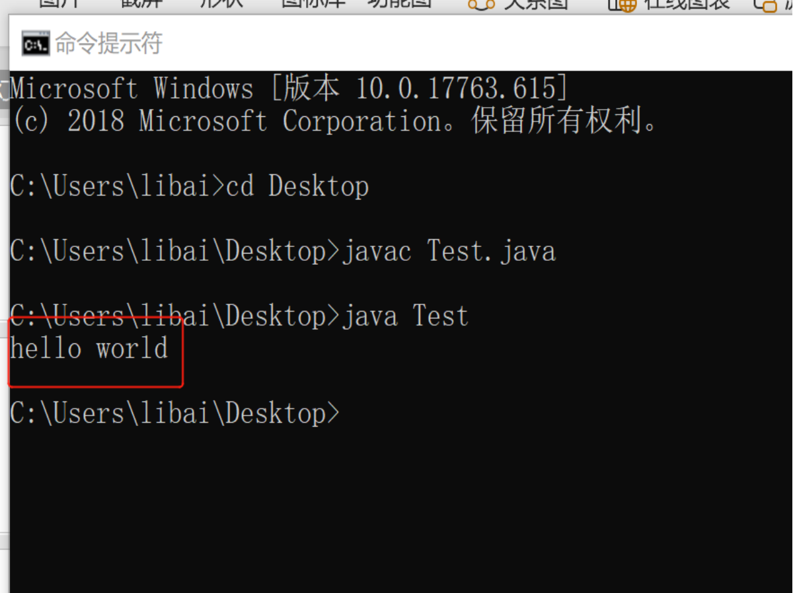

# 使用记事本开发Java

步骤

```
    1、创建一个Test.txt文本文件(首字母大写)
	2、编写符合Java语法的代码
	3、保存，将后缀名改成 .java
	4、在doc界面输入 指令 javac编译代码
	5、在doc界面输入 指令  java  运行字节文件
```



## **2.4常见的问题**

​	(1)扩展名被隐藏

​		如何找到：工具--文件夹选项--查看--去除隐藏扩展名的那个勾勾

​	(2)我要求文件名称和类名一致。

​		实际上不这样做也是可以的。

​		但是，注意：

​			javac后面跟的是文件名+扩展名

​			java后面跟的类名不带扩展名

​	(3)Java语言严格区分大小写，请注意。

​		 还有就是单词不要写错了。

​	(4)见到非法字符: \65307肯定是中文问题。

​		我们写程序要求标点符号必须全部是英文状态。

​	(5)括号的配对问题。

​		一般来说，括号都是成对出现的。

​	(6)遇到

​		在类 HelloWorld 中找不到主方法, 请将主方法定义为

​		肯定是主方法的格式问题。

