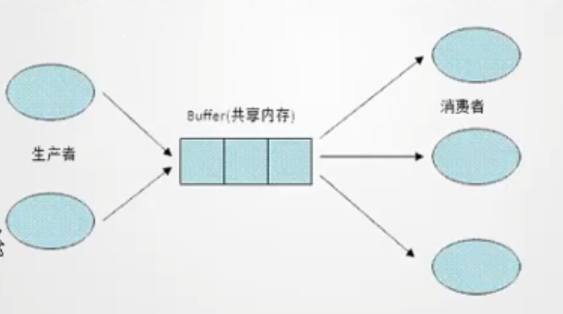

# **5-多线程**

### **5.1程序、进程、线程**

进程是指运行中的程序。进程的特点：动态性、独立性、并发性。

线程是进程内部的一个执行单元，它是程序中一个单一的顺序控制流程。

多线程是在一个进程中同时运行多个线程，用于完成不同的工作。比如迅雷软件同时现在不同的文件资源。

### **5.2线程与进程的区别**

| 区别     | 进程                                                         | 线程                                                         |
| -------- | ------------------------------------------------------------ | ------------------------------------------------------------ |
| 根本区别 | 作为资源分配的单位                                           | 调度和执行的单位                                             |
| 开销     | 每个进程都有独立的代码和数据空间（进程上下文），进程间的切换会有较大的开销。 | 线程可以看成是轻量级的进程，同一类线程共享代码和数据空间，每个线程有独立的运行栈和程序计数器（PC），线程切换的开销小。 |
| 所处环境 | 在操作系统中能同时运行多个任务（程序）                       | 在同一应用程序中有多个顺序流同时执行                         |
| 分配内存 | 系统在运行时会为每个进程分配不同的内存区域                   | 除了CPU之外，不会为线程分配内存（线程所使用的资源时它所属的进程的资源），线程组只能共享资源 |
| 包含关系 | 没有线程的进程是可以被看作单线程的，如果一个进程内拥有多个线程，则执行过程不是一条线的，而是多条线（线程）共同完成的。 | 线程是进程的一部分，所以线程有的时候被称为是轻量级进程。     |

**主线程**

main()方法即为主线程入口。
产生其他子线程的线程。
必须最后完成执行，因为它执行各种关闭动作。

### **5.3线程的创建与启动**

**Thread类的常用方法**

| 方法                          | 功能                                  |
| ----------------------------- | ------------------------------------- |
| static Thread currentThread() | 得到当前线程                          |
| getName()                     | 返回线程的名称                        |
| setName(String name)          | 指定线程的名称                        |
| int getPriority()             | 获得线程的优先级数值                  |
| void setPriority()            | 设置线程的优先级                      |
| void start()                  | 调用run()方法启动线程，开始线程的执行 |
| void run()                    | 存放线程体代码                        |
| isAlive()                     | 判断线程是否活着                      |

#### **显示主线程名**

```java
public class ThreadDemo {
	public static void main(String args[]) {
		Thread t= Thread.currentThread(); 
		System.out.println("当前线程是: "+t.getName()); 
		t.setName("MyJavaThread"); 
		System.out.println("当前线程名是: "+t.getName()); 
	}
}
```

#### **继承Thread类创建线程**

```java
public class MyThread extends Thread{
    //重写run()方法
	public void run(){
		for(int i=1;i<100;i++){
			System.out.println(Thread.currentThread().getName()+":"+i);
		}
	}
}
```

```java
public class Test {
	public static void main(String[] args) {
		MyThread thread = new MyThread();
		thread.start(); //启动线程
	}
}
```


#### **多线程交替执行**

```java
public class MyThread extends Thread{
    //重写run()方法
	public void run(){
		for(int i=1;i<100;i++){
			System.out.println(Thread.currentThread().getName()+":"+i);
		}
	}
}
```

```java
public class Test {
	public static void main(String[] args) {
		MyThread thread = new MyThread();
		MyThread thread2 = new MyThread(); //创建新线程thread2
		thread.start();
		thread2.start(); //启动thread2
	}
}
```


#### **直接调用run()和start()区别**

```java
public class MyThread extends Thread{
    //重写run()方法
	public void run(){
		for(int i=1;i<100;i++){
			System.out.println(Thread.currentThread().getName()+":"+i);
		}
	}
}
```

```java
public class Test {
	public static void main(String[] args) {
		MyThread thread = new MyThread();
		MyThread thread2 = new MyThread(); 
		//直接调用run()方法
		thread.run();
		thread2.run(); 
	}
}
```


#### **实现Runable接口创建线程**

```java
class MyRunnable implements Runnable{
	//实现run()方法
	public void run(){
		for(int i=1;i<100;i++){	
			System.out.println(Thread.currentThread().getName()+":"+i);
		}
	}
}
```

```java
public class Test {
	public static void main(String[] args) {
		MyRunnable myRunnable = new MyRunnable();
		Thread myThread = new Thread(myRunnable);		
		myThread.start();
	}
}

```


### **5.4线程的生命周期**


**新生状态**

- 用new关键字建立一个线程对象后，该线程对象就处于新生状态。
- 处于新生状态的线程有自己的内存空间，通过调用start进入就绪状态。

**就绪状态**

- 处于就绪状态线程具备了运行条件，但还没分配到CPU，处于线程就绪队列，等待系统为其分配CPU。
- 当系统选定一个等待执行的线程后，它就会从就绪状态进入执行状态，该动作称之为“cpu调度”。

**运行状态**

- 在运行状态的线程执行自己的run方法中代码，直到等待某资源而阻塞或者完成任务而死亡。
- 如果在给定时间片内没有执行结束，就会被系统给换下来回到等待执行状态。

**阻塞状态**

- 处于运行状态的线程在某些情况下，如果执行了sleep（）方法，或者等待的I/O设备等资源，将让出CPU，并暂停停止自己的运行，进入阻塞状态。
- 在阻塞状态的线程不能进入就绪队列，只有当引起阻塞的原因消除时，（比如睡眠时间已到，或等待的I/O设备空闲下来），线程便转入就绪状态，重新到就绪队列中排队等待，被系统选中后从原来停止的位置开始继续运行。

**死亡状态**

- 死亡状态是线程生命周期中的最后一个阶段。线程死亡原因有三个：

  一是正常运行的线程完成了它的全部工作；

  二是线程被强制性的终止；

  三是线程抛出未捕获的异常；
#### **描述线程的状态**

```java
/**
 * 描述线程的状态
 */
public class Mythread implements Runnable{
	public void run() {
		try {
			System.out.println("线程t在运行！");
			Thread.sleep(500);
			System.out.println("线程t在短时间睡眠后重新运行！");
		} catch (InterruptedException IE) {
			System.out.println("线程被中断");
		}
	}
	public static void main(String args[]) {
		Thread t=new Thread(new Mythread());
		 System.out.println ("线程 t 为新建！");		
		 t.start();
		 System.out.println ("线程 t 为就绪！");
	}
}
```


### **5.5线程调度**

线程调度指按照特定机制为多个线程分配CPU的使用权。

| 方法                              | 说明                                                         |
| --------------------------------- | ------------------------------------------------------------ |
| void setPriority(int newPriority) | 设置线程的优先级,由1-10表示，默认优先级为5。优先级越高，获得CPU资源的概率越大。 |
| static void sleep(long millis)    | 在指定的毫秒数内让当前正在执行的线程休眠，进入阻塞状态，不会释放CPU执行权。 |
| void join()                       | 阻塞指定线程等到另一个线程完成以后再继续执行。好比强行“插队”。 |
| static void yield()               | 暂停当前正在执行的线程对象，转入就绪状态，再次公平竞争CPU资源。 |

#### **线程的优先级**

```java
/**
 * 设置线程优先级
 *
 */
public class MyThread implements Runnable{
	public void run(){	
		for(int i=1;i<100;i++){			
			System.out.println(Thread.currentThread().getName()+"正在运行:"+i);
		}
	}
	public static void main(String[] args) {
		Thread t1 = new Thread(new MyThread(),"线程A");//通过构造方法指定线程名
		Thread t2 = new Thread(new MyThread(),"线程B");
		//设置线程的优先级（对比演示设置前后设置后的结果）
		t1.setPriority(Thread.MAX_PRIORITY);
		t2.setPriority(Thread.MIN_PRIORITY);
		System.out.println("****线程的优先级****");
		System.out.println("线程A的优先级："+t1.getPriority());
		System.out.println("线程B的优先级："+t2.getPriority());
		System.out.println("****************");
		t1.start();	
		t2.start();		
	}
}

```

#### **线程的休眠**

```java
/**
 * 线程休眠
 */
public class ThreadSleepDemo {
	public static void main(String[] args) {
		System.out.println("Wait");
		Wait.bySec(5); // 让主线程等待5秒种再执行
		System.out.println("start");
	}
}

class Wait {
	public static void bySec(long s) {
		for (int i = 0; i < s; i++) {
			System.out.println(i + 1 + "秒");
			try {
				Thread.sleep(1000); // 睡眠1秒
			} catch (InterruptedException e) {
				e.printStackTrace();
			} 
		}
	}
}
```

#### **线程的强制执行**

```java
public class MyThread implements Runnable{
	public void run(){
		for(int i=0;i<10;i++){
			try {
				Thread.sleep(100);
			} catch (InterruptedException e) {
				// TODO Auto-generated catch block
				e.printStackTrace();
			}
			//输出当前线程的信息
			System.out.println(Thread.currentThread().getName()+"运行："+i);
		}
	}	
}
```

```java
/**
 * 线程强制执行
 */
public class ThreadJoinDemo {
	public static void main(String[] args) {
		System.out.println("*****线程强制执行******");
		//创建子线程并启动
		Thread temp = new Thread(new MyThread());
		temp.start();
		for(int i=0;i<20;i++){
			if(i==5){				
				try {
					//阻塞主线程，子线程强制执行
					temp.join();
				} catch (InterruptedException e) {
					e.printStackTrace();
				}
			}
			try {
				Thread.sleep(100);
			} catch (InterruptedException e) {
				// TODO Auto-generated catch block
				e.printStackTrace();
			}
			System.out.println(Thread.currentThread().getName()+"运行："+i);
		}
	}	
}

```

#### **线程的礼让**

```jav
public class MyThread implements Runnable{
     public void run(){
    	 for(int i=0;i<5;i++){
    		 System.out.println(Thread.currentThread().getName()+"正在运行："+i);
    		 if(i==3){
    			 System.out.print("线程礼让：");
				Thread.yield();
    		 }
    	 }
     }
}
```

```java
public class ThreadYieldDemo {
	public static void main(String[] args) {
		System.out.println("*****线程的礼让*****");
		MyThread my = new MyThread();
		Thread t1 = new Thread(my,"线程A");		
		Thread t2 = new Thread(my,"线程B");
		t1.start();
		t2.start();
	}
}
```

### **5.6线程同步**

使用synchronized修饰的方法控制对类成员变量的访问。

**线程同步的好处**

解决线程安全问题

**线程同步的缺点**

- 性能下降
- 会带来死锁

**死锁**

- 当两个线程相互等待对方释放“锁”时就会发生死锁。
- 出现死锁后，不会出现异常，不会出现提示，只是所有的线程都处于阻塞状态，无法继续。
- 多线程编程时，应该注意避免死锁发生。

#### **多线程共享数据引发的问题**

```java
/**
 * 线程不安全的网络抢票
 *
 */
public class Site implements Runnable{
	private int count=10;  //记录剩余票数	
	private int num = 0;   //记录买到第几张票
	public void  run(){
		while(true){
			//没有余票时，跳出循环
			if(count<=0){
				break;
			}
			//第一步：修改数据
			num++;
			count--;
			try {
				Thread.sleep(500); //模拟网络延时
			} catch (InterruptedException e) {			
				e.printStackTrace();
			}			
			//第二步：显示信息
			System.out.println(Thread.currentThread().getName()+"抢到第"+num+"张票，剩余"+count+"张票！");			
		}
	}
}
```

```java
public class Test {
	public static void main(String[] args) {
		Site site = new Site();
		Thread person1= new Thread(site,"桃跑跑");
		Thread person2= new Thread(site,"抢票代理");
		Thread person3= new Thread(site,"黄牛党");
		System.out.println("********开始抢票********");
		person1.start();
		person2.start();
		person3.start();
	}
}

```

#### **同步方法解决共享数据并发**

```java
/**
 * 模拟网络延时线程不安全
 *
 */
public class Site implements Runnable{
	private int count=10;  //记录剩余票数	
	private int num = 0;   //记录买到第几张票
	public void  run(){
		while(true){
			if(count<=0){
				break;
			}
			//第一步：修改数据
			num++;
			count--;
			try {
				Thread.sleep(500); //模拟网络延时
			} catch (InterruptedException e) {			
				e.printStackTrace();
			}			
			//第二步：显示信息
			System.out.println(Thread.currentThread().getName()+"抢到第"+num+"张票，剩余"+count+"张票！");			
		}
	}
}

```

```java
public class Test {
	public static void main(String[] args) {
		Site site = new Site();
		Thread person1= new Thread(site,"桃跑跑");
		Thread person2= new Thread(site,"抢票代理");
		Thread person3= new Thread(site,"黄牛党");
		System.out.println("********开始抢票********");
		person1.start();
		person2.start();
		person3.start();
	}
}
```

#### **同步代码块解决共享数据并发**

```java
/**
 * 同步后的网络购票
 */
public class Site implements Runnable {
	private int count = 10; // 记录剩余票数
	private int num = 0; // 记录买到第几张票

	public void run() {
		while (true) {
			//同步代码块
			synchronized (this) {
				// 没有余票时，跳出循环
				if (count <= 0) {
					break;
				}
				// 第一步：修改数据
				num++;
				count--;
				try {
					Thread.sleep(500); // 模拟网络延时
				} catch (InterruptedException e) {
					e.printStackTrace();
				}
				// 第二步：显示信息
				System.out.println(Thread.currentThread().getName() + "抢到第"
						+ num + "张票，剩余" + count + "张票！");
			}
		}
	}
}
```

```java
public class Test {
	public static void main(String[] args) {
		Site site = new Site();
		Thread person1= new Thread(site,"桃跑跑");
		Thread person2= new Thread(site,"抢票代理");
		Thread person3= new Thread(site,"黄牛党");
		System.out.println("********开始抢票********");
		person1.start();
		person2.start();
		person3.start();
	}
}
```

多个线程并发访问同一资源的同步代码块时：

- 同一时刻只能有一个线程进入synchronized(this)同步代码块。
- 当一个线程访问一个sychronized(this)同步代码块时，其他synchronized（this）同步代码块同样被锁定。
- 当一个线程访问一个synchronized（this）同步代码块时，其他线程可以访问该资源的非synchronized（this）同步代码块。

### **练习**

#### **1、使用继承Thread类方式创建线程？**

```java
public class Test {
	public static void main(String[] args) {
        //创建线程对象
		Mythread thread1 = new Mythread();		
		Mythread thread2 = new Mythread();
		//启动线程
		thread2.start();
                thread1.start();
	}
}
//使用继承Thread类的方式创建线程
class Mythread extends Thread{
	public void run(){
		for(int i=1;i<=20;i++){
			System.out.println(i+".你好，来自线程"+Thread.currentThread().getName());
		}
	}
}
```


#### **2、使用实现Runnable接口的方式创建线程？**

```java
public class Test {
	public static void main(String[] args) {
        //创建线程对象
		Thread thread1 = new Thread(new Mythread());		
		Thread thread2 = new Thread(new Mythread());
		//启动线程
		thread2.start();
        thread1.start();
	}
}
//使用实现Runnable接口的方式创建线程
class Mythread implements Runnable{
	public void run(){
		for(int i=1;i<=20;i++){
			System.out.println(i+".你好，来自线程"+Thread.currentThread().getName());
		}
	}
}
```

#### **3、模拟多人爬山？**

```java
public class ClimbThread extends Thread {
	private int time; // 爬100米的时间
	public int num = 0; // 爬多少个100米

	public ClimbThread(String name, int time, int kilometer) {
		super(name);
		this.time = time;
		this.num = kilometer * 1000 / 100;
	}

	public void run() {
		while (num > 0) {
			try {
				Thread.sleep(this.time);
			} catch (InterruptedException e) {
				e.printStackTrace();
			}
			System.out.println(Thread.currentThread().getName() + "爬完100米！");
			num--;
		}
		System.out.println(Thread.currentThread().getName()+"到达终点！");
	}
}
```

```java
/**
 * 模拟多人爬山
 */
public class Test {
	public static void main(String[] args) {
		ClimbThread youngMan = new ClimbThread("年轻人",500,1);
		ClimbThread oldMan = new ClimbThread("老年人",1500,1);
		System.out.println("********开始爬山*********");
		youngMan.start();
		oldMan.start();
	}
}

```

#### **4、线程的优先级？**

```java
public class ThreadPriorityDemo {
	public static void main(String[] args) {
		Thread mainThread = Thread.currentThread();  //获取主线程
		Thread myThread = new Thread(new MyThread());  //创建子线程
		System.out.println("*******显示默认优先级*******");		
		System.out.println("主线程名："+mainThread.getName()+",优先级："+mainThread.getPriority());				
		System.out.println("子线程名："+myThread.getName()+",优先级："+myThread.getPriority());
		System.out.println("*******修改默认优先级后*******");
		mainThread.setPriority(Thread.MAX_PRIORITY);  //修改主线程默认优先级
		myThread.setPriority(Thread.MIN_PRIORITY);  //修改子线程默认优先级
	    System.out.println("主线程名："+mainThread.getName()+",优先级："+mainThread.getPriority());
		System.out.println("子线程名："+myThread.getName()+",优先级："+myThread.getPriority());
	}
}

class MyThread implements Runnable {
	public void run() {
	}
}
```

#### **5、模拟叫号看病？**

```java
/**
 * 治病
 */
public class CureThread implements Runnable {
	public void run() {
		for (int i = 0; i < 10; i++) {
			System.out.println("特需号："+(i+1)+"号病人在看病！");
			try {
				Thread.sleep(1000);
			} catch (InterruptedException e) {
				// TODO Auto-generated catch block
				e.printStackTrace();
			}
		}
	}
}

```

```java
public class Test {
	public static void main(String[] args) {
		Thread thread = new Thread(new CureThread());
		thread.setPriority(Thread.MAX_PRIORITY);
		thread.start();
		//主线程模拟医院叫号
		for(int i=0;i<20;i++){
			System.out.println("普通号:"+(i+1)+"号病人在看病！");
			try {
				Thread.sleep(500);
			} catch (InterruptedException e1) {				
				e1.printStackTrace();
			}
			if(i==9){				
				try {
					thread.join();
				} catch (InterruptedException e) {					
					e.printStackTrace();
				}
			}
		}
	}
}
```

#### **6、模拟接力赛跑？**

```java
public class RunThread implements Runnable {
	private int meters = 1000; //共1000米
	public  void run() {
		while (true) {
            //同步代码块
			synchronized (this) {			
			if(meters<=100){
				break;
			}
			System.out.println(Thread.currentThread().getName()+"拿到接力棒！");
			for (int i = 0; i < 100; i += 10) {
				try {
					Thread.sleep(100);
				} catch (InterruptedException e) {					
					e.printStackTrace();
				}
				System.out.println(Thread.currentThread().getName() + "跑了" + (i + 10)
						+ "米！");
			}
			meters-=100;
			}
		}
	}
}

/**
 * 模拟接力赛跑
 *
 */
class Test {
	public static void main(String[] args) {
		RunThread run = new RunThread();
		for(int i=0;i<3;i++){
			new Thread(run,(i+1)+"号选手").start();
		}
	}
}
```

```java
/**
 * 跑步线程类
 */
public class RunThread implements Runnable {
	private int meters = 1000; //共跑1000米
	public  void run() {
		while (true) {
			if(meters<=100){
				break;
			}
			go();
		}
	}
	//同步方法：跑步（每人跑100米）
	public synchronized void go(){		
		System.out.println(Thread.currentThread().getName()+"拿到接力棒！");
		for (int i = 0; i < 100; i += 10) {
			try {
				Thread.sleep(100);
			} catch (InterruptedException e) {					
				e.printStackTrace();
			}
			System.out.println(Thread.currentThread().getName() + "跑了" + (i + 10)
					+ "米！");
		}
		meters-=100;
	
	}
}

/**
 * 模拟接力赛跑
 */
class Test {
	public static void main(String[] args) {
		RunThread run = new RunThread();
		//5人参加接力赛跑
		for(int i=0;i<5;i++){
			new Thread(run,(i+1)+"号选手").start();
		}
	}
}
```

#### **7、网络购票？**

```java
/**
 * 模拟网络延时线程不安全 
 */
public class Site implements Runnable {
	private int count = 10; // 记录剩余票数
	private int num = 0; // 记录买到第几张票
	private boolean flag = false;  //记录是否售完

	public void run() {
		while (true) {
			if(!sale()){
			break;
			}
		}		
	}
	// 同步方法：卖票
	public synchronized boolean sale() {	
		if (count <= 0) {
			return false;
		}
		// 第一步：修改数据
		num++;
		count--;
		try {
			Thread.sleep(500); // 模拟网络延时
		} catch (InterruptedException e) {
			e.printStackTrace();
		}
		// 第二步：显示信息
		System.out.println(Thread.currentThread().getName() + "抢到第" + num
				+ "张票，剩余" + count + "张票！");
       if(Thread.currentThread().getName().equals("黄牛党")){
    	   return false;
       }
       return true;
        
	}
}

class Test {
	public static void main(String[] args) {
		Site site = new Site();
		Thread person1= new Thread(site,"桃跑跑");
		Thread person2= new Thread(site,"抢票代理");
		Thread person3= new Thread(site,"黄牛党");
		person1.start();
		person2.start();
		person3.start();
	}
}

```


### **5.7Lock与synchronized的比较**

**Lock锁**

- JDK1.5后新增功能，与采用synchronized相比，Lock可提供多种锁方案，更灵活。
- java.util.concurrent.lock中的lock框架是锁定的一个抽象，它允许把锁定的实现作为Java类，而不是作为语言的特性来实现。这就为Lock的多种实现留下了空间，各种实现可能有不同的调度算法、性能特性或者锁定语义。
- ReentrantLock类实现了Lock，它拥有与synchronized相同的并发性和内存语义，但是添加了类似锁投票、定时锁等候和可中断锁等候的一些特性。此外，它还提供了再激烈竞争下的更佳的性能。
- 注意：如果同步代码有异常，要将unlock()写入finally语句块。

**Lock和synchronized的区别**

- Lock是显式锁（手动开启和关闭锁，勿忘关闭锁），synchronized式隐式锁。
- Lock只有代码块锁，synchronized有代码块锁和方法锁。
- 使用Lock锁，JVM将花费较少的时间来调度线程，性能更好。并且具有更好的扩展性（提供更多的子类）

**优先使用顺序**

Lock ---同步代码块（已经进入方法体，分配响应资源） ----同步方法（再方法体之外）

### 5**.8Hashtable和HashMap**

**Hashtable**

- 实现了Map接口，继承了Dictionary类。
- 线程安全，效率较低。
- 键和值都不允许为null。

**HashMap**

- 实现了Map接口，继承AbstractMap类。
- 非线程安全，效率高。
- 键和值都允许null。

### **5.9StringBuffer和StringBuilder**

- 前者线程安全、后者线程不安全。

### **5.10线程通信**

#### **5.10.1生产者与消费者**


**分析**

- 这是一个线程同步问题，生产者和消费者共享同一个资源，并且生产者和消费者之间相互依赖、相互条件。
- 对于生产者，没有生产产品之前，要通知消费者等待。而生产了产品之后，又需要马上通知消费者消费。
- 对于消费者，在消费之后，要通知生产者已经消费结束，需要继续生产新产品以供消费。
- 在生产者消费者问题中，仅有synchronized是不够的
    - synchronized可以阻止同时访问共享资源，实现线程同步。
    - synchronized不能用来实现不同线程之间的消息传递（通讯）。

**解决方案1**（管程法）

- 生产者：负责生产数据的模块（方法、对象、线程、进程）。
- 消费者：负责处理数据的模块（方法、对象、线程、进程）。
- 缓冲区：消费者不能直接使用生产者的数据，它们之间有个“缓冲区”。

生产者将生产好的数据放入“缓冲区”,消费者从“缓冲区”拿要处理的数据。



**解决方案2**（信号灯法）

Java提供了3个方法解决线程之间的通信问题。它们均是java.lang.Object类的方法。都只能在同步方法或者同步代码块中使用，否则会抛出异常。

| 方法名                                  | 作用                                                         |
| --------------------------------------- | ------------------------------------------------------------ |
| final void wait()                       | 表示线程一直等待，直到其它线程通知。                         |
| void wait(long timeout)                 | 线程等待指定毫秒参数的时间。                                 |
| final void wait(long timeout,int nanos) | 线程等待指定毫秒、微秒的时间。                               |
| final void notify()                     | 唤醒一个处于等待状态的线程。                                 |
| final void notifyAll()                  | 6.2唤醒同一个对象上所有调用wait()方法的线程，优先级别高的线程优先运行。 |

#### **5.10.2线程通信下的线程生命周期**


#### **5.10.3线程组**

- 线程组表示一个线程的集合。
- 线程组也可以包含其他线程组。线程组构成一颗树。在树中，除了初始线程组外，每个线程组都有一个父线程组。
- 顶级线程组system，线程的默认线程组名称是main。
- 在创建初，线程被限制到一个组里，而且不能改变到一个不同的组。
- 作用1：统一管理，便于都一组线程进行批量管理线程或线程组对象。
- 作用2：允许线程访问有关自己的线程组的信息，但是不允许它访问有关器线程组的父线程组或其他任何线程组的信息。

#### **5.10.4线程池**

- 创建和销毁对象是非常耗时的。
- 创建对象：需要分配内存等资源。
- 销毁对象：虽然不需要程序员操心，但是垃圾回收器会在后台一直跟踪并销毁。
- 对于经常创建和销毁、使用量特别大的资源，比如并发情况下的线程，对性能影响很大。
- 解决方法：创建好多个线程，放入线程池中，使用时直接获取引用，不使用时放回池中。可以避免频繁创建销毁、实现重复利用。
- 好处1：提高响应速度（减少创建新线程的时间）。
- 好处2：降低资源消耗（重复利用线程池中线程，不需要每次都创建）。
- 好处3：提高线程的可管理性，避免线程无限制创建，从而销毁系统资源，降低系统稳定性，甚至内存溢出或者CPU耗尽。


- Executor： 线程池顶级接口，只有一个方法
- ExecutorService：真正的线程池接口
    - void execute(Runnable command):执行任务/命令，没有返回值，一般用来执行Runnable
    - <T>Future<T>submit(Callable<T> task): 执行任务，有返回值，一般用来执行Callable
    - void shutdown(): 关闭连接池
- AbstractExecutorService: 基本实现了ExecutorService的所有方法
- ThreadPoolExecutor : 默认的线程池实现类
- ScheluledThreadPoolExcutor : 实现周期性任务调度的线程池
- Executors : 工具类、线程池的工厂类，用于创建并返回不同类型的线程池
    - Executors.newCachedThreadPool() : 创建一个 可根据需要创建新线程的线程池
    - Executors.newFixedThreadPool(n): 创建一个可重用固定线程数的线程池
    - Executors.newSingleThreadExecutor() : 创建一个只有一个线程的线程池
    - Executors.newScheduledThreadPool(n) : 创建一个线程池，它可安排在给定延迟后运行命令或者定期的执行。

**线程池参数**

- corePoolSize: 核心池的大小
    - 默认情况下，创建了线程池后，线程数为0，当有任务来之后，就会创建一个线程去执行任务。
    - 当线程池中线程数量达到corePoolSize，就会把到达的任务放到队列中等待。

- maximumPoolSize: 最大线程数
    - corePoolSize和maximumPoolSize之间的线程会自动释放，小于等于corePoolSize的不会释放。当大于了这个值就会将任务由一个丢弃处理机制来处理。
- keepAliveTime: 线程没有任务时最多保持多长时间后会终止
    - 默认只限于corePoolSize和maimumPoolSize之间的线程
- TimeUnit
    - keepAliveTime的时间单位

- BlockingQueue:
    - 存储等待执行的任务的阻塞队列，有多种选择，可以是顺序队列、链式队列等。
- ThreadFactory：
    - 线程工厂，默认是DefaultThreadFactory,Executors的静态内部类
- Rejected Execution Handler：
    - 拒绝处理任务时的策略，如果线程池的线程已经饱和，并且任务队列也已满，对新的任务应该采取什么策略。
    - 比如抛出异常、直接舍弃、丢弃队列种最旧任务等，默认是直接抛出异常。
        - CallerRunsPolicy: 如果发现线程池还在运行，就直接运行这个线程
        - DiscardOldestPolicy: 在线程池的等待队列中，将头取出一个抛弃，然后将当前线程放进去
        - DiscardPolicy： 什么也不做
        - AbortPolicy：java默认，抛出一个异常


