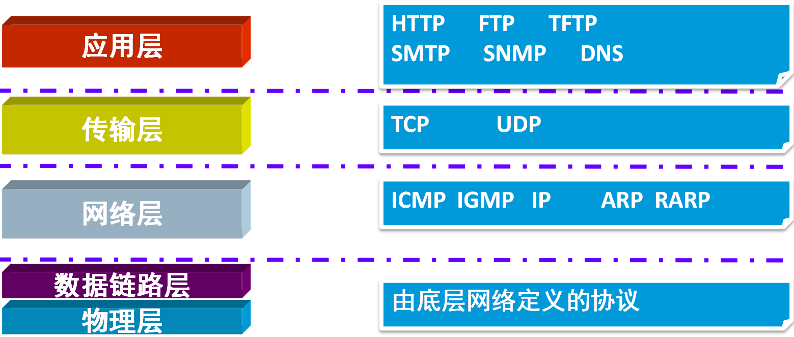

# **6-网络编程**

## **6.1IP地址**

IP地址是唯一表示网络上的每台计算机。由4个8位二进制组成。

IP地址=网络地址+主机地址。

网络地址：标识计算机或网络设备所在的网段。

主机地址：标识特定主机或网路设备。

## **6.2DNS域名解析**

## **6.3网络服务器**

在网络环境下，具有较高计算能力，能够提供用户服务功能的计算机。

## **6.4网络通信协议**

为了在网络中不同的计算机之间进行通信而建立的规则、标准或约定的集合。



## **6.5Socket**

Socket称为“套接字”，是通信链路的端点。是提供给应用程序的接口。位于在java.net包中。

## **6.6基于TCP协议的Socket编程**

用来实现双向安全连接网络通信。进行网络通信时，Socket需要借助数据流来完成数据的传递工作。

### **客户端发送信息给服务器端**

```java
import java.net.*;
import java.io.*;
public class LoginClient {
	public static void main(String[] args) {
		try {
			//建立客户端Socket连接，指定服务器的位置以及端口
			Socket socket=new Socket("localhost",8800);
			//打开输入输出流
			OutputStream os=socket.getOutputStream();
			//发送客户端登录信息，即向输出流写入信息
			String info="用户名：Tom;用户密码：123456";
			os.write(info.getBytes());
		
			//关闭资源
			os.close();
			socket.close();
		} catch (UnknownHostException e) {
			// TODO Auto-generated catch block
			e.printStackTrace();
		} catch (IOException e) {
			// TODO Auto-generated catch block
			e.printStackTrace();
		}
	}
}
```

```java
import java.net.*;
import java.io.*;
public class LoginServer {
	public static void main(String[] args) {
		try {
			//建立一个服务器Socket（ServerSocket）指定端口并开始监听
			ServerSocket serverSocket=new ServerSocket(8800);
			//使用accept()方法等待客户端触发通信
			Socket socket=serverSocket.accept();
			//打开输入输出流
			InputStream is=socket.getInputStream();
	
			//获取客户端信息，即从输入流读取信息
			BufferedReader br=new BufferedReader(new InputStreamReader(is));
			String info=null;
			while(!((info=br.readLine())==null)){
				System.out.println("我是服务器，客户登录信息为："+info);
			}			

			//关闭资源
			br.close();	
			is.close();
			socket.close();
			serverSocket.close();
		} catch (IOException e) {
			// TODO Auto-generated catch block
			e.printStackTrace();
		}
	}
}
```

### **客户端发送对象给服务器端**

```java
import java.io.Serializable;

/*
 *用户类：用户名和密码
 */
public class User implements Serializable {
	private String userName;
	private String pwd;
	
	public User() {
	}
	public User(String userName, String pwd) {
		this.userName = userName;
		this.pwd = pwd;
	}
	public String getUserName() {
		return userName;
	}
	public void setUserName(String userName) {
		this.userName = userName;
	}
	public String getPwd() {
		return pwd;
	}
	public void setPwd(String pwd) {
		this.pwd = pwd;
	}
	
	
}
```

```java
import java.io.BufferedReader;
import java.io.IOException;
import java.io.InputStream;
import java.io.InputStreamReader;
import java.io.ObjectOutputStream;
import java.io.OutputStream;
import java.net.Socket;
import java.net.UnknownHostException;

/*
 * 客户端
 * */
public class LoginClient {
	public static void main(String[] args) {
		try {
			//1、创建一个客户端Socket
			Socket socket=new Socket("localhost",5000);
			//2、通过输出流发送请求
			OutputStream os=socket.getOutputStream();
			User user=new User("TOM","123456");
			ObjectOutputStream oos=new ObjectOutputStream(os);
			oos.writeObject(user);		
			socket.shutdownOutput();
			//通过输入流来接收到服务器给客户端的响应
			InputStream is=socket.getInputStream();
			BufferedReader br=new BufferedReader(new InputStreamReader(is));
			String reply;
			while((reply=br.readLine())!=null){
				System.out.println("服务器的响应："+reply);
			}		
			//3、释放资源
			br.close();
			is.close();
			os.close();
			socket.close();
			
		} catch (UnknownHostException e) {
			e.printStackTrace();
		} catch (IOException e) {
			e.printStackTrace();
		}
	}
}

```

```java
import java.io.BufferedReader;
import java.io.IOException;
import java.io.InputStream;
import java.io.InputStreamReader;
import java.io.ObjectInputStream;
import java.io.OutputStream;
import java.net.ServerSocket;
import java.net.Socket;
/*
 * 服务器端
 * */
public class LoginServer {
	public static void main(String[] args) {
		try {
			//1.创建一个服务器Socket
			ServerSocket serverSocket=new ServerSocket(5000);
			//2.使用accept()等待客户的通信
			Socket socket=serverSocket.accept();
			//3.获得输入流，获得相应的用户请求
			InputStream is=socket.getInputStream();
			ObjectInputStream ois=new ObjectInputStream(is);
			User user=(User)ois.readObject();
			System.out.println("我是服务器，接收到的信息："+user.getUserName()+"--"+user.getPwd());
			
			//给客户端一个响应
			String reply="欢迎登录！";
			byte[] replys=reply.getBytes();
			OutputStream os=socket.getOutputStream();
			os.write(replys);
			
			//4.释放相应资源
			os.close();
			ois.close();
			is.close();
			socket.close();
			serverSocket.close();
		} catch (IOException e) {
			e.printStackTrace();
		} catch (ClassNotFoundException e) {
			e.printStackTrace();
		}
	}
}
```

### **多客户端用户登录**

```java
import java.io.Serializable;
/**
 * 用户类
 * */
public class User implements Serializable{
	private String loginName; //用户名
	private String pwd; //用户密码
	
	public User() {
	}
	public User(String loginName, String pwd) {
		super();
		this.loginName = loginName;
		this.pwd = pwd;
	}
	
	public String getLoginName() {
		return loginName;
	}
	public void setLoginName(String loginName) {
		this.loginName = loginName;
	}
	public String getPwd() {
		return pwd;
	}
	public void setPwd(String pwd) {
		this.pwd = pwd;
	}
}
```

```java
import java.io.IOException;
import java.io.InputStream;
import java.io.ObjectInputStream;
import java.io.OutputStream;
import java.net.Socket;
import java.net.UnknownHostException;

public class LoginThread extends Thread {
	Socket socket=null;
	//每启动一个线程，对应Socket
	public LoginThread(Socket socket){
		this.socket=socket;
	}
	//启动线程，即响应客户请求
	public void run(){
		try {			
			//打开输入输出流
			InputStream is=socket.getInputStream();
			OutputStream os=socket.getOutputStream();
			//反序列化
			ObjectInputStream ois=new ObjectInputStream(is);			
			//获取客户端信息，即从输入流读取信息
			//BufferedReader br=new BufferedReader(new InputStreamReader(ois));
			User user=(User)ois.readObject();
			if(!(user==null)){
				System.out.println("我是服务器，客户登录信息为："+user.getLoginName()+","+user.getPwd());
			}			
			//给客户端一个响应，即向输出流写入信息
			String reply="欢迎你，登录成功!";
			os.write(reply.getBytes());
			//关闭资源
			ois.close();
			os.close();
			is.close();
			socket.close();			
		}  catch (UnknownHostException e) {			
			e.printStackTrace();
		} catch (IOException e) {			
			e.printStackTrace();
		}catch (ClassNotFoundException e) {
			e.printStackTrace();
		}
	}
}
```

```java
import java.net.*;
import java.io.*;
public class LoginClient {
	public static void main(String[] args) {
		try {
			//建立客户端Socket连接，指定服务器的位置以及端口
			Socket socket=new Socket("localhost",8800);
			//打开输入输出流
			OutputStream os=socket.getOutputStream();
			InputStream is=socket.getInputStream();
			//对象序列化
			ObjectOutputStream oos=new ObjectOutputStream(os);
			//发送客户端登录信息，即向输出流写入信息
			User user=new User();
			user.setLoginName("Tom");
			user.setPwd("123456");
			oos.writeObject(user);
			socket.shutdownOutput();
		
			//接收服务器段的响应，即从输入流读取信息
			String reply=null;
			BufferedReader br=new BufferedReader(new InputStreamReader(is));
			while(!((reply=br.readLine())==null)){
				System.out.println("我是客户端，服务器的响应为："+reply);
			}
			//4.关闭资源
			oos.close();
			is.close();		
			os.close();
			socket.close();
		} catch (UnknownHostException e) {			
			e.printStackTrace();
		} catch (IOException e) {			
			e.printStackTrace();
		}
	}
}
```

```java
import java.net.*;
import java.io.*;
public class LoginClient2 {
	public static void main(String[] args) {
		try {
			//建立客户端Socket连接，指定服务器的位置以及端口
			Socket socket=new Socket("localhost",8800);
			//打开输入输出流
			OutputStream os=socket.getOutputStream();
			InputStream is=socket.getInputStream();
			//对象序列化
			ObjectOutputStream oos=new ObjectOutputStream(os);
			//发送客户端登录信息，即向输出流写入信息
			User user=new User();
			user.setLoginName("Kate");
			user.setPwd("654321");
			oos.writeObject(user);
			socket.shutdownOutput();
		
			//接收服务器段的响应，即从输入流读取信息
			String reply=null;
			BufferedReader br=new BufferedReader(new InputStreamReader(is));
			while(!((reply=br.readLine())==null)){
				System.out.println("我是客户端，服务器的响应为："+reply);
			}
			//4.关闭资源
			oos.close();
			is.close();		
			os.close();
			socket.close();
		} catch (UnknownHostException e) {			
			e.printStackTrace();
		} catch (IOException e) {			
			e.printStackTrace();
		}
	}
}
```

```java
import java.net.*;
import java.io.*;
public class LoginServer {
	public static void main(String[] args)   {
		try {
			//建立一个服务器Socket（ServerSocket）指定端口并开始监听
			ServerSocket serverSocket=new ServerSocket(8800);
			//使用accept()方法等待客户端触发通信
			Socket socket=null;
			//监听一直进行中
			while(true){
				socket=serverSocket.accept();
				LoginThread LoginThread=new LoginThread(socket);
				LoginThread.start();
			}
		}  catch (UnknownHostException e) {			
			e.printStackTrace();
		} catch (IOException e) {			
			e.printStackTrace();
		}
	}
}
```

## **6.7基于UDP协议的Socket编程**

### **客户端返送信息给服务器端**

```java
import java.io.IOException;
import java.net.DatagramPacket;
import java.net.DatagramSocket;
import java.net.InetAddress;
import java.net.SocketException;
import java.net.UnknownHostException;

/*
 * 客户端
 * */
public class LoginClient {
	public static void main(String[] args) {
		String info="您好，我想咨询一个问题！";
		byte[] infos=info.getBytes();
		DatagramSocket socket=null;
		try {
			InetAddress ia=InetAddress.getByName("localhost");
			//构建客户端要发送的数据包对象
			DatagramPacket dp=new DatagramPacket(infos, infos.length,ia,5000);
			//客户端需要一个DatagramSocket对象
			socket=new DatagramSocket();
			//通过DatagramSocket对象发送数据包到服务器
			socket.send(dp);
			
			//接收服务器的响应
			byte[] replys=new byte[1024];
			DatagramPacket dp1=new DatagramPacket(replys, replys.length);
			socket.receive(dp1);
			String reply=new String(dp1.getData(),0,dp1.getData().length);
			System.out.println("服务器回应："+reply);
		} catch (UnknownHostException e) {
			e.printStackTrace();
		} catch (SocketException e) {
			e.printStackTrace();
		} catch (IOException e) {
			e.printStackTrace();
		}finally{
			//释放资源
			socket.close();
		}

	}
}
```

```java
import java.io.IOException;
import java.net.DatagramPacket;
import java.net.DatagramSocket;
import java.net.SocketAddress;
import java.net.SocketException;

/**
 * 服务器端
 * */
public class LoginServer {
	public static void main(String[] args) {
		byte[] infos=new byte[1024];
		DatagramPacket dp=new DatagramPacket(infos, infos.length);
		DatagramSocket socket=null;
		try {
			socket=new DatagramSocket(5000);
			//接收客户端的数据包，并将信息封装在dp中
			socket.receive(dp);
			
			//构建一个字符串
			String info=new String(dp.getData(),0,dp.getData().length);
			System.out.println("客户端说："+info);
			
			//给客户端一个响应
			String reply="您好，我在，请说！";
			//客户端的地址
			SocketAddress sa=dp.getSocketAddress();
			//打一个包裹
			DatagramPacket dp1=
					new DatagramPacket(reply.getBytes(),0,reply.getBytes().length,sa);
			//将包裹寄走
			socket.send(dp1);
		} catch (SocketException e) {
			e.printStackTrace();
		} catch (IOException e) {
			e.printStackTrace();
		}finally{
			socket.close();
		}	
	}
}
```

## **练习**

1、模拟用户登录的功能?
2、多客户端用户登录?
3、客户咨询问题?


