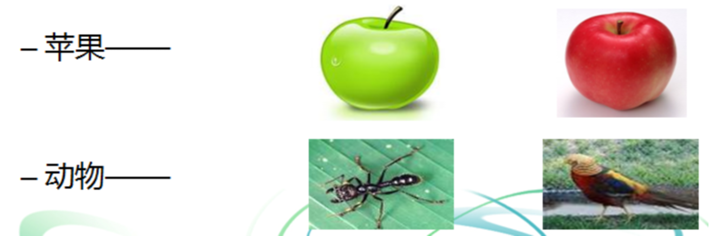
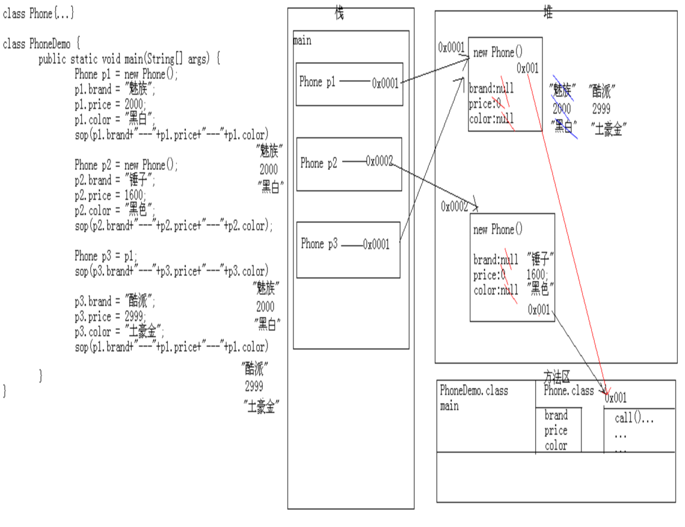
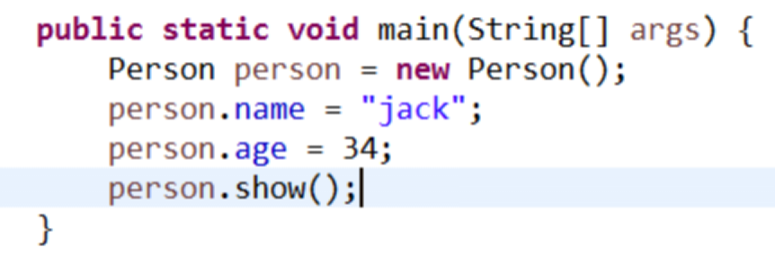
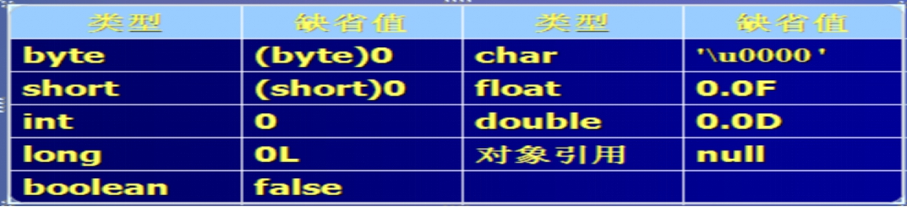

# **1-面向对象**

### **1.1类与对象**

面向对象作为一种思想及编程语言，为软件开发的整个过程：从分析设计到实现，提供了一个完整解决方案。面向对象堪称是软件发展取得的里程碑式的伟大成就。

从80年代后期开始，进行了面向对象分析（OOA）、面向对象设计（OOD）和面向对象程序设计（OOP）等新的系统开发方式模型的研究 。

类与对象的概念：

对象：现实世界中每个事务都是一个对象；即某一个类型事务的实例。

类：对象的抽象称之为类；分类、类型、模型。

万物皆对象。

**对象**用来描述客观事物的一个实体，由一组属性和方法构成。

**对象有2大特征：**

	属性：对象具有的各种特征；
	
	方法：对象可以执行的操作或者具备的功能；

**类和对象的关系**

	类是对象的抽象化。
	
	对象是类的具体化。



PS：每一个苹果我们可以把它看作成一个对象，一个实例。将所有的苹果抽象出来的叫做苹果类。蚂蚁和小鸟都是动物类的一个对象、实例。

```java
//定义School类
public class School {
	//属性或成员变量
	String schoolName;		//学校名称
	int classNumber;		//教室数目
	int labNumber;			//实验室数目
    
    //无参构造器
    public School(){}
    
    //含参构造器
	public School(String schoolName,int classNumber,int labNumber){
        this.schoolName=schoolName;
        this.classNumber=classNumber;
        this.labNumber=labNumber;
    }
	//定义的方法
	public void showCenter(){
		System.out.println(schoolName + "培养学生\n" + "具有：" 
			+ classNumber + "个教室" + labNumber + "个实验室");
	}
}

```

### **1.2创建对象与方法的调用**

如果需要去访问类中的属性和方法，则需要先创建该类的对象。

	调用属性：对象名.属性名;
	
	调用方法：对象名.方法名(参数列表);

```java
public class Person {

	String name;						// 定义属性，人的姓名
	int age;							// 定义属性，人的年龄

	/**
	 * 定义方法，显示人的姓名和年龄
	 */
	public void show() {
		// +和字符串一起使用的时候表示连接而非加分运算
		System.out.println("姓名:" + name + ",年龄:" + age);
	}

	public static void main(String[] args) {
		Person person = new Person();	// 创建人的对象，即某一个成员
		person.name = "jack";			// 初始化人的姓名，通过赋值=将jack赋值给该对象的姓名属性
		person.age = 34;				// 初始化人的年龄，通过赋值=将34赋值给该对象的年龄属性
		person.show();					// 调用show()方法
	}

}
	PS:通过对象调用属性和方法，可以在同一个类的main方法中调用，也可以在不同的类中进行调用。
```


```
public class InitialSchool {
	public static void main(String[] args) {
		School center = new School();
		System.out.println("***初始化成员变量前***");
		center.showCenter();
		center.schoolName = "哈佛大学";		  //给schoolName属性赋值
		center.classNumber = 10;			//给classNumber属性赋值
		center.labNumber = 10;				//给labNumber属性赋值
		System.out.println("\n***初始化成员变量后***");
		center.showCenter();
	}
}
```

### **1.3对象的内存图**






### **1.4成员变量**

#### **属性直接赋值**

```java
public class InitialSchool {
	public static void main(String[] args) {
		//属性赋值
		School mySchool = new School();
		mySchool.schoolName = "哈佛大学";		  //给schoolName属性赋值
		mySchool.classNumber = 10;			//给classNumber属性赋值
		mySchool.labNumber = 10;				//给labNumber属性赋值
		mySchool.showCenter();
	}
}
```

#### 构造器和方法重载

要使用面向对象，首先必须构造对象，并指定它们的初始状态，然后通过对象调用方法。

在java的语言设计种，使用构造函数(constructor)来构造新的实例，一个构造函数是新的方法，它的作用就是构造对象并进行初始化.

（1）构造函数的方法名与类名相同。 

（2）构造函数没有返回类型。 

（3）构造函数的主要作用是完成对类对象的初始化工作。 

（4）构造函数不能由编程人员显式地直接调用(用对象调用，使用new关键字掉用)。 

（5）在创建一个类的新对象的同时，系统会自动调用该类的构造函数为新对象初始化。 

```java
public class Person {

	String name;
	int age;

	//要使用Person的方法，必须先创建Person类的对象，在创建对象的同时对name，age属性进行了初始化
	public Person(String name, int age) {
		super();
		this.name = name;
		this.age = age;
	}

}
```

**构造函数的特点有：**

（1）构造函数和类具有相同的名字。

（2）一个类可以有多个构造函数。

（3）构造函数可以有0个、1个或多个参数。

（4）构造函数没有返回值。

（5）构造函数总是和new关键字一起被调用。

```java
public class Person {

	String name;
	int age;

	public Person() {

	}

	public Person(String name, int age) {
		super();
		this.name = name;
		this.age = age;
	}

	public Person(String name) {
		super();
		this.name = name;
	}

	public Person(int age) {
		super();
		this.age = age;
	}

}
```

**构造函数的作用：**

（1）对象初始化

（2）引入更多的灵活度（成员变量赋值或更复杂的操作）

（3）Java中可以不定义构造函数

     Java中可以不定义构造函数，此时系统会自动为该系统生成一个默认的构造函数。这个构造函数的名字与类名相同，它没有任何形式参数，也不完成任何操作。 为了避免失去控制，一般将构造函数的声明与创建分开处理. 

 


**构造函数重载:**

一个类可以有多个构造函数，如果一个类没有定义一个构造函数，Java 编译器将为这个类自动提供缺省构造函数(即无参的构造函数) ，缺省构造函数将成员变量的值初始化为缺省值，一旦创建了自己的构造函数， Java 编译器将不再自动提供无参的构造函数。

重载构造函数提供了一组创建对象的方式，可以根据需要决定是否带初始参数。根据参数列表决定调用的是哪个重载的构造函数。

构造函数重载：一个类中可以有多个构造函数，它们具有不同的参数列表(参数的类型、个数、顺序)。

```java
public class Person {

	String name;
	int age;

	public Person() {
		System.out.println("无参的构造函数");
	}

	public Person(String name, int age) {
		this.name = name;
		this.age = age;
		System.out.println("带两个参数的构造函数1");
	}

	public Person(int age, String name) {
		this.name = name;
		this.age = age;
		System.out.println("带两个参数的构造函数2");
	}

	public Person(String name) {
		this.name = name;
		System.out.println("参数为name的构造函数");
	}

	public Person(int age) {
		this.age = age;
		System.out.println("参数为age的构造函数");
	}

}
```


#### **构造器赋值**

```java
public class InitialSchool {
	public static void main(String[] args) {
		//构造器赋值
		School mySchool = new School("哈佛大学",10,10);
		mySchool.showCenter();
	}
}
```


#### **成员变量与局部变量区别**

	(1)在类中的位置不同
	
		成员变量：类中方法外
	
		局部变量：方法定义中或者方法声明上
	
	(2)在内存中的位置不同
	
		成员变量：在堆中
	
		局部变量：在栈中
	
	(3)生命周期不同
	
		成员变量：随着对象的创建而存在，随着对象的消失而消失
	
		局部变量：随着方法的调用而存在，随着方法的调用完毕而消失
	
	(4)初始化值不同
	
		成员变量：有默认值
	
		局部变量：没有默认值，必须定义，赋值，然后才能使用

```java
//定义School类
public class School {
	//属性或成员变量
	String schoolName;		//学校名称
	int classNumber;		//教室数目
	int labNumber;			//实验室数目
	
    public void welcome(){
        for(int i=0;i++;i<3){
            //i为局部变量
            System.out.println("欢迎，");
        }
    }
   
	//定义的方法
	public void showCenter(){
		System.out.println(schoolName + "培养学生\n" + "具有：" 
			+ classNumber + "个教室" + labNumber + "个实验室");
	}
}
```


### **1.5成员方法**

**语法**

		修饰符 返回值类型 方法名(参数类型 参数名1,参数类型 参数名2...) {
	
			方法体语句;
	
			return 返回值;
	
		}
	
		修饰符：目前就用 public static。后面再详细讲解其他修饰符
	
		返回值类型：就是功能结果的数据类型
	
		方法名：就是起了一个名字，方便我们调用该方法。
	
		参数类型：就是参数的数据类型
	
		参数名：就是变量
	
		参数分类：
	
			实参：实际参与运算的数据
	
			形参：方法上定义的，用于接收实际参数的变量
	
		方法体语句：就是完成功能的代码块
	
		return：结束方法
	
		返回值：就是功能的结果，由return带给调用者。
	
		返回值类型：结果的数据类型
	
		参数列表：参数的个数及对应的数据类型

#### **无参方法**

```java
//定义榨汁机
public class FruitMachine {
	//无参方法
    public String zhazhi () {
          String juice = "菠萝汁";
          return juice; 
     }   
    public static void main(String[] args){
    	/*调用水果机方法*/
    	FruitMachine myFruitMachine = new FruitMachine();
    	String fruit = "菠萝";
    	String myJuice = myFruitMachine.zhazhi(fruit);
    	System.out.println(myJuice);
    }
}
```


#### **含参方法**

```java
//定义榨汁机
public class FruitMachine {
    //含参方法
    public String zhazhi ( String fruit ) {
          String juice = fruit + "汁";
          return juice; 
     }   
    public static void main(String[] args){
    	/*调用水果机方法*/
    	FruitMachine myFruitMachine = new FruitMachine();
    	String fruit = "菠萝";
    	String myJuice = myFruitMachine.zhazhi(fruit);
    	System.out.println(myJuice);
    }
}
```

####  **数组为参方法**

```java
//学生类
public class Student {
	//属性
	public String name;//姓名
	public int score; //成绩
	
	//方法
	public void showInfo(){
		System.out.println(name+"的成绩是："+score);
	}
}
```

```java

public class StudentManager {
	
	//输出学员信息(数组为入参)
	public void showInfo(Student[] stus){
		for(Student stu:stus){
			stu.showInfo();
		}
	}

	public static void main(String[] args) {
		Student s1=new Student();
		s1.name="吴彦祖";
		s1.score=40;
		Student s2=new Student();
		s2.name="王菲";
		s2.score=90;
		Student s3=new Student();
		s3.name="鹿晗";
		s3.score=43;
        Student[]stus=new Student[3];
		stus[0]=s1;
		stus[1]=s2;
		stus[2]=s3;
        StudentManager ms=new StudentManager();
		ms.showInfo(stus);
	}

}
```

#### **参数传递**

基本数据类型和引用数据类型的区别


### **1.6方法与方法重载**

#### **构造方法重载**

	在同一个类中，构造方法名相同、参数列表不同、与返回值和访问修饰符无关。

```java
//定义School类
public class School {
    //属性或成员变量
    public String schoolName;		//学校名称
    public int classNumber;		//教室数目
    public int labNumber;			//实验室数目
	//构造方法
    public School() {
    }
    public School(String schoolName) {
        this.schoolName = schoolName;
    }
    public School(int classNumber) {
        this.classNumber = classNumber;
    }
    public School(String schoolName, int classNumber) {
        this.schoolName = schoolName;
        this.classNumber = classNumber;
    }

    public School(int classNumber, int labNumber) {
        this.classNumber = classNumber;
        this.labNumber = labNumber;
    }

    public School(String schoolName, int classNumber, int labNumber) {
        this.schoolName = schoolName;
        this.classNumber = classNumber;
        this.labNumber = labNumber;
    }

}
```

	**注意**：默认情况下，系统自行添加无参构造方法（无参构造函数）。

```
//定义School类
public class School {
    //属性或成员变量
    public String schoolName;		//学校名称
    public int classNumber;		//教室数目
    public int labNumber;			//实验室数目
    
    //系统默认生成无参构造函数，不需要手写。
    /*public School() {
    *}
	*/

}
```

#### **一般方法重载**

**同一个类中**多个方法有相同的名字，不同的参数列表（参数的个数，类型，顺序），和返回值类型无关，这种情况称为方法重载。

当重载方法被调用时，Java编译器根据参数的类型、数量、顺序来确定实际调用哪个重载方法的版本。方法重载不考虑方法的返回类型。

```java
public class Calculate {
	public int getSum(int num1,int num2){
		System.out.println("int");
		return num1+num2;
	}
	
	public double getSum(double num1,double num2){
		System.out.println("double");
		return num1+num2;
	}
	
	public double getSum(double num1,double num2,double num3){
		return num1+num2+num3;
	}
	
	public static void main(String[] args) {
		Calculate calc=new Calculate();
		System.out.println(calc.getSum(10, 20));
        System.out.println(calc.getSum(10.1, 20.2));
		System.out.println(calc.getSum(10.1, 20.2,30.3));
	}
}
```


### **1.7this关键字的使用**

**this关键字：与对象关联，表示当前对象（实例），即new出的是哪个对象，代表的就是哪个对象.**

this关键字的作用：可以调用调用类中的构造方法，普通方法，成员变量。this调用构造方法只能是在构造方法中使用，必须是第一行.

```java
public class Person {

	String name;
	int age;

	public Person() {
		this("jack");//如果使用this调用构造方法，必须在第一行，只能在构造方法种调用构造方法。
		System.out.println("无参的构造函数");
		this.show();
	}

	public Person(String name) {
		this(20);
		System.out.println("参数为name的构造函数");
	}

	public Person(int age) {
		System.out.println("参数为age的构造函数");
	}
	
	public void show(){
		//this(); //不可调用。
		System.out.println("show");
	}
	
	public static void main(String[] args) {
		new Person();
	}

}
```


#### **调用属性**

```java
//定义School类
public class School {
	//属性或成员变量
	String schoolName;		//学校名称
	int classNumber;		//教室数目
	int labNumber;			//实验室数目
	
	//使用this调用属性
	public void showCenter(){
		System.out.println(this.schoolName + "培养学生\n" + "具有：" 
			+ this.classNumber + "个教室" + this.labNumber + "个实验室");
	}
}
```

#### **调用方法**

```java
//定义School类
public class School {
	//属性或成员变量
	String schoolName;		//学校名称
	int classNumber;		//教室数目
	int labNumber;			//实验室数目
	
	public void welcome(){
		System.out.println("同学们，大家好！");
	}
	
	public void showCenter(){
		//使用this调用方法
		this.welcome();
		System.out.println(schoolName + "培养学生\n" + "具有：" 
			+ classNumber + "个教室" + labNumber + "个实验室");
	}
}
```

#### **调用构造方法**

	**注意**：如果使用，必须是构造方法中的第一条语句。

```java
//定义School类
public class School {
    //属性或成员变量
    public String schoolName;		//学校名称
    public int classNumber;		//教室数目
    public int labNumber;			//实验室数目

    public School() {
    }

    public School(int classNumber, int labNumber) {
        this.classNumber = classNumber;
        this.labNumber = labNumber;
    }
	//在构造方法中，使用this关键字
    public School(String schoolName, int classNumber, int labNumber) {
        this(classNumber,labNumber);
        this.schoolName = schoolName;

    }
}
```

### **块级作用域**

**变量初始化：**

任何变量在使用前必须被初始化，对于实例变量，Java 编译器会用缺省初始值自动进行初始化。对于局部变量java编译器不会自动初始化，局部变量在使用之前必须赋初值。

 

**方法的参数：**

方法的参数只有两种类型：基本数据类型和引用数据类型。

1.在Java中，参数的传递只有一种方式，就是按值传递（传递自身的拷贝）：

2.对于基本数据类型，传递的值就是变量自身的值

3.对于对象类型，传递的值就是对象的引用（而不是对象自身！）

方法不能改变传递给它的参数的自身

 ```java
例1：基本数据类型作为参数

**public** **class** Test {

 

	**public** **void** change(**int** a){

		a=20;

	}

	

	**public** **static** **void** main(String[] args) {

		**int** a = 10;

		System.**out**.println(a);//10

		Test t = **new** Test();

		

		t.change(a);

		System.**out**.println(a);//10

	}

	

}
 ```

```java
	例2：对象类型作为参数

	当对象作为参数时，在方法中只能改变对象的状态不能改变对象的引用

**public** **class** Test {

 

	**public** **void** change(Person person) {

		person.age = 20;// 试试下面的代码

		// Person person1 = new Person();

		// person1.age = 30;

		// person = person1;

	}

 

	**public** **static** **void** main(String[] args) {

 

		Person person = **new** Person();

 

		person.age = 10;

 

		System.**out**.println(person.age);// 10

 

		Test t = **new** Test();

 

		t.change(person);

 

		System.**out**.println(person.age);//20

 

	}

 

}

 

**class** Person {

 

	**int** age;

 

}
```

```java
	例3：字符串作为传递参数

**public** **class** Test {

 

	**public** **void** change(String str) {

		str = "jack";

	}

 

	**public** **static** **void** main(String[] args) {

		//字符串是一个特殊的引用数据类型。它的传递方式和基本数据类型一致

		String str = "tom";

 

		System.**out**.println(str);

		Test t = **new** Test();

 

		t.change(str);

		System.**out**.println(str);

	}

 

}
```

```java
	例4：数组作为传递参数

**public** **class** Test {

	**public** **void** change(**int**[] arr) {

		// arr[0]=20;//试试看

		**int**[] arr2 = { 30 };

		arr = arr2;

	}

 

	**public** **static** **void** main(String[] args) {


		**int**[] arr = { 10 };

		System.**out**.println(arr[0]);// 10

		Test t = **new** Test();

		t.change(arr);

		System.**out**.println(arr[0]);


	}

}
```