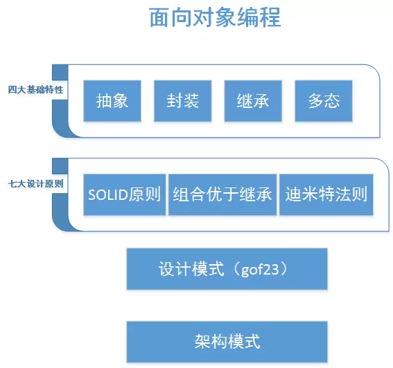

# **8-面向对象编程思想**

###  **8.1简介**

从面向对象编程思想是如何解决软件开发中各种疑难问题的角度，讲述面向对象编程思想的理解，梳理面向对象四大基本特性、七大设计原则和23种设计模式之间的关系。

软件开发中疑难问题：

- 软件复杂庞大；
- 很多软件很难维护；
- 需求不断变更；

软件开发中存在很多很多的问题，上面三个问题只是从程序开发和设计的角度看到的部分问题。要解决上面软件开发的问题，就要求我们编写（设计）的软件具有很好的**可读性**、**可维护性**和**可扩展性**，并且还要保证代码具有**高内聚低耦合**。

###  **8.2四大基本特性**

OOP（面向对象编程）的四大特性：**抽象、封装、多态、继承**。

**抽象**：抽象是提取现实世界中某事物的关键特性，为该事物构建模型的过程。对同一事物中不同的需求下，需要提取的特性可能不一样。得到的抽象模型中一般包含：属性（数据）和操作（行为）。这个抽象模型我们称之为类，通过对类进行实例化得到具体的对象。

**封装**：封装可以使类具有独立性和隔离性，从而保证类的高内聚。只暴露给类外部或者子类必须的属性和操作。类封装的实现依赖类的修饰符（public、protected和private）。

**继承**：继承是对现有类的一种复用机制。一个类如果继承现有的类，则这个类将拥有被继承类的所有非私有特性（属性和操作）。这里指的继承包含类的继承和接口的实现。常见的继承方法有共有继承、私有继承、多重继承、多层继承。

**多态**：多态是中继承的基础上实现的。多态的三个要素：继承、重写和父类引用指向子类的对象。父类引用指向不同的子类对象时，调用相同的方法，呈现出不同的行为；就是类的多态性。多态还可分为编译时多态（静态多态性）和运行时多态（动态多态性）。另外类的函数重载、运算符重载，也可算为多态的特性。

###  **8.3七大设计原则**

在面向对象四大基础特性之上，我们在做面向对象设计时，还需要遵循一些基本设计原则。

- SOLID原则（单一职责原则、开放关闭原则、里氏替换原则、接口隔离原则和依赖倒置原则）；
- 迪米特法则；
- 组合优于继承原则（合成复用原则）；

下面是这七大原则的详细描述：

- **单一责任原则**：*一个类应该只有一个引起变化的原因*。
- **开放关闭原则**：*类应该对扩展开放，对修改关闭*；我们的目标是允许类容易扩展，在不修改现有代码的情况下，就可搭配新的行为。这样的设计具有弹性可以应对改变，可以接受新的功能来应对改变的需求。
- **里氏替换原则**：*所有引用基类的地方必须能透明地使用其子类对象*。只要有父类出现的地方，都可以用子类来替代。
- **接口隔离原则**：*客户端不应该依赖它不需要的接口；一个类对另一个类的依赖应该建立在最小的接口上*；
- **赖倒置原则（Dependency Inversion Principle）**：*要依赖抽象，不要依赖具体类依*。
- **迪米特法则**：*又叫最少知识原则，只和你的密友谈话*。
- **组合优于继承原则**：*多用组合，少用继承*；使用组合建立系统具有很大的弹性，不仅可将算法族封装成类，更可以“在运行时动态地改变行为”，只要组合的行为对象符合正确的接口标准即可。

另外还有如下几个常用的原则：

- **好莱坞原则**：别调用（打电话给）我们，我们会调用（打电话给）你。
- **封装变化**：找出应用中可能需要变化之处，把它们独立出来，不要和那些不需要变化的代码混在一起。
- **针对接口编程，不要对实现编程**；针对接口编程真正的意思是针对超类型（supertype）编程，这样可以在运行时才指定具体实现的对象。
- **为了交互对象之间的松耦合设计而努力**：松耦合的设计之所以能让我们建立有弹性的OO系统，能够应付变化，是因为对象之间的互相依赖降到了最低。

###  **8.4.24种设计模式**

在遵循上面这些面向对象设计原则的基础上，总结出一些解决不同问题场景的通用设计模式。

- 创建型模式

1. 简单工厂模式
2. 工厂模式
3. 抽象工厂模式
4. 单例模式
5. 原型模式
6. 创建者模式

- 结构型模式

1. 组合模式
2. 装饰者模式
3. 外观模式
4. 适配器模式
5. 代理模式
6. 享元模式
7. 桥接模式

- 行为型模式

1. 观察者模式
2. 策略模式
3. 状态模式
4. 中介模式
5. 模版方法
6. 命令模式
7. 备忘录模式
8. 访问者模式
9. 解释器模式
10. 迭代器模式
11. 职责链模式