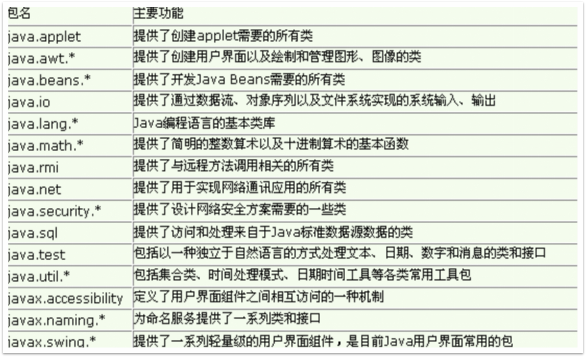
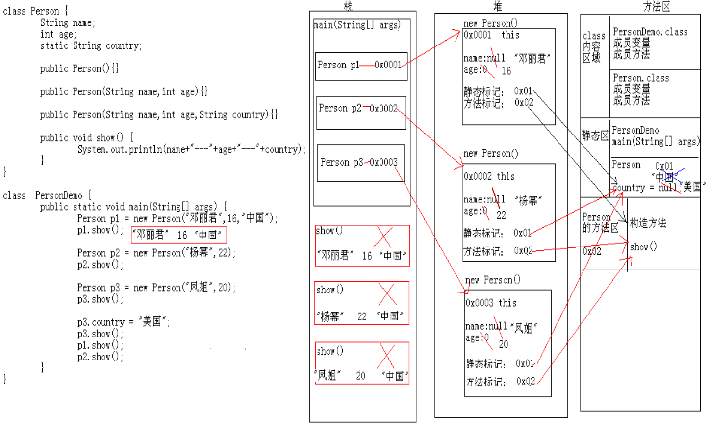

# **2-封装**

### **2.1封装定义**
a)封装是对象的一种隐藏技术，其目的是将对象中的属性和方法组织起来。同时隐藏不想暴露的属性和方法及实现细节。 

b)用户或其它对象不能看到也无法修改其实现。只能通过接口去调用对象的方法，达到互相通信的目的。 

c)封闭的目的在于将设计者与使用者分开。使用者不必知道实现的细节，只需用设计者提供的方法来访问该对象。

d)封装的手段是通过**private****关键子来修饰需要封装的属性和方法**

```java
//定义School类
public class School {
    //属性的访问修饰符改成private
    private String schoolName;		//学校名称
    private int classNumber;		//教室数目
    private int labNumber;			//实验室数目
	
    //定义setter/getter方法
    public String getSchoolName() {
        return schoolName;
    }

    public void setSchoolName(String schoolName) {
        this.schoolName = schoolName;
    }

    public int getClassNumber() {
        return classNumber;
    }

    public void setClassNumber(int classNumber) {
        this.classNumber = classNumber;
    }

    public int getLabNumber() {
        return labNumber;
    }

    public void setLabNumber(int labNumber) {
        this.labNumber = labNumber;
    }

    //定义的方法
    public void showInfo(){
        System.out.println(schoolName + "培养学生\n" + "具有："
                + classNumber + "个教室" + labNumber + "个实验室");
    }

    public static void main(String[] args) {
        School school=new School();
        school.setClassNumber(30);
        school.setLabNumber(10);
        school.setSchoolName("清华大学");
        school.showInfo();
    }
}
```

  ### **2.2包的定义和使用和导入**

包名由小写字母组成，不能以圆点开头或结尾。

包名之前最好加上唯一的前缀，通常使用组织倒置的网络域名。

包名后续部分依不同机构内部的规范不同而不同。

一个类同时引用了两个来自不同包的同名类
必须通过完整类名来区分
每个包都是独立的，顶层包不会包含子包的类
package和import的顺序是固定的
package必须位于第一行（忽略注释行）
只允许有一个package语句
其次是import
接着是类的声明

```java
//通过package定义包
package com.web;

//通过import导入包
import java.util.*;

//定义School类
public class School {
}
```

### **2.3访问权限控制**

#### **属性的隐藏**

属性的私有化，同时定义setter/getter方法访问属性。

#### **包机制**

包本质也是一种封装。

#### **类的访问修饰符**

public修饰符：公有访问级别

```java
//public 修饰class,该类可以被一切访问
public class School {
}
```

默认修饰符：包级私有访问级别

```java
//默认修饰，该类只能被本包访问
class School {
}
```

#### **类成员的访问修饰符**

|                 | 本类 |  本包  |  子包  |  其他  |
| :-------------: | :--: | :----: | :----: | :----: |
|     private     | 可以 | 不可以 | 不可以 | 不可以 |
| 默认（default） | 可以 |  可以  | 不可以 | 不可以 |
|    protected    | 可以 |  可以  |  可以  | 不可以 |
|     public      | 可以 |  可以  |  可以  |  可以  |



  ### 2.4static关键字**

#### **修饰成员变量**

静态变量，可以直接通过类名访问。

```java
/*
 * 一群选民进行投票，每个选民只允许投一次票，并且当投票总数达到100时，就停止投票
 * Voter：选民类
 * */
public class Voter {
	private static int count; // 所有选民都会改变同一个数据：投票次数
	private static final int MAX_COUNT = 100; // 最大投票数100适用于所有选民
	private String name;// 投票人姓名

	public Voter(String name) {
		this.name = name;
	}

	//投票
	public void voteFor() {
		if(count==MAX_COUNT){
			System.out.println("投票活动已经结束");
			return;
		}else{
			count++;
			System.out.println(this.name + "：感谢您投票！");
		}
	}
}

```

```java
public class TestVoter {
	public static void main(String[] args) {
		Voter fan=new Voter("范冰冰");
		Voter liu=new Voter("刘亦菲");
		Voter wang=new Voter("王祖蓝");
		
		fan.voteFor();
		liu.voteFor();
		wang.voteFor();
		
		for(int i=1;i<=97;i++){
			Voter v=new Voter("v"+i);
			v.voteFor();
		}
		
		Voter v101=new Voter("v101");
		v101.voteFor();
	}
}
```


 static变量的作用：
（1）能被类的所有实例共享，可作为实例之间进行交流的共享数据
（2）如果类的所有实例都包含一个相同的常量属性，可把这个属性定义为静态常量类型，从而节省内存空间.

```java
public class StaticTest {
         static int num;
         public static void main(String[] args) {
                 num++;
                 StaticTest st1=new StaticTest();
                 st1.num++;
                 StaticTest st2=new StaticTest();
                 st2.num++;
                 StaticTest.num++;
                 System.out.println(num); 
        }
}

```

#### **修饰成员变量的内存图**



```java
/*
	定义一个人类
	
	姓名和年龄都是变化的，这个我能接收，因为每个人的姓名和年龄是不同的。
	但是，我们现在选取的几个人都是中国人，他们的国籍是一样的。
	一样的国籍，我每次创建对象，在堆内存都要开辟这样的空间，
	我就觉得有点浪费了。怎么办呢? 
		针对多个对象有共同的这样的成员变量值的时候，
		Java就提高了一个关键字来修饰：static。
*/
class Person {
	//姓名
	String name;
	//年龄
	int age;
	//国籍
	//String country;
	static String country;
	
	public Person(){}
	
	public Person(String name,int age) {
		this.name = name;
		this.age = age;
	}
	
	public Person(String name,int age,String country) {
		this.name = name;
		this.age = age;
		this.country = country;
	}
	
	public void show() {
		System.out.println("姓名："+name+",年龄："+age+",国籍："+country);
	}
}

class PersonDemo {
	public static void main(String[] args) {
		//创建对象1
		Person p1 = new Person("邓丽君",16,"中国");
		p1.show();
		
		//创建对象2
		Person p2 = new Person("杨幂",22);
		p2.show();
		
		//创建对象3
		Person p3 = new Person("凤姐",20);
		p3.show();
		
		p3.country = "美国";
		p3.show();
		
		p1.show();
		p2.show();
	}
}
```


#### **修饰成员方法**

-   随着类的加载而加载，比如main方法。
-    优先于对象存在，被类的所有对象共享
-   可以通过类名调用，其实它本身也可以通过对象名调用。推荐使用类名调用。
-   静态方法只能访问静态变量和静态方法。

```java
class Student {
	//非静态变量
	int num = 10;
	
	//静态变量
	static int num2 = 20;
}

class StudentDemo {
	public static void main(String[] args) {
		Student s = new Student();
		System.out.println(s.num);
		
		System.out.println(Student.num2);
		System.out.println(s.num2);
	}
}
```

```java
/*
	static关键字注意事项
		A:在静态方法中是没有this关键字的
			如何理解呢?
				静态是随着类的加载而加载，this是随着对象的创建而存在。
				静态比对象先存在。
		B:静态方法只能访问静态的成员变量和静态的成员方法
				静态方法：
					成员变量：只能访问静态变量
					成员方法：只能访问静态成员方法
				非静态方法：
					成员变量：可以是静态的，也可以是非静态的
					成员方法：可是是静态的成员方法，也可以是非静态的成员方法。
			简单记：
				静态只能访问静态。
*/
class Teacher {
	public int num = 10;
	public static int num2 = 20;
	
	public void show() {
		System.out.println(num); //隐含的告诉你访问的是成员变量
		System.out.println(this.num); //明确的告诉你访问的是成员变量
		System.out.println(num2);
		
		//function();
		//function2();
	}
	
	public static void method() {
		//无法从静态上下文中引用非静态 变量 num
		//System.out.println(num);
		System.out.println(num2);
		
		//无法从静态上下文中引用非静态 方法 function()
		//function();
		function2();
	}
	
	public void function() {
	
	}
	
	public static void function2() {
	
	}
}

class TeacherDemo {
	public static void main(String[] args) {
		//创建对象
		Teacher t = new Teacher();
		t.show();
		System.out.println("------------");
		t.method();
	}
}
```


```java
/*
 * 一群选民进行投票，每个选民只允许投一次票，并且当投票总数达到100时，就停止投票
 * Voter：选民类
 * */
public class Voter {
	private static int count; // 所有选民都会改变同一个数据：投票次数
	private static final int MAX_COUNT = 100; // 最大投票数100适用于所有选民
	private String name;// 投票人姓名

	public Voter(String name) {
		this.name = name;
	}

	//投票
	public void voteFor() {
		if(count==MAX_COUNT){
			System.out.println("投票活动已经结束");
			return;
		}else{
			count++;
			System.out.println(this.name + "：感谢您投票！");
		}
	}
	
	//打印投票结果;static修饰方法
	public static void printResult(){
		System.out.println("选民投票总数为："+count);
		//无法访问实例变量
		//System.out.println(name);
	}
	
}
```

```java
public class TestVoter {
	public static void main(String[] args) {
		Voter fan=new Voter("范冰冰");
		Voter liu=new Voter("刘亦菲");
		Voter wang=new Voter("王祖蓝");
		
		fan.voteFor();
		liu.voteFor();
		wang.voteFor();
		
		for(int i=1;i<=97;i++){
			Voter v=new Voter("v"+i);
			v.voteFor();
		}
		
		Voter v101=new Voter("v101");
		v101.voteFor();
		
		//通过类名调用静态方法,不需要new
		Voter.printResult();
	}
}
```


在实例方法里不可以定义static变量 。

```java
public class Dog {
       private String name = "泰迪"; // 昵称
      	
       public void play(int n) {
              static int age=5;	//是错误的		
              System.out.println(name+" "+age+" ");
       }	
       public static void main(String[] args) {
              Dog d=new Dog();
              d.play(5); 
      }
} 

```

#### **修饰代码块**

静态代码块，当Java虚拟机加载类时，就会执行该代码块。如果有多个静态块，按顺序加载。
每个静态代码块只会被执行一次。

```java
public class StaticTest {
         static int num=100;
         static{
                num+=100;
               System.out.println(num);
         }
         static{
                num+=100;
               System.out.println(num); 
        }
```

```java
StaticTest st1=new StaticTest();
StaticTest st2=new StaticTest();
System.out.println(StaticTest.num);
```

### **2.5代码块**

```java
/*
	代码块：在Java中，使用{}括起来的代码被称为代码块。
	根据其位置和声明的不同，可以分为
		局部代码块:局部位置,用于限定变量的生命周期。
		构造代码块:在类中的成员位置,用{}括起来的代码。每次调用构造方法执行前，都会先执行构造代码块。
			作用：可以把多个构造方法中的共同代码放到一起，对对象进行初始化。
		静态代码块:在类中的成员位置,用{}括起来的代码,只不过它用static修饰了。
			作用：一般是对类进行初始化。
			
	面试题?
		静态代码块,构造代码块,构造方法的执行顺序?
		静态代码块 -- 构造代码块 -- 构造方法
		静态代码块：只执行一次
		构造代码块：每次调用构造方法都执行
*/
class Code {
	static {
		int a = 1000;
		System.out.println(a);
	}

	//构造代码块
	{
		int x = 100;
		System.out.println(x);
	}
	
	//构造方法
	public Code(){
		System.out.println("code");
	}
	
	//构造方法
	public Code(int a){
		System.out.println("code");
	}
	
	//构造代码块
	{
		int y = 200;
		System.out.println(y);
	}
	
	//静态代码块
	static {
		int b = 2000;
		System.out.println(b);
	}
}

class CodeDemo {
	public static void main(String[] args) {
		//局部代码块
		{
			int x = 10;
			System.out.println(x);
		}
		//找不到符号
		//System.out.println(x);
		{
			int y = 20;
			System.out.println(y);
		}
		System.out.println("---------------");
		
		Code c = new Code();	
		System.out.println("---------------");
		Code c2 = new Code();
		System.out.println("---------------");
		Code c3 = new Code(1);
	}
}
```

```java
/*
	写程序的执行结果。	
*/
class Student {
	static {
		System.out.println("Student 静态代码块");
	}
	
	{
		System.out.println("Student 构造代码块");
	}
	
	public Student() {
		System.out.println("Student 构造方法");
	}
}

class StudentDemo {
	static {
		System.out.println(“StudentDemo中的静态代码块");
	}
	
	public static void main(String[] args) {
		System.out.println("我是main方法");
		
		Student s1 = new Student();
		Student s2 = new Student();
	}
}                           
//  StudentDemo中的静态代码块
	我是main方法
	Student 静态代码块
	Student 构造代码块
	Student 构造方法
	Student 构造代码块
	Student 构造方法
```

