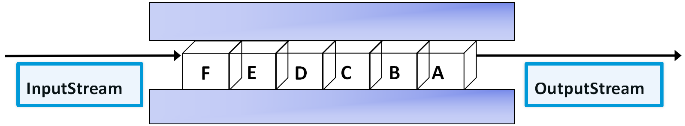
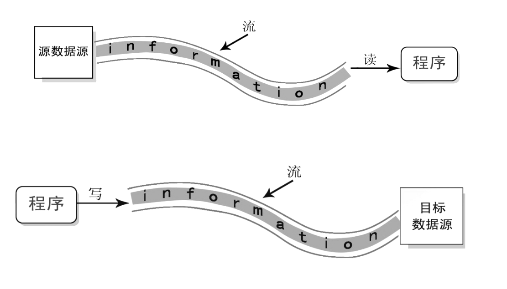

# **4-流的处理**

## **4.1File类**

相关记录或放在一起的数据的集合。File类访问文件属性。

**常用方法**

| 方法名称                 | 说明                                                 |
| :----------------------- | :--------------------------------------------------- |
| boolean exists()         | 判断文件或目录是否存在                               |
| boolean isFile()         | 判断是否是文件                                       |
| boolean isDirectory()    | 判断是否是目录                                       |
| String getPath()         | 返回对象文件的相对路径                               |
| String getAbsolutePath() | 返回对象文件的绝对路径                               |
| String getName()         | 返回对象表示文件或者目录的名称                       |
| boolean delete()         | 删除对象表示的文件或者目录                           |
| boolean createNewFile()  | 创建空文件，不创建文件夹                             |
| long length()            | 返回文件的长度，单位是字节。若文件不存在，则返回为0L |

```java
//对文件的增删查操作
import  java.io.*;
public class FileMethods {
	public static void main(String[] args) {
	    FileMethods fm=new FileMethods();
	    File file=new File("D:\\myDoc\\test.txt");
	    //fm.create(file);
	    fm.showFileInfo(file);
	    //fm.delete(file); 
   }
   /**
    * 创建文件的方法
    * @param file 文件对象
    */
   public void create(File file){
	   if(!file.exists()){
		   try {
			   file.createNewFile();
			   System.out.println("文件已创建！");
		   } catch (IOException e) {
			   e.printStackTrace();
		   }
	   }
   }
   /**
    * 删除文件
    * @param file 文件对象
    */
   public void delete(File file){
	   if(file.exists()){
		   file.delete();
		   System.out.println("文件已删除！");
	   }
   }
   
   /**
    * 显示文件信息
    * @param file 文件对象
    */
   public void showFileInfo(File file){
	   if(file.exists()){ //判断文件是否存在
		   if(file.isFile()){ //如果是文件
			   System.out.println("名称:" +  file .getName());
		       System.out.println("相对路径: " + file.getPath());
		       System.out.println("绝对路径: " + file.getAbsolutePath());   
		       System.out.println("文件大小:" + file.length()+ " 字节");   
		   } 
		   if(file.isDirectory()){
			   System.out.println("此文件是目录");
		   }
	   }else
		   System.out.println("文件不存在");
   }
}
```


## **4.2IO流**

通过流读写文件。

流是一组有序的数据序列。

以先进先出方式发送信息的通道。



**数据源、流和程序三者的关系**



**Java流的分类**

按照流向区分

​	输入流 InputStream\ Reader

​	输出流 OutputStream\ Writer

按照处理数据单位区分

​	字节流 InputStream/ OutputStream

​	字符流 Reader/ Writer

### **FileInputStream**

```java
import java.io.*;
public class FileInputStreamTest {
	public static void main(String[] args){
		FileInputStream fis=null;
		//创建流对象
		try {
			fis=new FileInputStream("d:\\myDoc\\hello.txt");
			int data;
			System.out.println("可读取的字节数："+fis.available());
			System.out.print("文件内容为：");
			//循环读数据 read()方法是从输入流读取1个8位的字节，把它转化为0-255之间的整数返回。将返回的整数转换为字符
			while((data=fis.read())!=-1){
				System.out.print((char)data);
			}
		} catch (FileNotFoundException e) {
			e.printStackTrace();
		} catch (IOException e) {
			e.printStackTrace();
		}finally{
			try {
				//关闭流对象
				fis.close();
			} catch (IOException e) {
				e.printStackTrace();
			}
		}
	}
}
```

### **FileOutputStream**

```java
import java.io.*;
public class FileOutputStreamTest {
	public static void main(String[] args){
		FileOutputStream fos=null;
		try {
			fos=new FileOutputStream("d:\\myDoc\\hello.txt",true);
			String str="好好学习Java";
			byte[] words=str.getBytes();
			fos.write(words,0,words.length);
			System.out.println("hello文件已更新");
		} catch (FileNotFoundException e) {
			e.printStackTrace();
		} catch (IOException e) {
			System.out.println("文件更新时出错！");
			e.printStackTrace();
		}finally{
			try {
				if(fos!=null){
					fos.close();
				}
			} catch (IOException e) {
				e.printStackTrace();
			}
		}
	}
}
```

### **使用FileReader读取文本文件**

```java
import java.io.FileNotFoundException;
import java.io.FileReader;
import java.io.IOException;
import java.io.Reader;

public class FileReaderTest {

	/**
	 * 使用FileReader读取文本文件
	 */
	public static void main(String[] args) {
		//创建 FileReader对象
		Reader fr=null;
		StringBuffer sbf=null;
		try {
			fr = new FileReader("C:\\myDoc\\简介.txt");
			char ch[]=new char[1024];  //创建字符数组作为中转站
			sbf=new StringBuffer();
			int length=-1; 
	        //将字符读入数组,循环读取并追加字符
	        while ((length=fr.read(ch))!= -1) { 
	            sbf.append(ch);   //追加到字符串
	        }
		} catch (FileNotFoundException e) {
			e.printStackTrace();
		} catch (IOException e) {
			e.printStackTrace();
   	    } finally{
			try {
				if(fr!=null)
					fr.close();
			} catch (IOException e) {
				e.printStackTrace();
			}
		}
		System.out.println(sbf.toString());
	}

}
```

### **使用BufferedReader和FileReader读取文本文件**

```java
import  java.io.*;
public class BufferedReaderTest {

	/**
	 * @param args
	 */
	public static void main(String[] args) {
		FileReader fr=null;
		BufferedReader br=null;
		try {
	        //创建一个FileReader对象
	        fr=new FileReader("C:\\myDoc\\hello.txt"); 
	        //创建一个BufferedReader 对象
	        br=new BufferedReader(fr); 
	        //读取一行数据 
	        String line=null;
	        while((line=br.readLine())!=null){ 
	            System.out.println(line);
	        }
	    }catch(IOException e){
	            System.out.println("文件不存在!");
	    }finally{
	    	 try {
	    	     //关闭 流
	    		if(br!=null)
	    			br.close();
	    		if(fr!=null)
	    			fr.close(); 
	 	     } catch (IOException e) {
				e.printStackTrace();
			 }
	    }
	}
}

```

### **解决中文乱码**

```java
import java.io.*;

/*
 * 当hello.txt编码格式是ANSI时，程序可以正常读取数据，（InputStreamReader fr=new InputStreamReader(fis,"gbk"); ）；
 * 当hello.txt编码格式改为UTF-8时，代码改为InputStreamReader fr=new InputStreamReader(fis,"UTF-8"); 时才可以正常读取数据。
 * */

public class BufferedReaderTest {
	public static void main(String[] args) {
		InputStreamReader fr = null;
		BufferedReader br = null;
		try {
			FileInputStream fis = new FileInputStream("c:\\myDoc\\hello.txt");
			// 指定编码格式
			fr = new InputStreamReader(fis, "utf-8");
			br = new BufferedReader(fr);
			String line = null;
			while ((line = br.readLine()) != null) {
				System.out.println(line);
			}

		} catch (IOException e) {
			try {
				br.close();
				fr.close();
			} catch (IOException e1) {
				// TODO Auto-generated catch block
				e1.printStackTrace();
			}
			System.out.println(e.getMessage());
		}
	}

}

```

### **使用FileWriter类向文本文件写数据**

```java
import java.io.BufferedReader;
import java.io.BufferedWriter;
import java.io.FileReader;
import java.io.FileWriter;
import java.io.IOException;
import java.io.Writer;
public class FileWriterTest {
	/**
	 * 使用FileWriter类向文本文件写数据
	 */
	public static void main(String[] args) {
		Writer fw=null;
		try {
			  //创建一个FileWriter对象
			  fw=new FileWriter("C:\\myDoc\\简介.txt"); 
			  //fw=new FileWriter("C:\\myDoc\\简介.txt",true); 
			  //写入信息
			  fw.write("我热爱编程！"); 	       
			  fw.flush();  //刷新缓冲区	 
		}catch(IOException e){
			  System.out.println("文件不存在!");
		}finally{
			try {
				if(fw!=null)
					fw.close();  //关闭流
	 	     } catch (IOException e) {
				e.printStackTrace();
			 }
		}
	}
}
```

### **使用FileWriter类和BufferedWriter类写文本文件**

```java
import  java.io.*;
public class BufferedWriterTest {
	public static void main(String[] args) {
		FileWriter fw=null;
		BufferedWriter bw=null;
		FileReader fr=null;
		BufferedReader br=null;
		try {
	       //创建一个FileWriter 对象
	       fw=new FileWriter("C:\\myDoc\\hello.txt"); 
	       //创建一个BufferedWriter 对象
	       bw=new BufferedWriter(fw); 
	       bw.write("大家好！"); 
	       bw.write("我正在学习BufferedWriter。"); 
	       bw.newLine(); 
	       bw.write("请多多指教！"); 
	       bw.newLine();		       
	       bw.flush();
	       		       
	       //读取文件内容
	        fr=new FileReader("C:\\myDoc\\hello.txt"); 
	        br=new BufferedReader(fr); 
	        String line=null;
	        while((line=br.readLine())!=null){ 
	            System.out.println(line);
	        }
	      
	        fr.close(); 
	       }catch(IOException e){
	            System.out.println("文件不存在!");
	       }finally{
	    	   try{
	    		   if(fw!=null)
	    			   fw.close();
	    		   if(br!=null)
	    			   br.close();
	    		   if(fr!=null)
	    			   fr.close();  
	    	   }catch(IOException ex){
		            ex.printStackTrace();
		       }
	       }
	}
}
```

### **二进制文件的读写**

```java
import java.io.*;
//二进制文件的读写
public class ReadAndWriteBinaryFile {
	public static void main(String[] args){
		DataInputStream dis=null;
		DataOutputStream dos=null;
		FileInputStream fis=null;
		FileOutputStream fos=null;
		try {
			//创建输入流对象
			fis=new FileInputStream("c:\\myDoc\\star.jpg");
			dis=new DataInputStream(fis);
			//创建输出流对象
			fos=new FileOutputStream("c:\\myDoc\\new.jpg");
			dos=new DataOutputStream(fos);
			//读取文件并写入文件
			int temp;
			while((temp=dis.read())!=-1){
				dos.write(temp);
			}
		} catch (FileNotFoundException e) {
			e.printStackTrace();
		} catch (IOException e) {
			e.printStackTrace();
		}finally{
			
			try {
				if(dis!=null){
					dis.close();
				}
				if(dos!=null){
					dos.close();
				}
				if(fis!=null){
					fis.close();
				}
				if(fos!=null){
					fos.close();
				}
			} catch (IOException e) {
				e.printStackTrace();
			}			
		}
		
	}
}
```

### **使用序列化和反序列化**

```java
public class Student implements java.io.Serializable  {	
	private String name;
	private int age;
	private String gender;
	private transient String password;
	public Student(String name, int age,String gender){
		this.name=name;
		this.age=age;
		this.gender=gender;   
	}
	
	public Student(String name, int age,String gender,String password){
		this.name=name;
		this.age=age;
		this.gender=gender; 
		this.password=password;
	}
	public String getName() {
		return name;
	}
	public void setName(String name) {
		this.name = name;
	}
	public int getAge() {
		return age;
	}
	public void setAge(int age) {
		this.age = age;
	}
	public String getGender() {
		return gender;
	}
	public void setGender(String gender) {
		this.gender = gender;
	}
	
	public String getPassword() {
		return password;
	}
	public void setPassword(String password) {
		this.password = password;
	}
}
```

```java
import java.io.*;
public class SerializableObj {
	public static void main(String[] args) throws IOException, ClassNotFoundException {
		ObjectOutputStream oos = null;
		ObjectInputStream ois=null;
		try {
			// 创建ObjectOutputStream输出流
			oos = new ObjectOutputStream(new FileOutputStream(
					"c:\\myDoc\\stu.txt"));
			Student stu = new Student("James Gosphy", 30, "女","aaaa");
			System.out.println("姓名为："+stu.getName());
			System.out.println("年龄为："+stu.getAge());
			System.out.println("性别为："+stu.getGender());
			System.out.println("密码为："+stu.getPassword());
			// 对象序列化，写入输出流
			oos.writeObject(stu);
			//创建ObjectInputStream输入流
			ois=new ObjectInputStream(new FileInputStream("c:\\myDoc\\stu.txt"));
			//反序列化，强转类型
			Student stu1=(Student)ois.readObject();
			//输出生成后对象信息
			System.out.println("姓名为："+stu1.getName());
			System.out.println("年龄为："+stu1.getAge());
			System.out.println("性别为："+stu1.getGender());
			System.out.println("密码为："+stu1.getPassword());
		} catch (IOException ex) {
			ex.printStackTrace();
		} finally {
			try {
				if (oos != null) {
					oos.close();
				}
				if (ois != null) {
					ois.close();
				}
			}catch (IOException ex) {
				ex.printStackTrace();
			}         			
		}
	}
}
```
### **练习**

#### **1、使用FileInputStream和FileOutputStream实现文件的复制？**

```java
import java.io.FileInputStream;
import java.io.FileNotFoundException;
import java.io.FileOutputStream;
import java.io.IOException;

public class InputAndOutputFile {
	public static void main(String[] args) {
		FileInputStream fis=null;
		FileOutputStream fos=null;
		try {
			//1、创建输入流对,负责读取D:/ a.txt文件
			fis = new FileInputStream("D:/a.txt");
			//2、创建输出流对象
			fos = new FileOutputStream("C:/myFile/a1.txt",true);
			//3、创建中转站数组,存放每次读取的内容
			byte[] words=new byte[1024];
			//4、通过循环实现文件读取
			int len = -1;
			while((len = fis.read(words))!=-1){
				fos.write(words, 0, len);
			}
			fos.flush();
			System.out.println("复制完成，请查看文件！");		
		} catch (FileNotFoundException e) {
			e.printStackTrace();
		} catch (IOException e) {
			e.printStackTrace();
		}finally{
			//5、关闭流
	        try {
	        	if(fos!=null)
	        		fos.close();
	        	if(fis!=null)
	        		fis.close();
			} catch (IOException e) {
				e.printStackTrace();
			}	
		}
	}
}
```

#### **2、如何替换文本文件内容？**

```java
import java.io.BufferedReader;
import java.io.BufferedWriter;
import java.io.File;
import java.io.FileInputStream;
import java.io.FileOutputStream;
import java.io.FileReader;
import java.io.FileWriter;
import java.io.IOException;
import java.io.InputStreamReader;
import java.nio.charset.Charset;
import org.omg.CORBA.Environment;

public class ReaderAndWriterFile {

	 public void replaceFile(String file1,String file2) {   
		   BufferedReader reader = null;
           BufferedWriter writer = null;
		 try {
			//创建 FileReader对象和FileWriter对象.
			 //中文内容编码问题
			//FileReader fr  = new FileReader(file1);  
			 FileInputStream fis=new FileInputStream(file1);
			InputStreamReader isr=new InputStreamReader(fis,"utf-8");
			
			FileWriter fw = new FileWriter(file2);
            //创建 输入、输入出流对象.
            reader = new BufferedReader(isr);
            writer = new BufferedWriter(fw);
            String line = null;
            StringBuffer sbf=new StringBuffer();  
            //循环读取并追加字符
            while ((line = reader.readLine()) != null) {
                sbf.append(line);  
            }
            System.out.println("替换前："+sbf);
            /*替换内容*/
            String newString=sbf.toString().replace("{name}", "欧欧");
            newString = newString.replace("{type}", "狗狗");
            newString = newString.replace("{master}", "李伟");
            System.out.println("替换后："+newString);
            writer.write(newString);  //写入文件       
        } catch (IOException e) {
            e.printStackTrace();
        }finally{
        	//关闭 reader 和 writer.
			try {
				if(reader!=null)
					reader.close();
				if(writer!=null)
					writer.close();
			} catch (IOException e) {
				e.printStackTrace();
			}
		}
	}
	public static void main(String[] args) {
		ReaderAndWriterFile obj = new ReaderAndWriterFile();
        obj.replaceFile("c:\\pet.template", "C:\\myDoc\\pet.txt");   
        System.out.println(Charset.defaultCharset());
	}
}
```

#### **3、如何复制图片？**

```java
import java.io.*;
//二进制文件的读写
public class ReadAndWriteBinaryFile {
	public static void main(String[] args){
		DataInputStream dis=null;
		DataOutputStream dos=null;
		FileInputStream fis=null;
		FileOutputStream fos=null;	
		try {
			//创建输入流对象
			fis=new FileInputStream("c:\\myDoc\\star.jpg");
			dis=new DataInputStream(fis);
			//创建输出流对象
			fos=new FileOutputStream("c:\\myDoc\\new.jpg");
			dos=new DataOutputStream(fos);
			//读取文件并写入文件
			int temp;
			while((temp=dis.read())!=-1){
				dos.write(temp);
			}
		} catch (FileNotFoundException e) {
			e.printStackTrace();
		} catch (IOException e) {
			e.printStackTrace();
		}finally{
			try {
				if(dis!=null){
					dis.close();
				}
				if(dos!=null){
					dos.close();
				}
				if(fis!=null){
					fis.close();
				}
				if(fos!=null){
					fos.close();
				}
			} catch (IOException e) {
				e.printStackTrace();
			}
			
		}
		
	}
}
```

#### **4、如何对学生对象进行序列化和反序列化？**

```java
答案见上述
```


