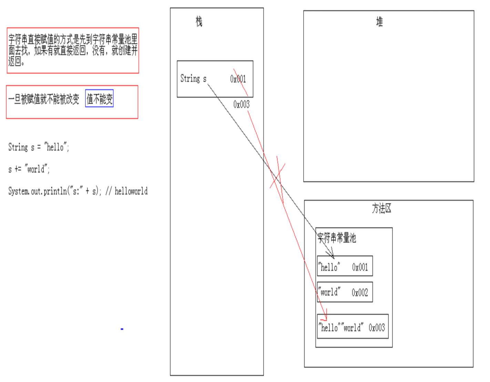

# **3-实用类**

## **3.1枚举**

枚举指由一组固定的常量组成的类型。

```java
//一周七天的枚举
public enum Week {
	MON,TUE,WED,THU,FRI,SAT,SUN
}
```

```java
//没有使用枚举
public class WeekDemo1 {
	/**
	 * 一周做什么事情
	 * */
	public void doWhat(int day){
		//使用条件判断
		if(day>7 || day<1){
			System.out.println("参数错误，应在1-7之间");
			return;
		}
		switch(day){
			case 1:
			case 2:
			case 3:
			case 4:
			case 5:
				System.out.println("工作日，努力写代码！");
				break;
			case 6:
				System.out.println("星期六，休息！看电影！");
				break;
			case 7:
				System.out.println("星期日，休息！看电影！");
				break;
			default:
				System.out.println("地球上的一个星期就7天");
		}
	}
	
	public static void main(String[] args){
		WeekDemo1 wd=new WeekDemo1();
		wd.doWhat(5);
		wd.doWhat(10);
	}
}
```

```java
/**
 * 枚举常量的定义和使用
 * */
public class WeekDemo2 {
	/**
	 * 做什么事情
	 * */
	public void doWhat(Week day){
		//使用枚举
		switch(day){
			case MON:
			case TUE:
			case WED:
			case THU:
			case FRI:
				System.out.println("工作日，努力写代码！");
				break;
			case SAT:
				System.out.println("星期六，休息！看电影！");
				break;
			case SUN:
				System.out.println("星期日，休息！看电影！");
				break;
			default:
				System.out.println("地球上的一个星期就7天");
		}
	}
	
	public static void main(String[] args){
		WeekDemo2 wd=new WeekDemo2();
        //使用枚举 WeeK.FRI
		wd.doWhat(Week.FRI);
	}
}
```

### **练习**

1、使用枚举设计L1、L2、L3对应不同级别的工程师，并在控制台输出？

```java
public class Test {
	// 定义枚举
	public enum Level {
		L1,L2,L3
	}
	public void show(Level level) {
		switch (level) {
		case L1:
			System.out.println("初级工程师");
			break;
		case L2:
			System.out.println("中级工程师");
			break;
		case L3:
			System.out.println("高级工程师");
			break;
		default:
			System.out.println("输入有错");
		}
	}
	public static void main(String[] args) {
		Test t = new Test();
		t.show(Level.L1);
		Level level = Level.U2;
		t.show(level);
		t.show(Level.L3);
	}
}
```


## **3.2包装类**

包装类把基本类型数据转换为对象。每个基本类型在java.lang包中都有一个相应的包装类。

#### **包装类作用**

提供了一系列实用的方法。
集合不允许存放基本数据类型数据，存放数字时，要用包装类型。


```java
public class Demo {
	public static void main(String[] args) {
		//所有包装类都可将与之对应的基本数据类型作为参数，来构造它们的实例
		Integer i=new Integer(34);
		Double d=new Double(98.7);
		Boolean b=new Boolean(true);
		Character c=new Character('a');
		System.out.println(i+"\t"+d+"\t"+b+"\t"+c);
		
		//除Character类外，其他包装类可以一个字符串为参数构造它们的实例
		//编译错误
		//Character c2=new Character("a");
		Integer i2=new Integer("34");
		Double d2=new Double("98.7");
		Boolean b2=new Boolean("true");
		System.out.println(i2+"\t"+d2+"\t"+b2);
		
		//Boolean类构造方法参数为String类型时，若该字符串内容为true(不考虑大小写)，则该Boolean对象表示true，否则表示false
		Boolean b3=new Boolean("TRue");
		Boolean b4=new Boolean("false");
		Boolean b5=new Boolean("love");
		System.out.println(b3+"\t"+b4+"\t"+b5);
		
		//当包装类构造方法参数为String 类型时，字符串不能为null，且该字符串必须可解析为相应的基本数据类型的数据，否则编译通过，运行时NumberFormatException异常
		Integer i3=new Integer(null);
		Double d4=new Double("包装类");
		System.out.println(i3+"\t"+d4);
	}
}
```

```java
/**
 * 包装类常用方法
 * */
public class Demo {
	public static  void main(String[] args){
		//XXXValue():包装类转换成基本类型
		Integer integerId=new Integer(25);
		int intId=integerId.intValue();
		System.out.println(intId);
		
		Boolean booleanVal=new Boolean(true);
		boolean bool2=booleanVal.booleanValue();
		System.out.println(bool2);
		System.out.println("*************************");
		
		//toString():以字符串形式返回包装对象表示的基本类型数据
		String sex=Character.toString('男');
		String id=Integer.toString(89);
		System.out.println(sex);
		System.out.println(id);
		String sex2='男'+"";
		String id2=89+"";
		System.out.println(sex2);
		System.out.println(id2);
		System.out.println("*************************");
		
		//所有包装类valueOf(type value)
		Integer intValue=Integer.valueOf(21);
		System.out.println(intValue);
		Boolean bool=Boolean.valueOf(false);
		System.out.println(bool);
		System.out.println("*************************");
		
		//除Character类外，其他包装类valueOf(String s)
		intValue=Integer.valueOf("32");
		//bool=Boolean.valueOf("true");
		bool=Boolean.valueOf("love");
		//编译错误
		//Character c=Character.valueOf("a");
		System.out.println(intValue);
		System.out.println(bool);
		System.out.println("*************************");
			
		//parseXXX()：把字符串转换为相应的基本数据类型数据（Character除外）
		int i=Integer.parseInt("89");
		System.out.println(i);
		//boolean flag=Boolean.parseBoolean("true");
		//boolean flag=Boolean.parseBoolean("TRue");
		//boolean flag=Boolean.parseBoolean("love");
		boolean flag=Boolean.parseBoolean("false");
		System.out.println(flag);
		System.out.println("*************************");
		
		//基本类型和包装类的自动转换:装箱和拆箱
		//装箱
		Integer intObject=5;
		//拆箱
		int intValue2=intObject;
		System.out.println(intObject+"\t"+intValue2);
	}
}
```

#### **Integer类**

```java
/*
 * 需求1：我要求大家把100这个数据的二进制，八进制，十六进制计算出来
 * 需求2：我要求大家判断一个数据是否是int范围内的。
 * 		首先你的知道int的范围是多大?
 */
public class IntegerDemo {
	public static void main(String[] args) {
		
		// public static String toBinaryString(int i)
		System.out.println(Integer.toBinaryString(100));
		// public static String toOctalString(int i)
		System.out.println(Integer.toOctalString(100));
		// public static String toHexString(int i)
		System.out.println(Integer.toHexString(100));

		// public static final int MAX_VALUE
		System.out.println(Integer.MAX_VALUE);
		// public static final int MIN_VALUE
		System.out.println(Integer.MIN_VALUE);
	}
}
```

```java
/*
 * Integer的构造方法：
 * public Integer(int value)
 * public Integer(String s)
 * 		注意：这个字符串必须是由数字字符组成
 */
public class IntegerDemo {
	public static void main(String[] args) {
		// 方式1
		int i = 100;
		Integer ii = new Integer(i);
		System.out.println("ii:" + ii);

		// 方式2
		String s = "100";
		// NumberFormatException
		// String s = "abc";
		Integer iii = new Integer(s);
		System.out.println("iii:" + iii);
	}
}
```

```java
/*
 * int类型和String类型的相互转换
 * 
 * int -- String
 * 		String.valueOf(number)
 * 
 * String -- int
 * 		Integer.parseInt(s)
 */
public class IntegerDemo {
	public static void main(String[] args) {
		// int -- String
		int number = 100;
		// 方式1
		String s1 = "" + number;
		System.out.println("s1:" + s1);
		// 方式2
		String s2 = String.valueOf(number);
		System.out.println("s2:" + s2);
		// 方式3
		// int -- Integer -- String
		Integer i = new Integer(number);
		String s3 = i.toString();
		System.out.println("s3:" + s3);
		// 方式4
		// public static String toString(int i)
		String s4 = Integer.toString(number);
		System.out.println("s4:" + s4);
		System.out.println("-----------------");

		// String -- int
		String s = "100";
		// 方式1
		// String -- Integer -- int
		Integer ii = new Integer(s);
		// public int intValue()
		int x = ii.intValue();
		System.out.println("x:" + x);
		//方式2
		//public static int parseInt(String s)
		int y = Integer.parseInt(s);
		System.out.println("y:"+y);
	}
}
```

```java
/*
 * 常用的基本进制转换
 * public static String toBinaryString(int i)
 * public static String toOctalString(int i)
 * public static String toHexString(int i)
 * 
 * 十进制到其他进制
 * public static String toString(int i,int radix)
 * 由这个我们也看到了进制的范围：2-36
 * 为什么呢?0,...9,a...z
 * 
 * 其他进制到十进制
 * public static int parseInt(String s,int radix)
 */
public class IntegerDemo {
	public static void main(String[] args) {
		// 十进制到二进制，八进制，十六进制
		System.out.println(Integer.toBinaryString(100));
		System.out.println(Integer.toOctalString(100));
		System.out.println(Integer.toHexString(100));
		System.out.println("-------------------------");

		// 十进制到其他进制
		System.out.println(Integer.toString(100, 10));
		System.out.println(Integer.toString(100, 2));
		System.out.println(Integer.toString(100, 8));
		System.out.println(Integer.toString(100, 16));
		System.out.println(Integer.toString(100, 5));
		System.out.println(Integer.toString(100, 7));
		System.out.println(Integer.toString(100, -7));
		System.out.println(Integer.toString(100, 70));
		System.out.println(Integer.toString(100, 1));
		System.out.println(Integer.toString(100, 17));
		System.out.println(Integer.toString(100, 32));
		System.out.println(Integer.toString(100, 37));
		System.out.println(Integer.toString(100, 36));
		System.out.println("-------------------------");
		
		//其他进制到十进制
		System.out.println(Integer.parseInt("100", 10));
		System.out.println(Integer.parseInt("100", 2));
		System.out.println(Integer.parseInt("100", 8));
		System.out.println(Integer.parseInt("100", 16));
		System.out.println(Integer.parseInt("100", 23));
		//NumberFormatException
		//System.out.println(Integer.parseInt("123", 2));
	}
}
```

```java
/*
 * JDK5的新特性
 * 自动装箱：把基本类型转换为包装类类型
 * 自动拆箱：把包装类类型转换为基本类型
 * 
 * 注意一个小问题：
 * 		在使用时，Integer  x = null;代码就会出现NullPointerException。
 * 		建议先判断是否为null，然后再使用。
 */
public class IntegerDemo {
	public static void main(String[] args) {
		// 定义了一个int类型的包装类类型变量i
		// Integer i = new Integer(100);
		Integer ii = 100;
		ii += 200;
		System.out.println("ii:" + ii);

		// 通过反编译后的代码
		// Integer ii = Integer.valueOf(100); //自动装箱
		// ii = Integer.valueOf(ii.intValue() + 200); //自动拆箱，再自动装箱
		// System.out.println((new StringBuilder("ii:")).append(ii).toString());

		Integer iii = null;
		// NullPointerException
		if (iii != null) {
			iii += 1000;
			System.out.println(iii);
		}
	}
}
```

```java
/*
 * 注意：Integer的数据直接赋值，如果在-128到127之间，会直接从缓冲池里获取数据
 */
public class IntegerDemo {
	public static void main(String[] args) {
		Integer i1 = new Integer(127);
		Integer i2 = new Integer(127);
		System.out.println(i1 == i2);
		System.out.println(i1.equals(i2));
		System.out.println("-----------");

		Integer i3 = new Integer(128);
		Integer i4 = new Integer(128);
		System.out.println(i3 == i4);
		System.out.println(i3.equals(i4));
		System.out.println("-----------");

		Integer i5 = 128;
		Integer i6 = 128;
		System.out.println(i5 == i6);
		System.out.println(i5.equals(i6));
		System.out.println("-----------");

		Integer i7 = 127;
		Integer i8 = 127;
		System.out.println(i7 == i8);
		System.out.println(i7.equals(i8));

		// 通过查看源码，我们就知道了，针对-128到127之间的数据，做了一个数据缓冲池，如果数据是该范围内的，每次并不创建新的空间
		// Integer ii = Integer.valueOf(127);
	}
}
```

#### **Character类**

```java
/*
 * Character 类在对象中包装一个基本类型 char 的值
 * 此外，该类提供了几种方法，以确定字符的类别（小写字母，数字，等等），并将字符从大写转换成小写，反之亦然
 * 
 * 构造方法：
 * 		Character(char value)
 */
public class CharacterDemo {
	public static void main(String[] args) {
		// 创建对象
		// Character ch = new Character((char) 97);
		Character ch = new Character('a');
		System.out.println("ch:" + ch);
	}
}
```

```java
/*
 * public static boolean isUpperCase(char ch):判断给定的字符是否是大写字符
 * public static boolean isLowerCase(char ch):判断给定的字符是否是小写字符
 * public static boolean isDigit(char ch):判断给定的字符是否是数字字符
 * public static char toUpperCase(char ch):把给定的字符转换为大写字符
 * public static char toLowerCase(char ch):把给定的字符转换为小写字符
 */
public class CharacterDemo {
	public static void main(String[] args) {
		// public static boolean isUpperCase(char ch):判断给定的字符是否是大写字符
		System.out.println("isUpperCase:" + Character.isUpperCase('A'));
		System.out.println("isUpperCase:" + Character.isUpperCase('a'));
		System.out.println("isUpperCase:" + Character.isUpperCase('0'));
		System.out.println("-----------------------------------------");
		// public static boolean isLowerCase(char ch):判断给定的字符是否是小写字符
		System.out.println("isLowerCase:" + Character.isLowerCase('A'));
		System.out.println("isLowerCase:" + Character.isLowerCase('a'));
		System.out.println("isLowerCase:" + Character.isLowerCase('0'));
		System.out.println("-----------------------------------------");
		// public static boolean isDigit(char ch):判断给定的字符是否是数字字符
		System.out.println("isDigit:" + Character.isDigit('A'));
		System.out.println("isDigit:" + Character.isDigit('a'));
		System.out.println("isDigit:" + Character.isDigit('0'));
		System.out.println("-----------------------------------------");
		// public static char toUpperCase(char ch):把给定的字符转换为大写字符
		System.out.println("toUpperCase:" + Character.toUpperCase('A'));
		System.out.println("toUpperCase:" + Character.toUpperCase('a'));
		System.out.println("-----------------------------------------");
		// public static char toLowerCase(char ch):把给定的字符转换为小写字符
		System.out.println("toLowerCase:" + Character.toLowerCase('A'));
		System.out.println("toLowerCase:" + Character.toLowerCase('a'));
	}
}
```

```java
import java.util.Scanner;

/*
 * 统计一个字符串中大写字母字符，小写字母字符，数字字符出现的次数。(不考虑其他字符)
 * 
 * 分析：
 * 		A:定义三个统计变量。
 * 			int bigCont=0;
 * 			int smalCount=0;
 * 			int numberCount=0;
 * 		B:键盘录入一个字符串。
 * 		C:把字符串转换为字符数组。
 * 		D:遍历字符数组获取到每一个字符
 * 		E:判断该字符是
 * 			大写	bigCount++;
 * 			小写	smalCount++;
 * 			数字	numberCount++;
 * 		F:输出结果即可
 */
public class CharacterTest {
	public static void main(String[] args) {
		// 定义三个统计变量。
		int bigCount = 0;
		int smallCount = 0;
		int numberCount = 0;

		// 键盘录入一个字符串。
		Scanner sc = new Scanner(System.in);
		System.out.println("请输入一个字符串：");
		String line = sc.nextLine();

		// 把字符串转换为字符数组。
		char[] chs = line.toCharArray();

		// 历字符数组获取到每一个字符
		for (int x = 0; x < chs.length; x++) {
			char ch = chs[x];

			// 判断该字符
			if (Character.isUpperCase(ch)) {
				bigCount++;
			} else if (Character.isLowerCase(ch)) {
				smallCount++;
			} else if (Character.isDigit(ch)) {
				numberCount++;
			}
		}

		// 输出结果即可
		System.out.println("大写字母：" + bigCount + "个");
		System.out.println("小写字母：" + smallCount + "个");
		System.out.println("数字字符：" + numberCount + "个");
	}
}
```

## **3.3Math类**

对于数学运算进行操作的类。

```java
/*
 * Math:用于数学运算的类。
 * 成员变量：
 * 		public static final double PI
 * 		public static final double E
 * 成员方法：
 * 		public static int abs(int a)：绝对值
 *		public static double ceil(double a):向上取整
 *		public static double floor(double a):向下取整
 *		public static int max(int a,int b):最大值 (min自学)
 *		public static double pow(double a,double b):a的b次幂
 *		public static double random():随机数 [0.0,1.0)
 *		public static int round(float a) 四舍五入(参数为double的自学)
 *		public static double sqrt(double a):正平方根
 */
public class MathDemo {
	public static void main(String[] args) {
		// public static final double PI
		System.out.println("PI:" + Math.PI);
		// public static final double E
		System.out.println("E:" + Math.E);
		System.out.println("--------------");

		// public static int abs(int a)：绝对值
		System.out.println("abs:" + Math.abs(10));
		System.out.println("abs:" + Math.abs(-10));
		System.out.println("--------------");

		// public static double ceil(double a):向上取整
		System.out.println("ceil:" + Math.ceil(12.34));
		System.out.println("ceil:" + Math.ceil(12.56));
		System.out.println("--------------");

		// public static double floor(double a):向下取整
		System.out.println("floor:" + Math.floor(12.34));
		System.out.println("floor:" + Math.floor(12.56));
		System.out.println("--------------");

		// public static int max(int a,int b):最大值
		System.out.println("max:" + Math.max(12, 23));
		// 需求：我要获取三个数据中的最大值
		// 方法的嵌套调用
		System.out.println("max:" + Math.max(Math.max(12, 23), 18));
		// 需求：我要获取四个数据中的最大值
		System.out.println("max:"
				+ Math.max(Math.max(12, 78), Math.max(34, 56)));
		System.out.println("--------------");

		// public static double pow(double a,double b):a的b次幂
		System.out.println("pow:" + Math.pow(2, 3));
		System.out.println("--------------");

		// public static double random():随机数 [0.0,1.0)
		System.out.println("random:" + Math.random());
		// 获取一个1-100之间的随机数
		System.out.println("random:" + ((int) (Math.random() * 100) + 1));
		System.out.println("--------------");

		// public static int round(float a) 四舍五入(参数为double的自学)
		System.out.println("round:" + Math.round(12.34f));
		System.out.println("round:" + Math.round(12.56f));
		System.out.println("--------------");
		
		//public static double sqrt(double a):正平方根
		System.out.println("sqrt:"+Math.sqrt(4));
	}
}
```

```java
/*
 * 需求：请设计一个方法，可以实现获取任意范围内的随机数。
 * 
 * 分析：
 * 		A:键盘录入两个数据。
 * 			int strat;
 * 			int end;
 * 		B:想办法获取在start到end之间的随机数
 * 			我写一个功能实现这个效果，得到一个随机数。(int)
 * 		C:输出这个随机数
 */
public class MathDemo {
	public static void main(String[] args) {
		Scanner sc = new Scanner(System.in);
		System.out.println("请输入开始数：");
		int start = sc.nextInt();
		System.out.println("请输入结束数：");
		int end = sc.nextInt();

		for (int x = 0; x < 100; x++) {
			// 调用功能
			int num = getRandom(start, end);
			// 输出结果
			System.out.println(num);
		}
	}

	/*
	 * 写一个功能 两个明确： 返回值类型：int 参数列表：int start,int end
	 */
	public static int getRandom(int start, int end) {
		// 回想我们讲过的1-100之间的随机数
		// int number = (int) (Math.random() * 100) + 1;
		// int number = (int) (Math.random() * end) + start;
		// 发现有问题了，怎么办呢?
		int number = (int) (Math.random() * (end - start + 1)) + start;
		return number;
	}
}
```


```java
import java.util.Scanner;
/*
 * 幸运抽奖：会员号的百位数与系统随机数相同，即为中奖
 * */
public class GoodLuck {
	public static void main(String[] args) {
		//随机产生一个0-9之间的任意整数
		int random=(int)(Math.random()*10);
//		System.out.println(random);
		//从控制台接收一个任意的四位数
		System.out.print("请输入4位会员号：");
		Scanner input=new Scanner(System.in);
		int custNo=input.nextInt();
		//获得会员号的百位数
		int baiwei=custNo/100%10;
		if(baiwei==random){
			System.out.println(custNo+"是幸运客户，获得精美MP3一个。");
		}else{
			System.out.println(custNo+" 谢谢您的支持！");
		}	
	}
}

```

## **3.4Random类**

产生随机数的类。

```java
/*
 * Random:产生随机数的类
 * 
 * 构造方法：
 * 		public Random():没有给种子，用的是默认种子，是当前时间的毫秒值
 *		public Random(long seed):给出指定的种子
 *
 *		给定种子后，每次得到的随机数是相同的。
 *
 * 成员方法：
 * 		public int nextInt()：返回的是int范围内的随机数
 *		public int nextInt(int n):返回的是[0,n)范围的内随机数
 */
public class RandomDemo {
	public static void main(String[] args) {
		// 创建对象
		// Random r = new Random();
		Random r = new Random(1111);

		for (int x = 0; x < 10; x++) {
			// int num = r.nextInt();
			int num = r.nextInt(100) + 1;
			System.out.println(num);
		}
	}
}
```


```java
import java.util.Random;
public class RandomDemo {
	public static void main(String[] args) {
		Random rand=new Random(); //创建一个Random对象
		for(int i=0;i<20;i++){//随机生成20个随机整数，并显示
		      int num=rand.nextInt(10);//返回下一个伪随机数，整型的
		      System.out.println("第"+(i+1)+"个随机数是："+num);
		} 

	}
}
```

## **3.5System类**

系统类，提供一些关于系统的操作的方法。

```java
public class Person {
	private String name;
	private int age;

	public Person() {
		super();
	}

	public Person(String name, int age) {
		super();
		this.name = name;
		this.age = age;
	}

	public String getName() {
		return name;
	}

	public void setName(String name) {
		this.name = name;
	}

	public int getAge() {
		return age;
	}

	public void setAge(int age) {
		this.age = age;
	}

	@Override
	public String toString() {
		return "Person [name=" + name + ", age=" + age + "]";
	}

	@Override
	protected void finalize() throws Throwable {
		System.out.println("当前的对象被回收了" + this);
		super.finalize();
	}

}
```

```java
/*
 * System类包含一些有用的类字段和方法。它不能被实例化。 
 * 
 * 方法：
 * 		public static void gc()：运行垃圾回收器。 
 *		public static void exit(int status)
 *		public static long currentTimeMillis()
 *		public static void arraycopy(Object src,int srcPos,Object dest,int destPos,int length)
 */
public class SystemDemo {
	public static void main(String[] args) {
		Person p = new Person("赵雅芝", 60);
		System.out.println(p);

		p = null; // 让p不再指定堆内存
		System.gc();
	}
}
```

```java
/*
 * System类包含一些有用的类字段和方法。它不能被实例化。 
 * 
 * 方法：
 * 		public static void gc()：运行垃圾回收器。 
 *		public static void exit(int status):终止当前正在运行的 Java 虚拟机。参数用作状态码；根据惯例，非 0 的状态码表示异常终止。 
 *		public static long currentTimeMillis():返回以毫秒为单位的当前时间
 *		public static void arraycopy(Object src,int srcPos,Object dest,int destPos,int length)
 */
public class SystemDemo {
	public static void main(String[] args) {
		// System.out.println("我们喜欢林青霞(东方不败)");
		// System.exit(0);
		// System.out.println("我们也喜欢赵雅芝(白娘子)");

		// System.out.println(System.currentTimeMillis());

		// 单独得到这样的实际目前对我们来说意义不大
		// 那么，它到底有什么作用呢?
		// 要求：请大家给我统计这段程序的运行时间
		long start = System.currentTimeMillis();
		for (int x = 0; x < 100000; x++) {
			System.out.println("hello" + x);
		}
		long end = System.currentTimeMillis();
		System.out.println("共耗时：" + (end - start) + "毫秒");
	}
}
```

```java
/*
 * System类包含一些有用的类字段和方法。它不能被实例化。 
 * 
 * 方法：
 * 		public static void gc()：运行垃圾回收器。 
 *		public static void exit(int status):终止当前正在运行的 Java 虚拟机。参数用作状态码；根据惯例，非 0 的状态码表示异常终止。 
 *		public static long currentTimeMillis():返回以毫秒为单位的当前时间
 *		public static void arraycopy(Object src,int srcPos,Object dest,int destPos,int length)
 *				从指定源数组中复制一个数组，复制从指定的位置开始，到目标数组的指定位置结束。
 */
public class SystemDemo {
	public static void main(String[] args) {
		// 定义数组
		int[] arr = { 11, 22, 33, 44, 55 };
		int[] arr2 = { 6, 7, 8, 9, 10 };

		// 请大家看这个代码的意思
		System.arraycopy(arr, 1, arr2, 2, 2);

		System.out.println(Arrays.toString(arr));
		System.out.println(Arrays.toString(arr2));
	}
}
```

## **3.6BigInteger类**

针对大整数的运算。

```java
/*
 * BigInteger:可以让超过Integer范围内的数据进行运算
 * 
 * 构造方法：
 * BigInteger(String val) 
 */
public class BigIntegerDemo {
	public static void main(String[] args) {
		// 这几个测试，是为了简单超过int范围内，Integer就不能再表示，所以就更谈不上计算了。
		// Integer i = new Integer(100);
		// System.out.println(i);
		// // System.out.println(Integer.MAX_VALUE);
		// Integer ii = new Integer("2147483647");
		// System.out.println(ii);
		// // NumberFormatException
		// Integer iii = new Integer("2147483648");
		// System.out.println(iii);

		// 通过大整数来创建对象
		BigInteger bi = new BigInteger("2147483648");
		System.out.println("bi:" + bi);
	}
}
```

```java
import java.math.BigInteger;

/*
 * public BigInteger add(BigInteger val):加
 * public BigInteger subtract(BigInteger val):减
 * public BigInteger multiply(BigInteger val):乘
 * public BigInteger divide(BigInteger val):除
 * public BigInteger[] divideAndRemainder(BigInteger val):返回商和余数的数组
 */
public class BigIntegerDemo {
	public static void main(String[] args) {
		BigInteger bi1 = new BigInteger("100");
		BigInteger bi2 = new BigInteger("50");

		// public BigInteger add(BigInteger val):加
		System.out.println("add:" + bi1.add(bi2));
		// public BigInteger subtract(BigInteger val):加
		System.out.println("subtract:" + bi1.subtract(bi2));
		// public BigInteger multiply(BigInteger val):加
		System.out.println("multiply:" + bi1.multiply(bi2));
		// public BigInteger divide(BigInteger val):加
		System.out.println("divide:" + bi1.divide(bi2));

		// public BigInteger[] divideAndRemainder(BigInteger val):返回商和余数的数组
		BigInteger[] bis = bi1.divideAndRemainder(bi2);
		System.out.println("商：" + bis[0]);
		System.out.println("余数：" + bis[1]);
	}
}
```

BigDecimal类

浮点数据做运算，会丢失精度。所以，对浮点数据的操作建议采用BigDecimal。

```java
/*
 * 看程序写结果：结果和我们想的有一点点不一样，这是因为float类型的数据存储和整数不一样导致的。它们大部分的时候，都是带有有效数字位。
 * 
 * 由于在运算的时候，float类型和double很容易丢失精度，演示案例。所以，为了能精确的表示、计算浮点数，Java提供了BigDecimal
 * 
 * BigDecimal类：不可变的、任意精度的有符号十进制数,可以解决数据丢失问题。
 */
public class BigDecimalDemo {
	public static void main(String[] args) {
		System.out.println(0.09 + 0.01);
		System.out.println(1.0 - 0.32);
		System.out.println(1.015 * 100);
		System.out.println(1.301 / 100);

		System.out.println(1.0 - 0.12);
	}
}
```

```java
import java.math.BigDecimal;

/*
 * 构造方法：
 * 		public BigDecimal(String val)
 * 
 * public BigDecimal add(BigDecimal augend)
 * public BigDecimal subtract(BigDecimal subtrahend)
 * public BigDecimal multiply(BigDecimal multiplicand)
 * public BigDecimal divide(BigDecimal divisor)
 * public BigDecimal divide(BigDecimal divisor,int scale,int roundingMode):商，几位小数，如何舍取
 */
public class BigDecimalDemo {
	public static void main(String[] args) {
		// System.out.println(0.09 + 0.01);
		// System.out.println(1.0 - 0.32);
		// System.out.println(1.015 * 100);
		// System.out.println(1.301 / 100);

		BigDecimal bd1 = new BigDecimal("0.09");
		BigDecimal bd2 = new BigDecimal("0.01");
		System.out.println("add:" + bd1.add(bd2));
		System.out.println("-------------------");

		BigDecimal bd3 = new BigDecimal("1.0");
		BigDecimal bd4 = new BigDecimal("0.32");
		System.out.println("subtract:" + bd3.subtract(bd4));
		System.out.println("-------------------");

		BigDecimal bd5 = new BigDecimal("1.015");
		BigDecimal bd6 = new BigDecimal("100");
		System.out.println("multiply:" + bd5.multiply(bd6));
		System.out.println("-------------------");

		BigDecimal bd7 = new BigDecimal("1.301");
		BigDecimal bd8 = new BigDecimal("100");
		System.out.println("divide:" + bd7.divide(bd8));
		System.out.println("divide:"
				+ bd7.divide(bd8, 3, BigDecimal.ROUND_HALF_UP));
		System.out.println("divide:"
				+ bd7.divide(bd8, 8, BigDecimal.ROUND_HALF_UP));
	}
}
```


## **3.7String类**

多个字符组成的一组数据。也可以看成为字符数组。

```java
/*
 * 字符串：就是由多个字符组成的一串数据。也可以看成是一个字符数组。
 * 通过查看API，我们可以知道
 * 		A:字符串字面值"abc"也可以看成是一个字符串对象。
 * 		B:字符串是常量，一旦被赋值，就不能被改变。
 * 
 * 构造方法：
 * 		public String():空构造
 *		public String(byte[] bytes):把字节数组转成字符串
 *		public String(byte[] bytes,int index,int length):把字节数组的一部分转成字符串
 *		public String(char[] value):把字符数组转成字符串
 *		public String(char[] value,int index,int count):把字符数组的一部分转成字符串
 *		public String(String original):把字符串常量值转成字符串
 *
 * 字符串的方法：
 * 		public int length()：返回此字符串的长度。
 */
public class StringDemo {
	public static void main(String[] args) {
		// public String():空构造
		String s1 = new String();
		System.out.println("s1:" + s1);
		System.out.println("s1.length():" + s1.length());
		System.out.println("--------------------------");

		// public String(byte[] bytes):把字节数组转成字符串
		byte[] bys = { 97, 98, 99, 100, 101 };
		String s2 = new String(bys);
		System.out.println("s2:" + s2);
		System.out.println("s2.length():" + s2.length());
		System.out.println("--------------------------");

		// public String(byte[] bytes,int index,int length):把字节数组的一部分转成字符串
		// 我想得到字符串"bcd"
		String s3 = new String(bys, 1, 3);
		System.out.println("s3:" + s3);
		System.out.println("s3.length():" + s3.length());
		System.out.println("--------------------------");

		// public String(char[] value):把字符数组转成字符串
		char[] chs = { 'a', 'b', 'c', 'd', 'e', '爱', '林', '亲' };
		String s4 = new String(chs);
		System.out.println("s4:" + s4);
		System.out.println("s4.length():" + s4.length());
		System.out.println("--------------------------");

		// public String(char[] value,int index,int count):把字符数组的一部分转成字符串
		String s5 = new String(chs, 2, 4);
		System.out.println("s5:" + s5);
		System.out.println("s5.length():" + s5.length());
		System.out.println("--------------------------");
		
		//public String(String original):把字符串常量值转成字符串
		String s6 = new String("abcde");
		System.out.println("s6:" + s6);
		System.out.println("s6.length():" + s6.length());
		System.out.println("--------------------------");
		
		//字符串字面值"abc"也可以看成是一个字符串对象。
		String s7 = "abcde";
		System.out.println("s7:"+s7);
		System.out.println("s7.length():"+s7.length());
	}
}
```

```java
/*
 *		A:字符串一旦被赋值，就不能改变。
 *			注意：这里指的是字符串的内容不能改变，而不是引用不能改变。
 *		B:字面值作为字符串对象和通过构造方法创建对象的不同
 *			String s = new String("hello");和String s = "hello"的区别?
 *
 */
public class StringDemo {
	public static void main(String[] args) {
		String s = "hello";
		s += "world";
		System.out.println("s:" + s); // helloworld
	}
}
```

```java
/*
 * String s = new String(“hello”)和String s = “hello”;的区别?
 * 有。前者会创建2个对象，后者创建1个对象。
 * 
 * ==:比较引用类型比较的是地址值是否相同
 * equals:比较引用类型默认也是比较地址值是否相同，而String类重写了equals()方法，比较的是内容是否相同。
 */
public class StringDemo2 {
	public static void main(String[] args) {
		String s1 = new String("hello");
		String s2 = "hello";

		System.out.println(s1 == s2);// false
		System.out.println(s1.equals(s2));// true
	}
}
```

```java
/*
 * 看程序写结果
 * 字符串如果是变量相加，先开空间，在拼接。
 * 字符串如果是常量相加，是先加，然后在常量池找，如果有就直接返回，否则，就创建。
 */
public class StringDemo4 {
	public static void main(String[] args) {
		String s1 = "hello";
		String s2 = "world";
		String s3 = "helloworld";
		System.out.println(s3 == s1 + s2);// false
		System.out.println(s3.equals((s1 + s2)));// true

		System.out.println(s3 == "hello" + "world");// false 这个我们错了，应该是true
		System.out.println(s3.equals("hello" + "world"));// true

		// 通过反编译看源码，我们知道这里已经做好了处理。
		// System.out.println(s3 == "helloworld");
		// System.out.println(s3.equals("helloworld"));
	}
}
```

```java

```

练习

```java
A:==和equals()
			String s1 = new String("hello");
			String s2 = new String("hello");
			System.out.println(s1 == s2);//false
			System.out.println(s1.equals(s2));// true

			String s3 = new String("hello");
			String s4 = "hello";
			System.out.println(s3 == s4);// false
			System.out.println(s3.equals(s4));// true

			String s5 = "hello";
			String s6 = "hello";
			System.out.println(s5 == s6);// true
			System.out.println(s5.equals(s6));// true
		B:字符串的拼接
			String s1 = "hello";
			String s2 = "world";
			String s3 = "helloworld";
			System.out.println(s3 == s1 + s2);// false
			System.out.println(s3.equals((s1 + s2)));// true

			System.out.println(s3 == "hello" + "world");// false 这个我们错了，应该是true
			System.out.println(s3.equals("hello" + "world"));// true																		
```



### **字符串长度**

****

```java
import java.util.*;
public class Register {
	/**
	 * 注册密码长度不少于6位
	 */
	public static void main(String[] args) {
		Scanner input = new Scanner(System.in);
		String uname,pwd;	
		System.out.print("请输入用户名： ");
		uname=input.next();
		System.out.print("请输入密码： ");
		pwd=input.next();	
		if(pwd.length()>=6){
			System.out.print("注册成功！ ");
		}else{
			System.out.print("密码长度不能小于6位！");
		}		
	}
}
```

### **字符串比较**

```java
import java.util.*;
public class Login {
	/**
	 * 登录
	 */
	public static void main(String[] args) {
		Scanner input = new Scanner(System.in);
		String uname,pwd;
        
		System.out.print("请输入用户名： ");
		uname=input.next();
		System.out.print("请输入密码： ");
		pwd=input.next();
		
		if(uname.equals("Jack")&&pwd.equals("123456")){
			System.out.print("登录成功！ ");
		}else{
			System.out.print("用户名或密码不匹配，登录失败！");
		}
	}
}
```

### **==和equals（）比较**

```java
public class StrEqu {
	public static void main(String[] args) {
		String str1="abcd";
		String str2="abcd";
		System.out.println(str1==str2);
		System.out.println(str1.equals(str2));
		
		String str3=new String("abcd");
		System.out.println(str1==str3);
		System.out.println(str1.equals(str3));
		
		String str4=new String("abcd");
		System.out.println(str3==str4);
		System.out.println(str3.equals(str4));
	}
}
```

### **忽略大小写的字符串比较**

```java
import java.util.*;
public class Login {
	/**
	 * 登录
	 */
	public static void main(String[] args) {
		Scanner input = new Scanner(System.in);
		String uname,pwd;
		
		System.out.print("请输入用户名： ");
		uname=input.next();
		System.out.print("请输入密码： ");
		pwd=input.next();
		
		/*
		if(uname.equals("TOM")&&pwd.equals("1234567")){
			System.out.print("登录成功！ ");
		}else{
			System.out.print("用户名或密码不匹配，登录失败！");
		}*/
		if(uname.equalsIgnoreCase("TOM")&&pwd.equalsIgnoreCase("1234567")){
			System.out.print("登录成功！ ");
		}else{
			System.out.print("用户名或密码不匹配，登录失败！");
		}
	}
}
```

### **字符串连接**

```java
public class PrintScore {

	/**
	 * 打印成绩单
	 * 
	 */
	public static void main(String[] args) {
		int sqlScore = 80;        	//SQL成绩
		int javaScore = 90;       	//Java成绩
		double htmlScore = 86.7;  	//HTML成绩

		//成绩单
		String scoreSheet = "SQL:" + sqlScore + "  Java:" + javaScore  + "  HTML:" + htmlScore;  
		
		//打印成绩单
        System.out.println("*****成绩单*****");
        System.out.println(scoreSheet);   

        String bottom = "\n\t\t清华大学教务处所有：".concat("社科院");
        System.out.println(bottom);
		
	}

}
```

### **字符串提取**

```java
import java.util.*;
public class Verify{
	public static void main(String[] args) {
        // 声明变量
        boolean fileCorrect = false; 	//标识文件名是否正确
        boolean emailCorrect = false; 	//标识E-mail是否正确
        System.out.print("---欢迎进入作业提交系统---");
        Scanner input = new Scanner(System.in);
        System.out.println("请输入Java文件名: ");
        String fileName = input.next();
        System.out.print("请输入你的邮箱:");
        String email = input.next();
        
        //检查Java文件名
        int index = fileName.lastIndexOf(".");  //"."的位置
        if(index!=-1 && index!=0 && 
            fileName.substring(index+1, 
            fileName.length()).equals("java")){
 
            fileCorrect = true;   	//标识文件名正确
        }else{
            System.out.println("文件名无效。");
        }        
        //检查你的邮箱格式
        if(email.indexOf('@')!=-1 &&
            email.indexOf('.')>email.indexOf('@')){  
            emailCorrect = true;   	//标识E-mail正确
        }else{
            System.out.println("E-mail无效。");
        }        
        //输出检测结果
        if(fileCorrect && emailCorrect){
            System.out.println("作业提交成功!");
        }else{
            System.out.println("作业提交失败!");
        }
    }
}
```

### **字符串拆分**

```java
public class Poem {
	/**
	 * 拆分诗歌
	 */
	public static void main(String[] args) {
		String words="君不见黄河之水天上来 奔流到海不复回 君不见高堂明镜悲白发 朝如青丝暮成雪";
		String[] printword=new String[100];//接收数组
		
		System.out.println("***原诗歌格式***\n"+words);
		System.out.println("\n***拆分后诗歌格式***");
		printword=words.split(" ");//按照空格进行拆分
		for(int i=0;i<printword.length;i++){
			System.out.println(printword[i]);//打印输出
		}
	}
}
```

**String类的获取功能**

```java
/*
 * String类的获取功能
 * int length():获取字符串的长度。
 * char charAt(int index):获取指定索引位置的字符
 * int indexOf(int ch):返回指定字符在此字符串中第一次出现处的索引。
 * 		为什么这里是int类型，而不是char类型?
 * 		原因是：'a'和97其实都可以代表'a'
 * int indexOf(String str):返回指定字符串在此字符串中第一次出现处的索引。
 * int indexOf(int ch,int fromIndex):返回指定字符在此字符串中从指定位置后第一次出现处的索引。
 * int indexOf(String str,int fromIndex):返回指定字符串在此字符串中从指定位置后第一次出现处的索引。
 * String substring(int start):从指定位置开始截取字符串,默认到末尾。
 * String substring(int start,int end):从指定位置开始到指定位置结束截取字符串。
 */
public class StringDemo {
	public static void main(String[] args) {
		// 定义一个字符串对象
		String s = "helloworld";

		// int length():获取字符串的长度。
		System.out.println("s.length:" + s.length());
		System.out.println("----------------------");

		// char charAt(int index):获取指定索引位置的字符
		System.out.println("charAt:" + s.charAt(7));
		System.out.println("----------------------");

		// int indexOf(int ch):返回指定字符在此字符串中第一次出现处的索引。
		System.out.println("indexOf:" + s.indexOf('l'));
		System.out.println("----------------------");

		// int indexOf(String str):返回指定字符串在此字符串中第一次出现处的索引。
		System.out.println("indexOf:" + s.indexOf("owo"));
		System.out.println("----------------------");

		// int indexOf(int ch,int fromIndex):返回指定字符在此字符串中从指定位置后第一次出现处的索引。
		System.out.println("indexOf:" + s.indexOf('l', 4));
		System.out.println("indexOf:" + s.indexOf('k', 4)); // -1
		System.out.println("indexOf:" + s.indexOf('l', 40)); // -1
		System.out.println("----------------------");

		// 自己练习：int indexOf(String str,int
		// fromIndex):返回指定字符串在此字符串中从指定位置后第一次出现处的索引。

		// String substring(int start):从指定位置开始截取字符串,默认到末尾。包含start这个索引
		System.out.println("substring:" + s.substring(5));
		System.out.println("substring:" + s.substring(0));
		System.out.println("----------------------");

		// String substring(int start,int
		// end):从指定位置开始到指定位置结束截取字符串。包括start索引但是不包end索引
		System.out.println("substring:" + s.substring(3, 8));
		System.out.println("substring:" + s.substring(0, s.length()));
	}
}
```

**遍历获取字符串中的每一个字符**

```java
/*
 * 需求：遍历获取字符串中的每一个字符
 * 
 * 分析：
 * 		A:如何能够拿到每一个字符呢?
 * 			char charAt(int index)
 * 		B:我怎么知道字符到底有多少个呢?
 * 			int length()
 */
public class StringTest {
	public static void main(String[] args) {
		// 定义字符串
		String s = "helloworld";

		// 原始版本
		// System.out.println(s.charAt(0));
		// System.out.println(s.charAt(1));
		// System.out.println(s.charAt(2));
		// System.out.println(s.charAt(3));
		// System.out.println(s.charAt(4));
		// System.out.println(s.charAt(5));
		// System.out.println(s.charAt(6));
		// System.out.println(s.charAt(7));
		// System.out.println(s.charAt(8));
		// System.out.println(s.charAt(9));

		// 只需要我们从0取到9
		// for (int x = 0; x < 10; x++) {
		// System.out.println(s.charAt(x));
		// }

		// 如果长度特别长，我不可能去数，所以我们要用长度功能
		for (int x = 0; x < s.length(); x++) {
			// char ch = s.charAt(x);
			// System.out.println(ch);
			// 仅仅是输出，我就直接输出了
			System.out.println(s.charAt(x));
		}
	}
}
```

**统计各种字符出现的次数**

```java
/*
 * 需求：统计一个字符串中大写字母字符，小写字母字符，数字字符出现的次数。(不考虑其他字符)
 * 举例：
 * 		"Hello123World"
 * 结果：
 * 		大写字符：2个
 * 		小写字符：8个
 * 		数字字符：3个
 * 
 * 分析：
 * 		前提：字符串要存在
 * 		A:定义三个统计变量
 * 			bigCount=0
 * 			smallCount=0
 * 			numberCount=0
 * 		B:遍历字符串，得到每一个字符。
 * 			length()和charAt()结合
 * 		C:判断该字符到底是属于那种类型的
 * 			大：bigCount++
 * 			小：smallCount++
 * 			数字：numberCount++
 * 
 * 			这道题目的难点就是如何判断某个字符是大的，还是小的，还是数字的。
 * 			ASCII码表：
 * 				0	48
 * 				A	65
 * 				a	97
 * 			虽然，我们按照数字的这种比较是可以的，但是想多了，有比这还简单的
 * 				char ch = s.charAt(x);
 * 
 * 				if(ch>='0' && ch<='9') numberCount++
 * 				if(ch>='a' && ch<='z') smallCount++
 * 				if(ch>='A' && ch<='Z') bigCount++
 *		D:输出结果。
 *
 * 练习：把给定字符串的方式，改进为键盘录入字符串的方式。
 */
public class StringTest2 {
	public static void main(String[] args) {
		//定义一个字符串
		String s = "Hello123World";
		
		//定义三个统计变量
		int bigCount = 0;
		int smallCount = 0;
		int numberCount = 0;
		
		//遍历字符串，得到每一个字符。
		for(int x=0; x<s.length(); x++){
			char ch = s.charAt(x);
			
			//判断该字符到底是属于那种类型的
			if(ch>='a' && ch<='z'){
				smallCount++;
			}else if(ch>='A' && ch<='Z'){
				bigCount++;
			}else if(ch>='0' && ch<='9'){
				numberCount++;
			}
		}
		
		//输出结果。
		System.out.println("大写字母"+bigCount+"个");
		System.out.println("小写字母"+smallCount+"个");
		System.out.println("数字"+numberCount+"个");
	}
}
```

**String的转换功能**

```java
/*
 * String的转换功能：
 * byte[] getBytes():把字符串转换为字节数组。
 * char[] toCharArray():把字符串转换为字符数组。
 * static String valueOf(char[] chs):把字符数组转成字符串。
 * static String valueOf(int i):把int类型的数据转成字符串。
 * 		注意：String类的valueOf方法可以把任意类型的数据转成字符串。
 * String toLowerCase():把字符串转成小写。
 * String toUpperCase():把字符串转成大写。
 * String concat(String str):把字符串拼接。
 */
public class StringDemo {
	public static void main(String[] args) {
		// 定义一个字符串对象
		String s = "JavaSE";

		// byte[] getBytes():把字符串转换为字节数组。
		byte[] bys = s.getBytes();
		for (int x = 0; x < bys.length; x++) {
			System.out.println(bys[x]);
		}
		System.out.println("----------------");

		// char[] toCharArray():把字符串转换为字符数组。
		char[] chs = s.toCharArray();
		for (int x = 0; x < chs.length; x++) {
			System.out.println(chs[x]);
		}
		System.out.println("----------------");

		// static String valueOf(char[] chs):把字符数组转成字符串。
		String ss = String.valueOf(chs);
		System.out.println(ss);
		System.out.println("----------------");

		// static String valueOf(int i):把int类型的数据转成字符串。
		int i = 100;
		String sss = String.valueOf(i);
		System.out.println(sss);
		System.out.println("----------------");

		// String toLowerCase():把字符串转成小写。
		System.out.println("toLowerCase:" + s.toLowerCase());
		System.out.println("s:" + s);
		// System.out.println("----------------");
		// String toUpperCase():把字符串转成大写。
		System.out.println("toUpperCase:" + s.toUpperCase());
		System.out.println("----------------");

		// String concat(String str):把字符串拼接。
		String s1 = "hello";
		String s2 = "world";
		String s3 = s1 + s2;
		String s4 = s1.concat(s2);
		System.out.println("s3:"+s3);
		System.out.println("s4:"+s4);
	}
}

```

**字符串首字母大写，其他小写**

```java
/*
 * 需求：把一个字符串的首字母转成大写，其余为小写。(只考虑英文大小写字母字符)
 * 举例：
 * 		helloWORLD
 * 结果：
 * 		Helloworld
 * 
 * 分析：
 * 		A:先获取第一个字符
 * 		B:获取除了第一个字符以外的字符
 * 		C:把A转成大写
 * 		D:把B转成小写
 * 		E:C拼接D
 */
public class StringTest {
	public static void main(String[] args) {
		// 定义一个字符串
		String s = "helloWORLD";

		// 先获取第一个字符
		String s1 = s.substring(0, 1);
		// 获取除了第一个字符以外的字符
		String s2 = s.substring(1);
		// 把A转成大写
		String s3 = s1.toUpperCase();
		// 把B转成小写
		String s4 = s2.toLowerCase();
		// C拼接D
		String s5 = s3.concat(s4);
		System.out.println(s5);

		// 优化后的代码
		// 链式编程
		String result = s.substring(0, 1).toUpperCase()
				.concat(s.substring(1).toLowerCase());
		System.out.println(result);
	}
}
```

**String的替换、去空格、字典比较功能**

```java
/*
 * String类的其他功能：
 * 
 * 替换功能：
 * String replace(char old,char new)
 * String replace(String old,String new)
 *
 * 去除字符串两空格	
 * String trim()
 * 
 * 按字典顺序比较两个字符串  
 * int compareTo(String str)
 * int compareToIgnoreCase(String str)
 */
public class StringDemo {
	public static void main(String[] args) {
		// 替换功能
		String s1 = "helloworld";
		String s2 = s1.replace('l', 'k');
		String s3 = s1.replace("owo", "ak47");
		System.out.println("s1:" + s1);
		System.out.println("s2:" + s2);
		System.out.println("s3:" + s3);
		System.out.println("---------------");

		// 去除字符串两空格
		String s4 = " hello world  ";
		String s5 = s4.trim();
		System.out.println("s4:" + s4 + "---");
		System.out.println("s5:" + s5 + "---");

		// 按字典顺序比较两个字符串
		String s6 = "hello";
		String s7 = "hello";
		String s8 = "abc";
		String s9 = "xyz";
		System.out.println(s6.compareTo(s7));// 0
		System.out.println(s6.compareTo(s8));// 7
		System.out.println(s6.compareTo(s9));// -16
	}
}
```

**把数组中的数据按照指定个格式拼接成一个字符串**

```java
/*
 * 需求：把数组中的数据按照指定个格式拼接成一个字符串
 * 举例：
 * 		int[] arr = {1,2,3};	
 * 输出结果：
 *		"[1, 2, 3]"
 * 分析：
 * 		A:定义一个字符串对象，只不过内容为空
 * 		B:先把字符串拼接一个"["
 * 		C:遍历int数组，得到每一个元素
 * 		D:先判断该元素是否为最后一个
 * 			是：就直接拼接元素和"]"
 * 			不是：就拼接元素和逗号以及空格
 * 		E:输出拼接后的字符串
 */
public class StringTest {
	public static void main(String[] args) {
		// 前提是数组已经存在
		int[] arr = { 1, 2, 3 };

		// 定义一个字符串对象，只不过内容为空
		String s = "";

		// 先把字符串拼接一个"["
		s += "[";

		// 遍历int数组，得到每一个元素
		for (int x = 0; x < arr.length; x++) {
			// 先判断该元素是否为最后一个
			if (x == arr.length - 1) {
				// 就直接拼接元素和"]"
				s += arr[x];
				s += "]";
			} else {
				// 就拼接元素和逗号以及空格
				s += arr[x];
				s += ", ";
			}
		}

		// 输出拼接后的字符串
		System.out.println("最终的字符串是：" + s);
	}
}
/*********************************法二：封装功能*********************************/
public class StringTest2 {
	public static void main(String[] args) {
		// 前提是数组已经存在
		int[] arr = { 1, 2, 3 };

		// 写一个功能，实现结果
		String result = arrayToString(arr);
		System.out.println("最终结果是：" + result);
	}

	/*
	 * 两个明确： 返回值类型：String 参数列表：int[] arr
	 */
	public static String arrayToString(int[] arr) {
		// 定义一个字符串
		String s = "";

		// 先把字符串拼接一个"["
		s += "[";

		// 遍历int数组，得到每一个元素
		for (int x = 0; x < arr.length; x++) {
			// 先判断该元素是否为最后一个
			if (x == arr.length - 1) {
				// 就直接拼接元素和"]"
				s += arr[x];
				s += "]";
			} else {
				// 就拼接元素和逗号以及空格
				s += arr[x];
				s += ", ";
			}
		}

		return s;
	}
}
```

**字符串反转**

```java
public class StringTest3 {
	public static void main(String[] args) {
		// 键盘录入一个字符串
		Scanner sc = new Scanner(System.in);
		System.out.println("请输入一个字符串：");
		String line = sc.nextLine();

		/*
		// 定义一个新字符串
		String result = "";

		// 把字符串转成字符数组
		char[] chs = line.toCharArray();

		// 倒着遍历字符串，得到每一个字符
		for (int x = chs.length - 1; x >= 0; x--) {
			// 用新字符串把每一个字符拼接起来
			result += chs[x];
		}

		// 输出新串
		System.out.println("反转后的结果是：" + result);
		*/

		// 改进为功能实现
		String s = myReverse(line);
		System.out.println("实现功能后的结果是：" + s);
	}

	/*
	 * 两个明确： 返回值类型：String 参数列表：String
	 */
	public static String myReverse(String s) {
		// 定义一个新字符串
		String result = "";

		// 把字符串转成字符数组
		char[] chs = s.toCharArray();

		// 倒着遍历字符串，得到每一个字符
		for (int x = chs.length - 1; x >= 0; x--) {
			// 用新字符串把每一个字符拼接起来
			result += chs[x];
		}
		return result;
	}
}
```

**统计大串中小串出现的次数**

```java
/*
 * 统计大串中小串出现的次数
 * 举例：
 * 		在字符串"woaijavawozhenaijavawozhendeaijavawozhendehenaijavaxinbuxinwoaijavagun"
 * 结果：
 * 		java出现了5次
 * 
 * 分析：
 * 		前提：是已经知道了大串和小串。
 * 
 * 		A:定义一个统计变量，初始化值是0
 * 		B:先在大串中查找一次小串第一次出现的位置
 * 			a:索引是-1，说明不存在了，就返回统计变量
 * 			b:索引不是-1，说明存在，统计变量++
 * 		C:把刚才的索引+小串的长度作为开始位置截取上一次的大串，返回一个新的字符串，并把该字符串的值重新赋值给大串
 * 		D:回到B
 */
public class StringTest4 {
	public static void main(String[] args) {
		// 定义大串
		String maxString = "woaijavawozhenaijavawozhendeaijavawozhendehenaijavaxinbuxinwoaijavagun";
		// 定义小串
		String minString = "java";

		// 写功能实现
		int count = getCount(maxString, minString);
		System.out.println("Java在大串中出现了：" + count + "次");
	}

	/*
	 * 两个明确： 返回值类型：int 参数列表：两个字符串
	 */
	public static int getCount(String maxString, String minString) {
		// 定义一个统计变量，初始化值是0
		int count = 0;

		// 先在大串中查找一次小串第一次出现的位置
		int index = maxString.indexOf(minString);

		// 索引不是-1，说明存在，统计变量++
		while (index != -1) {
			count++;
			// 把刚才的索引+小串的长度作为开始位置截取上一次的大串，返回一个新的字符串，并把该字符串的值重新赋值给大串
			int startIndex = index + minString.length();
			maxString = maxString.substring(startIndex);
			// 继续查
			index = maxString.indexOf(minString);
		}

		return count;
	}
}
```

```java
/*
 * 统计大串中小串出现的次数
 * 举例：
 * 		在字符串"woaijavawozhenaijavawozhendeaijavawozhendehenaijavaxinbuxinwoaijavagun"
 * 结果：
 * 		java出现了5次
 * 
 * 分析：
 * 		前提：是已经知道了大串和小串。
 * 
 * 		A:定义一个统计变量，初始化值是0
 * 		B:先在大串中查找一次小串第一次出现的位置
 * 			a:索引是-1，说明不存在了，就返回统计变量
 * 			b:索引不是-1，说明存在，统计变量++
 * 		C:把刚才的索引+小串的长度作为开始位置截取上一次的大串，返回一个新的字符串，并把该字符串的值重新赋值给大串
 * 		D:回到B
 */
public class StringTest5 {
	public static void main(String[] args) {
		// 定义大串
		String maxString = "woaijavawozhenaijavawozhendeaijavawozhendehenaijavaxinbuxinwoaijavagun";
		// 定义小串
		String minString = "java";

		// 写功能实现
		int count = getCount(maxString, minString);
		System.out.println("Java在大串中出现了：" + count + "次");
	}

	/*
	 * 两个明确： 返回值类型：int 参数列表：两个字符串
	 */
	public static int getCount(String maxString, String minString) {
		// 定义一个统计变量，初始化值是0
		int count = 0;

		/*
		// 先在大串中查找一次小串第一次出现的位置
		int index = maxString.indexOf(minString);
		// 索引不是-1，说明存在，统计变量++
		while (index != -1) {
			count++;
			// 把刚才的索引+小串的长度作为开始位置截取上一次的大串，返回一个新的字符串，并把该字符串的值重新赋值给大串
			// int startIndex = index + minString.length();
			// maxString = maxString.substring(startIndex);
			maxString = maxString.substring(index + minString.length());
			// 继续查
			index = maxString.indexOf(minString);
		}
		*/
		
		int index;
		//先查，赋值，判断
		while((index=maxString.indexOf(minString))!=-1){
			count++;
			maxString = maxString.substring(index + minString.length());
		}

		return count;
	}
}
```


### **练习**

1、编写会员注册信息验证？

```java
import java.util.Scanner;

public class Register {
	/**
	 * 验证注册信息
	 * @return flag 验证信息
	 */
	public boolean verify(String name,String pwd1,String pwd2){
		boolean flag=false;
		if(name.length()<3 || pwd1.length()<6){
			System.out.println("用户名长度不能小于3，密码长度不能小于6！");
		}else if(!pwd1.equals(pwd2)){
			System.out.println("两次输入的密码不相同！");
		}else{
			System.out.println("注册成功！请牢记用户名和密码。");
			flag=true;
		}
		return flag;
	}
	public static void main(String[] args) {
		Register r=new Register();
		Scanner input = new Scanner(System.in);
		String uname,p1,p2;
		boolean resp=false;
		
		System.out.println("***欢迎进入注册系统*** \n");
		do{			
			System.out.print("请输入用户名： ");
			uname=input.next();
			System.out.print("请输入密码： ");
			p1=input.next();
			System.out.print("请再次输入密码： ");
			p2=input.next();		
			resp=r.verify(uname, p1, p2);		
		}while(!resp);
	}
}
```

2、查找特定字符出现的次数？

```java
import java.util.Scanner;
public class Counter {
		public int counter(String inputs,String word){
			int counter=0;//计数器，初始化0
			String[] temps=new String[inputs.length()];
			//字符串转换成数组
			for(int i=0;i<temps.length;i++){
				temps[i]=inputs.substring(i,i+1);			
			}
			//比较字母，计数
			for(int j=0;j<temps.length;j++){
				if(temps[j].equals(word)){
					counter++;
				}
			}
			return counter;
		}
		public static void main(String[] args) {		
			Scanner myinput=new Scanner(System.in);
			Counter cnt=new Counter();
			
			//定义2个变量，接收用户的输入
			String myString;
			String myWord;
			System.out.print("请输入一个字符串：");
			myString=myinput.next();
			System.out.print("请输入要查找的字符：");
			myWord=myinput.next();
			
			//调用方法，输出结果
			int geshu=cnt.counter(myString,myWord);
			System.out.print("\""+myString+"\"中包含"+geshu+"个\""+myWord+"\"。");
		}
	}

```

3、模拟登录，给出3次机会，并提示还有几次？

```java
import java.util.Scanner;

/*
 * 模拟登录,给三次机会,并提示还有几次。
 * 
 * 分析：
 * 		A:定义用户名和密码。已存在的。
 * 		B:键盘录入用户名和密码。
 * 		C:比较用户名和密码。
 * 			如果都相同，则登录成功
 * 			如果有一个不同，则登录失败
 * 		D:给三次机会，用循环改进，最好用for循环。
 */
public class StringTest {
	public static void main(String[] args) {
		// 定义用户名和密码。已存在的。
		String username = "admin";
		String password = "admin";

		// 给三次机会，用循环改进，最好用for循环。
		for (int x = 0; x < 3; x++) {
			// x=0,1,2
			// 键盘录入用户名和密码。
			Scanner sc = new Scanner(System.in);
			System.out.println("请输入用户名：");
			String name = sc.nextLine();
			System.out.println("请输入密码：");
			String pwd = sc.nextLine();

			// 比较用户名和密码。
			if (name.equals(username) && pwd.equals(password)) {
				// 如果都相同，则登录成功
				System.out.println("登录成功");
				break;
			} else {
				// 如果有一个不同，则登录失败
				// 2,1,0
				// 如果是第0次，应该换一种提示
				if ((2 - x) == 0) {
					System.out.println("帐号被锁定，请与班长联系");
				} else {
					System.out.println("登录失败，你还有" + (2 - x) + "次机会");
				}
			}
		}
	}
}
```

4、模拟登录,给三次机会,并提示还有几次。如果登录成功，就可以玩猜数字小游戏了。

```java
import java.util.Scanner;

/*
 * 模拟登录,给三次机会,并提示还有几次。如果登录成功，就可以玩猜数字小游戏了。
 * 
 * 分析：
 * 		A:定义用户名和密码。已存在的。
 * 		B:键盘录入用户名和密码。
 * 		C:比较用户名和密码。
 * 			如果都相同，则登录成功
 * 			如果有一个不同，则登录失败
 * 		D:给三次机会，用循环改进，最好用for循环。
 */
public class StringTest2 {
    
    public static void start() {
		// 产生一个随机数
		int number = (int) (Math.random() * 100) + 1;

		while (true) {
			// 键盘录入数据
			Scanner sc = new Scanner(System.in);
			System.out.println("请输入你要猜的数据(1-100)：");
			int guessNumber = sc.nextInt();

			// 判断
			if (guessNumber > number) {
				System.out.println("你猜的数据" + guessNumber + "大了");
			} else if (guessNumber < number) {
				System.out.println("你猜的数据" + guessNumber + "小了");
			} else {
				System.out.println("恭喜你，猜中了");
				break;
			}
		}
	}
	public static void main(String[] args) {
		// 定义用户名和密码。已存在的。
		String username = "admin";
		String password = "admin";

		// 给三次机会，用循环改进，最好用for循环。
		for (int x = 0; x < 3; x++) {
			// x=0,1,2
			// 键盘录入用户名和密码。
			Scanner sc = new Scanner(System.in);
			System.out.println("请输入用户名：");
			String name = sc.nextLine();
			System.out.println("请输入密码：");
			String pwd = sc.nextLine();

			// 比较用户名和密码。
			if (name.equals(username) && pwd.equals(password)) {
				// 如果都相同，则登录成功
				System.out.println("登录成功,开始玩游戏");
				//猜数字游戏
				this.start();
				break;
			} else {
				// 如果有一个不同，则登录失败
				// 2,1,0
				// 如果是第0次，应该换一种提示
				if ((2 - x) == 0) {
					System.out.println("帐号被锁定，请与班长联系");
				} else {
					System.out.println("登录失败，你还有" + (2 - x) + "次机会");
				}
			}
		}
	}
}
```


## **3.8StringBuffer类**

用字符串做拼接，比较耗时并且也耗内存，而这种拼接操作又是比较常见的，为了解决这个问题，Java就提供了

一个字符串缓冲区类。StringBuffer供我们使用。

```java
import java.util.*;
public class TestInsert {
	/**
	 * 每隔三位插入逗号
	 * 
	 */
	public static void main(String[] args) {		
		Scanner input = new Scanner(System.in);
		//接收数字串，存放于StringBuffer类型的对象中
		System.out.print("请输入一串数字： ");
		String nums = input.next();
		StringBuffer str=new StringBuffer(nums);
		//从后往前每隔三位添加逗号
		for(int i=str.length()-3;i>0;i=i-3){
			str.insert(i,',');
		}
		System.out.print(str);
	}
}
```

```java
/*
 * StringBuffer的构造方法：
 * 		public StringBuffer():无参构造方法
 *		public StringBuffer(int capacity):指定容量的字符串缓冲区对象
 *		public StringBuffer(String str):指定字符串内容的字符串缓冲区对象
  *
 * StringBuffer的方法：
 *		public int capacity()：返回当前容量。	理论值
 *		public int length():返回长度（字符数）。 实际值
 */
public class StringBufferDemo {
	public static void main(String[] args) {
		// public StringBuffer():无参构造方法
		StringBuffer sb = new StringBuffer();
		System.out.println("sb:" + sb);
		System.out.println("sb.capacity():" + sb.capacity());
		System.out.println("sb.length():" + sb.length());
		System.out.println("--------------------------");

		// public StringBuffer(int capacity):指定容量的字符串缓冲区对象
		StringBuffer sb2 = new StringBuffer(50);
		System.out.println("sb2:" + sb2);
		System.out.println("sb2.capacity():" + sb2.capacity());
		System.out.println("sb2.length():" + sb2.length());
		System.out.println("--------------------------");

		// public StringBuffer(String str):指定字符串内容的字符串缓冲区对象
		StringBuffer sb3 = new StringBuffer("hello");
		System.out.println("sb3:" + sb3);
		System.out.println("sb3.capacity():" + sb3.capacity());
		System.out.println("sb3.length():" + sb3.length());
	}
}
```

```java
/*
 * StringBuffer的添加功能：
 * public StringBuffer append(String str):可以把任意类型数据添加到字符串缓冲区里面,并返回字符串缓冲区本身
 * 
 * public StringBuffer insert(int offset,String str):在指定位置把任意类型的数据插入到字符串缓冲区里面,并返回字符串缓冲区本身
 */
public class StringBufferDemo {
	public static void main(String[] args) {
		// 创建字符串缓冲区对象
		StringBuffer sb = new StringBuffer();

		// public StringBuffer append(String str)
		// StringBuffer sb2 = sb.append("hello");
		// System.out.println("sb:" + sb);
		// System.out.println("sb2:" + sb2);
		// System.out.println(sb == sb2); // true

		// 一步一步的添加数据
		// sb.append("hello");
		// sb.append(true);
		// sb.append(12);
		// sb.append(34.56);

		// 链式编程
		sb.append("hello").append(true).append(12).append(34.56);
		System.out.println("sb:" + sb);

		// public StringBuffer insert(int offset,String
		// str):在指定位置把任意类型的数据插入到字符串缓冲区里面,并返回字符串缓冲区本身
		sb.insert(5, "world");
		System.out.println("sb:" + sb);
	}
}
```

```java
/*
 * StringBuffer的删除功能
 * public StringBuffer deleteCharAt(int index):删除指定位置的字符，并返回本身
 * public StringBuffer delete(int start,int end):删除从指定位置开始指定位置结束的内容，并返回本身
 */
public class StringBufferDemo {
	public static void main(String[] args) {
		// 创建对象
		StringBuffer sb = new StringBuffer();

		// 添加功能
		sb.append("hello").append("world").append("java");
		System.out.println("sb:" + sb);

		// public StringBuffer deleteCharAt(int index):删除指定位置的字符，并返回本身
		// 需求：我要删除e这个字符，肿么办?
		// sb.deleteCharAt(1);
		// 需求:我要删除第一个l这个字符，肿么办?
		// sb.deleteCharAt(1);

		// public StringBuffer delete(int start,int
		// end):删除从指定位置开始指定位置结束的内容，并返回本身
		// 需求：我要删除world这个字符串，肿么办?
		// sb.delete(5, 10);

		// 需求:我要删除所有的数据
		sb.delete(0, sb.length());

		System.out.println("sb:" + sb);
	}
}
```

```java
/*
 * StringBuffer的替换功能：
 * public StringBuffer replace(int start,int end,String str):从start开始到end用str替换
 */
public class StringBufferDemo {
	public static void main(String[] args) {
		// 创建字符串缓冲区对象
		StringBuffer sb = new StringBuffer();

		// 添加数据
		sb.append("hello");
		sb.append("world");
		sb.append("java");
		System.out.println("sb:" + sb);

		// public StringBuffer replace(int start,int end,String
		// str):从start开始到end用str替换
		// 需求：我要把world这个数据替换为"节日快乐"
		sb.replace(5, 10, "节日快乐");
		System.out.println("sb:" + sb);
	}
}
```

```java
/*
 * StringBuffer的反转功能：
 * public StringBuffer reverse()
 */
public class StringBufferDemo {
	public static void main(String[] args) {
		// 创建字符串缓冲区对象
		StringBuffer sb = new StringBuffer();

		// 添加数据
		sb.append("霞青林爱我");
		System.out.println("sb:" + sb);

		// public StringBuffer reverse()
		sb.reverse();
		System.out.println("sb:" + sb);
	}
}
```

```java
/*
 * StringBuffer的截取功能:注意返回值类型不再是StringBuffer本身了
 * public String substring(int start)
 * public String substring(int start,int end)
 */
public class StringBufferDemo {
	public static void main(String[] args) {
		// 创建字符串缓冲区对象
		StringBuffer sb = new StringBuffer();

		// 添加元素
		sb.append("hello").append("world").append("java");
		System.out.println("sb:" + sb);

		// 截取功能
		// public String substring(int start)
		String s = sb.substring(5);
		System.out.println("s:" + s);
		System.out.println("sb:" + sb);

		// public String substring(int start,int end)
		String ss = sb.substring(5, 10);
		System.out.println("ss:" + ss);
		System.out.println("sb:" + sb);
	}
}
```

```java
/*为什么我们要讲解类之间的转换：
 * A -- B的转换
 * 我们把A转换为B，其实是为了使用B的功能。
 * B -- A的转换
 * 我们可能要的结果是A类型，所以还得转回来。
 * String和StringBuffer的相互转换?*/
public class StringBufferTest {
	public static void main(String[] args) {
		// String -- StringBuffer
		String s = "hello";
		// 注意：不能把字符串的值直接赋值给StringBuffer
		// StringBuffer sb = "hello";
		// StringBuffer sb = s;
		// 方式1:通过构造方法
		StringBuffer sb = new StringBuffer(s);
		// 方式2：通过append()方法
		StringBuffer sb2 = new StringBuffer();
		sb2.append(s);
		System.out.println("sb:" + sb);
		System.out.println("sb2:" + sb2);
		System.out.println("---------------");

		// StringBuffer -- String
		StringBuffer buffer = new StringBuffer("java");
		// String(StringBuffer buffer)
		// 方式1:通过构造方法
		String str = new String(buffer);
		// 方式2：通过toString()方法
		String str2 = buffer.toString();
		System.out.println("str:" + str);
		System.out.println("str2:" + str2);
	}
}
```

```java
/*
 * 把数组拼接成一个字符串
 */
public class StringBufferTest2 {
	public static void main(String[] args) {
		// 定义一个数组
		int[] arr = { 44, 33, 55, 11, 22 };

		// 定义功能
		// 方式1：用String做拼接的方式
		String s1 = arrayToString(arr);
		System.out.println("s1:" + s1);

		// 方式2:用StringBuffer做拼接的方式
		String s2 = arrayToString2(arr);
		System.out.println("s2:" + s2);
	}

	// 用StringBuffer做拼接的方式
	public static String arrayToString2(int[] arr) {
		StringBuffer sb = new StringBuffer();

		sb.append("[");
		for (int x = 0; x < arr.length; x++) {
			if (x == arr.length - 1) {
				sb.append(arr[x]);
			} else {
				sb.append(arr[x]).append(", ");
			}
		}
		sb.append("]");

		return sb.toString();
	}

	// 用String做拼接的方式
	public static String arrayToString(int[] arr) {
		String s = "";

		s += "[";
		for (int x = 0; x < arr.length; x++) {
			if (x == arr.length - 1) {
				s += arr[x];
			} else {
				s += arr[x];
				s += ", ";
			}
		}
		s += "]";

		return s;
	}
}
```

```java
/*
 * 把字符串反转
 */
public class StringBufferTest3 {
	public static void main(String[] args) {
		// 键盘录入数据
		Scanner sc = new Scanner(System.in);
		System.out.println("请输入数据：");
		String s = sc.nextLine();

		// 方式1：用String做拼接
		String s1 = myReverse(s);
		System.out.println("s1:" + s1);
		// 方式2：用StringBuffer的reverse()功能
		String s2 = myReverse2(s);
		System.out.println("s2:" + s2);
	}

	// 用StringBuffer的reverse()功能
	public static String myReverse2(String s) {
		// StringBuffer sb = new StringBuffer();
		// sb.append(s);

		// StringBuffer sb = new StringBuffer(s);
		// sb.reverse();
		// return sb.toString();

		// 简易版
		return new StringBuffer(s).reverse().toString();
	}

	// 用String做拼接
	public static String myReverse(String s) {
		String result = "";

		char[] chs = s.toCharArray();
		for (int x = chs.length - 1; x >= 0; x--) {
			// char ch = chs[x];
			// result += ch;
			result += chs[x];
		}

		return result;
	}
}
```

```java
/*
 * 判断一个字符串是否是对称字符串
 * 例如"abc"不是对称字符串，"aba"、"abba"、"aaa"、"mnanm"是对称字符串
 * 
 * 分析：
 * 		判断一个字符串是否是对称的字符串，我只需要把
 * 			第一个和最后一个比较
 * 			第二个和倒数第二个比较
 * 			...
 * 		比较的次数是长度除以2。
 */
public class StringBufferTest4 {
	public static void main(String[] args) {
		// 创建键盘录入对象
		Scanner sc = new Scanner(System.in);
		System.out.println("请输入一个字符串：");
		String s = sc.nextLine();

		// 一个一个的比较
		boolean b = isSame(s);
		System.out.println("b:" + b);
		
		//用字符串缓冲区的反转功能
		boolean b2 = isSame2(s);
		System.out.println("b2:"+b2);
	}
	
	public static boolean isSame2(String s) {
		return new StringBuffer(s).reverse().toString().equals(s);
	}
	

	// public static boolean isSame(String s) {
	// // 把字符串转成字符数组
	// char[] chs = s.toCharArray();
	//
	// for (int start = 0, end = chs.length - 1; start <= end; start++, end--) {
	// if (chs[start] != chs[end]) {
	// return false;
	// }
	// }
	//
	// return true;
	// }

	public static boolean isSame(String s) {
		boolean flag = true;

		// 把字符串转成字符数组
		char[] chs = s.toCharArray();

		for (int start = 0, end = chs.length - 1; start <= end; start++, end--) {
			if (chs[start] != chs[end]) {
				flag = false;
				break;
			}
		}
		return flag;
	}
}
```

```java

```

```java

```

## **3.9正则表达式**

符合一定规则的字符串。

```reStructuredText
常见规则
		A:字符
			x 字符 x。举例：'a'表示字符a
			\\ 反斜线字符 表示\。
			\n 新行（换行）符 ('\u000A') 
			\r 回车符 ('\u000D')
			
		B:字符类
			[abc] a、b 或 c（简单类） 
			[^abc] 任何字符，除了 a、b 或 c（否定） 
			[a-zA-Z] a到 z 或 A到 Z，两头的字母包括在内（范围） 
			[0-9] 0到9的字符都包括
			
		C:预定义字符类
			. 任何字符。我的就是.字符本身，怎么表示呢? \.
			\d 数字：[0-9]
			\w 单词字符：[a-zA-Z_0-9]
				在正则表达式里面组成单词的东西必须有这些东西组成

		D:边界匹配器
			^ 行的开头 
			$ 行的结尾 
			\b 单词边界  
				就是不是单词字符的地方。
				举例：hello world?haha;xixi
			
		E:Greedy 数量词 
			X? X，一次或一次也没有
			X* X，零次或多次
			X+ X，一次或多次
			X{n} X，恰好 n 次 
			X{n,} X，至少 n 次 
			X{n,m} X，至少 n 次，但是不超过 m 次 
```

```java
/*
 * 正则表达式：符合一定规则的字符串。
*       1:要求必须是5-15位数字
 * 		2:0不能开头

 */
public class RegexDemo2 {
	public static void main(String[] args) {
		// 创建键盘录入对象
		Scanner sc = new Scanner(System.in);
		System.out.println("请输入你的QQ号码：");
		String qq = sc.nextLine();

		System.out.println("checkQQ:" + checkQQ(qq));
	}

	public static boolean checkQQ(String qq) {
		// String regex ="[1-9][0-9]{4,14}";
		// //public boolean matches(String regex)告知此字符串是否匹配给定的正则表达式
		// boolean flag = qq.matches(regex);
		// return flag;

		//return qq.matches("[1-9][0-9]{4,14}");
		
		return qq.matches("[1-9]\\d{4,14}");
	}
}
```

```java
/*
 * 判断功能
 *		String类的public boolean matches(String regex)
 *
 * 需求：
 * 		判断手机号码是否满足要求?
 * 
 * 分析：
 * 		A:键盘录入手机号码
 * 		B:定义手机号码的规则
 * 			13436975980
 * 			13688886868
 * 			13866668888
 * 			13456789012
 * 			13123456789
 * 			18912345678
 * 			18886867878
 * 			18638833883
 * 		C:调用功能，判断即可
 * 		D:输出结果
 */
public class RegexDemo {
	public static void main(String[] args) {
		//键盘录入手机号码
		Scanner sc = new Scanner(System.in);
		System.out.println("请输入你的手机号码：");
		String phone = sc.nextLine();
		
		//定义手机号码的规则
		String regex = "1[38]\\d{9}";
		
		//调用功能，判断即可
		boolean flag = phone.matches(regex);
		
		//输出结果
		System.out.println("flag:"+flag);
	}
}
```

```java
/*
 * 校验邮箱
 * 
 * 分析：
 * 		A:键盘录入邮箱
 * 		B:定义邮箱的规则
 * 			1517806580@qq.com
 * 			dongjie@163.com
 * 			qwe111@126.com
 * 			aaa@sina.com.cn
 * 			fqy@itcast.cn
 * 		C:调用功能，判断即可
 * 		D:输出结果
 */
public class RegexTest {
	public static void main(String[] args) {
		//键盘录入邮箱
		Scanner sc = new Scanner(System.in);
		System.out.println("请输入邮箱：");
		String email = sc.nextLine();
		
		//定义邮箱的规则
		//String regex = "[a-zA-Z_0-9]+@[a-zA-Z_0-9]{2,6}(\\.[a-zA-Z_0-9]{2,3})+";
		String regex = "\\w+@\\w{2,6}(\\.\\w{2,3})+";
		
		//调用功能，判断即可
		boolean flag = email.matches(regex);
		
		//输出结果
		System.out.println("flag:"+flag);
	}
}
```

```java
/*
 * 分割功能
 *		String类的public String[] split(String regex)
 *		根据给定正则表达式的匹配拆分此字符串。 
 *
 * 举例：
 * 		相亲网,QQ
 * 		搜索好友
 * 			性别：女
 * 			范围："18-24"
 * 
 * 		age>=18 && age<=24
 */
public class RegexDemo {
	public static void main(String[] args) {
		//定义一个年龄搜索范围
		String ages = "18-24";
		
		//定义规则
		String regex = "-";
		
		//调用方法
		String[] strArray = ages.split(regex);
		
//		//遍历
//		for(int x=0; x<strArray.length; x++){
//			System.out.println(strArray[x]);
//		}
		
		//如何得到int类型的呢?
		int startAge = Integer.parseInt(strArray[0]);
		int endAge = Integer.parseInt(strArray[1]);
		
		//键盘录入年龄
		Scanner sc = new Scanner(System.in);
		System.out.println("请输入你的年龄：");
		int age = sc.nextInt();
		
		if(age>=startAge && age<=endAge) {
			System.out.println("你就是我想找的");
		}else {
			System.out.println("不符合我的要求，gun");
		}
	}
}
```

```java
/*
 * 分割功能练习
 */
public class RegexDemo2 {
	public static void main(String[] args) {
		// 定义一个字符串
		String s1 = "aa,bb,cc";
		// 直接分割
		String[] str1Array = s1.split(",");
		for (int x = 0; x < str1Array.length; x++) {
			System.out.println(str1Array[x]);
		}
		System.out.println("---------------------");

		String s2 = "aa.bb.cc";
		String[] str2Array = s2.split("\\.");
		for (int x = 0; x < str2Array.length; x++) {
			System.out.println(str2Array[x]);
		}
		System.out.println("---------------------");

		String s3 = "aa    bb                cc";
		String[] str3Array = s3.split(" +");
		for (int x = 0; x < str3Array.length; x++) {
			System.out.println(str3Array[x]);
		}
		System.out.println("---------------------");
		
		//硬盘上的路径，我们应该用\\替代\
		String s4 = "E:\\JavaSE\\day14\\avi";
		String[] str4Array = s4.split("\\\\");
		for (int x = 0; x < str4Array.length; x++) {
			System.out.println(str4Array[x]);
		}
		System.out.println("---------------------");
	}
}
```

```java
/*
 * 我有如下一个字符串:"91 27 46 38 50"
 * 请写代码实现最终输出结果是："27 38 46 50 91"
 * 
 * 分析：
 * 		A:定义一个字符串
 * 		B:把字符串进行分割，得到一个字符串数组
 * 		C:把字符串数组变换成int数组
 * 		D:对int数组排序
 * 		E:把排序后的int数组在组装成一个字符串
 * 		F:输出字符串
 */
public class RegexTest {
	public static void main(String[] args) {
		// 定义一个字符串
		String s = "91 27 46 38 50";

		// 把字符串进行分割，得到一个字符串数组
		String[] strArray = s.split(" ");

		// 把字符串数组变换成int数组
		int[] arr = new int[strArray.length];

		for (int x = 0; x < arr.length; x++) {
			arr[x] = Integer.parseInt(strArray[x]);
		}

		// 对int数组排序
		Arrays.sort(arr);

		// 把排序后的int数组在组装成一个字符串
		StringBuilder sb = new StringBuilder();
		for (int x = 0; x < arr.length; x++) {
			sb.append(arr[x]).append(" ");
		}
		//转化为字符串
		String result = sb.toString().trim();
		
		//输出字符串
		System.out.println("result:"+result);
	}
}
```

```java
/*
 * 替换功能
 *  	String类的public String replaceAll(String regex,String replacement)
 *  	使用给定的 replacement 替换此字符串所有匹配给定的正则表达式的子字符串。 
 */
public class RegexDemo {
	public static void main(String[] args) {
		// 定义一个字符串
		String s = "helloqq12345worldkh622112345678java";

		// 我要去除所有的数字,用*给替换掉
		// String regex = "\\d+";
		// String regex = "\\d";
		//String ss = "*";
		
		
		// 直接把数字干掉
		String regex = "\\d+";
		String ss = "";

		String result = s.replaceAll(regex, ss);
		System.out.println(result);
	}
}
```

```java
import java.util.regex.Matcher;
import java.util.regex.Pattern;

/*
 * 获取功能
 *		Pattern和Matcher类的使用
 *		
 *		模式和匹配器的基本使用顺序
 */
public class RegexDemo {
	public static void main(String[] args) {
		// 模式和匹配器的典型调用顺序
		// 1把正则表达式编译成模式对象
		Pattern p = Pattern.compile("a*b");
		// 2通过模式对象得到匹配器对象，这个时候需要的是被匹配的字符串
		Matcher m = p.matcher("aaaaab");
		// 调用匹配器对象的功能
		boolean b = m.matches();
		System.out.println(b);
		
		//这个是判断功能，但是如果做判断，这样做就有点麻烦了，我们直接用字符串的方法做
		String s = "aaaaab";
		String regex = "a*b";
		boolean bb = s.matches(regex);
		System.out.println(bb);
	}
}
```

```java
import java.util.regex.Matcher;
import java.util.regex.Pattern;

/*
 * 获取功能：
 * 获取下面这个字符串中由三个字符组成的单词
 * da jia ting wo shuo,jin tian yao xia yu,bu shang wan zi xi,gao xing bu?
 */
public class RegexDemo2 {
	public static void main(String[] args) {
		// 定义字符串
		String s = "da jia ting wo shuo,jin tian yao xia yu,bu shang wan zi xi,gao xing bu?";
		// 规则
		String regex = "\\b\\w{3}\\b";

		// 把规则编译成模式对象
		Pattern p = Pattern.compile(regex);
		// 通过模式对象得到匹配器对象
		Matcher m = p.matcher(s);
		// 调用匹配器对象的功能
		// 通过find方法就是查找有没有满足条件的子串
		// public boolean find()
		// boolean flag = m.find();
		// System.out.println(flag);
		// // 如何得到值呢?
		// // public String group()
		// String ss = m.group();
		// System.out.println(ss);
		//
		// // 再来一次
		// flag = m.find();
		// System.out.println(flag);
		// ss = m.group();
		// System.out.println(ss);

		while (m.find()) {
			System.out.println(m.group());
		}

		// 注意：一定要先find()，然后才能group()
		// IllegalStateException: No match found
		// String ss = m.group();
		// System.out.println(ss);
	}
}
```

## **3.10Date类和DateFormat类**

Date是日期类，可以精确到毫秒。

DateFormat是针对日期进行格式化和针对字符串进行解析的类。是抽象类，使用其子类SimpleDateFormat。

```java
/*
 * Date:表示特定的瞬间，精确到毫秒。 
 * 
 * 构造方法：
 * 		Date():根据当前的默认毫秒值创建日期对象
 * 		Date(long date)：根据给定的毫秒值创建日期对象
 */
public class DateDemo {
	public static void main(String[] args) {
		// 创建对象
		Date d = new Date();
		System.out.println("d:" + d);

		// 创建对象
		// long time = System.currentTimeMillis();
		long time = 1000 * 60 * 60; // 1小时
		Date d2 = new Date(time);
		System.out.println("d2:" + d2);
	}
}
```

```java
import java.util.Date;

/*
 * public long getTime():获取时间，以毫秒为单位
 * public void setTime(long time):设置时间
 * 
 * 从Date得到一个毫秒值
 * 		getTime()
 * 把一个毫秒值转换为Date
 * 		构造方法
 * 		setTime(long time)
 */
public class DateDemo {
	public static void main(String[] args) {
		// 创建对象
		Date d = new Date();

		// 获取时间
		long time = d.getTime();
		System.out.println(time);
		// System.out.println(System.currentTimeMillis());

		System.out.println("d:" + d);
		// 设置时间
		d.setTime(1000);
		System.out.println("d:" + d);
	}
}
```

```java
import java.text.ParseException;
import java.text.SimpleDateFormat;
import java.util.Date;

/*
 * Date	 --	 String(格式化)
 * 		public final String format(Date date)
 * 
 * String -- Date(解析)
 * 		public Date parse(String source)
 * 
 * DateForamt:可以进行日期和字符串的格式化和解析，但是由于是抽象类，所以使用具体子类SimpleDateFormat。
 * 
 * SimpleDateFormat的构造方法：
 * 		SimpleDateFormat():默认模式
 * 		SimpleDateFormat(String pattern):给定的模式
 * 			这个模式字符串该如何写呢?
 * 			通过查看API，我们就找到了对应的模式
 * 			年 y
 * 			月 M	
 * 			日 d
 * 			时 H
 * 			分 m
 * 			秒 s
 * 
 * 			2018年9月12日 12:12:12
 */
public class DateFormatDemo {
	public static void main(String[] args) throws ParseException {
		// Date -- String
		// 创建日期对象
		Date d = new Date();
		// 创建格式化对象
		// SimpleDateFormat sdf = new SimpleDateFormat();
		// 给定模式
		SimpleDateFormat sdf = new SimpleDateFormat("yyyy年MM月dd日 HH:mm:ss");
		// public final String format(Date date)
		String s = sdf.format(d);
		System.out.println(s);
		
		
		//String -- Date
		String str = "2008-08-08 12:12:12";
		//在把一个字符串解析为日期的时候，请注意格式必须和给定的字符串格式匹配
		SimpleDateFormat sdf2 = new SimpleDateFormat("yyyy-MM-dd HH:mm:ss");
		Date dd = sdf2.parse(str);
		System.out.println(dd);
	}
}
```

```java
import java.text.ParseException;
import java.util.Date;

/*
 * 工具类的测试
 */
public class DateUtilDemo {
	public static void main(String[] args) throws ParseException {
		Date d = new Date();
		// yyyy-MM-dd HH:mm:ss
		String s = DateUtil.dateToString(d, "yyyy年MM月dd日 HH:mm:ss");
		System.out.println(s);

		String s2 = DateUtil.dateToString(d, "yyyy年MM月dd日");
		System.out.println(s2);

		String s3 = DateUtil.dateToString(d, "HH:mm:ss");
		System.out.println(s3);

		String str = "2014-10-14";
		Date dd = DateUtil.stringToDate(str, "yyyy-MM-dd");
		System.out.println(dd);
	}
}
```

```java
import java.text.ParseException;
import java.text.SimpleDateFormat;
import java.util.Date;

/**
 * 这是日期和字符串相互转换的工具类
 * 
 */
public class DateUtil {
	private DateUtil() {
	}

	/**
	 * 这个方法的作用就是把日期转成一个字符串
	 * 
	 * @param d
	 *            被转换的日期对象
	 * @param format
	 *            传递过来的要被转换的格式
	 * @return 格式化后的字符串
	 */
	public static String dateToString(Date d, String format) {
		// SimpleDateFormat sdf = new SimpleDateFormat(format);
		// return sdf.format(d);
		return new SimpleDateFormat(format).format(d);
	}
```

```java
/**
	 * 这个方法的作用就是把一个字符串解析成一个日期对象
	 * 
	 * @param s
	 *            被解析的字符串
	 * @param format
	 *            传递过来的要被转换的格式
	 * @return 解析后的日期对象
	 * @throws ParseException
	 */
	public static Date stringToDate(String s, String format)
			throws ParseException {
		return new SimpleDateFormat(format).parse(s);
	}
}
```

```java
import java.text.ParseException;
import java.text.SimpleDateFormat;
import java.util.Date;
import java.util.Scanner;

/*
 * 算一下你来到这个世界多少天?
 * 
 * 分析：
 * 		A:键盘录入你的出生的年月日
 * 		B:把该字符串转换为一个日期
 * 		C:通过该日期得到一个毫秒值
 * 		D:获取当前时间的毫秒值
 * 		E:用D-C得到一个毫秒值
 * 		F:把E的毫秒值转换为年
 * 			/1000/60/60/24
 */
public class MyYearOldDemo {
	public static void main(String[] args) throws ParseException {
		// 键盘录入你的出生的年月日
		Scanner sc = new Scanner(System.in);
		System.out.println("请输入你的出生年月日:");
		String line = sc.nextLine();

		// 把该字符串转换为一个日期
		SimpleDateFormat sdf = new SimpleDateFormat("yyyy-MM-dd");
		Date d = sdf.parse(line);

		// 通过该日期得到一个毫秒值
		long myTime = d.getTime();

		// 获取当前时间的毫秒值
		long nowTime = System.currentTimeMillis();

		// 用D-C得到一个毫秒值
		long time = nowTime - myTime;

		// 把E的毫秒值转换为年
		long day = time / 1000 / 60 / 60 / 24;

		System.out.println("你来到这个世界：" + day + "天");
	}
}
```


```3java
import java.text.SimpleDateFormat;
import java.util.Date;
public class Test {
	public static void main(String[] args) {
		Date date = new Date(); //创建日期对象
		SimpleDateFormat formater = new SimpleDateFormat("yyyy-MM-dd HH:mm:ss");//定制日期格式
		System.out.println("当前时间为："+formater.format(date));
	}
}
```

## **3.11Calendar类**

日历类，封装所有的日历字段值，通过统一的方法，根据传入不同的日历字段取到值。

```java
import java.util.Calendar;
/*
 * Calendar:它为特定瞬间与一组诸如 YEAR、MONTH、DAY_OF_MONTH、HOUR 等 日历字段之间的转换提供了一些方法，并为操作日历字段（例如获得下星期的日期）提供了一些方法。
 * 
 * public int get(int field):返回给定日历字段的值。日历类中的每个日历字段都是静态的成员变量，并且是int类型。
 */
public class Test {
	public static void main(String[] args) {
		Calendar t = Calendar.getInstance();
		System.out.println("今天是"+t.get(Calendar.YEAR)+"年"
				+(t.get(Calendar.MONTH)+1)+"月"+t.get(Calendar.DAY_OF_MONTH)+"日");
		//Calendar.DAY_OF_WEEK 中 Sunday是1
		System.out.println("今天是星期"+(t.get(Calendar.DAY_OF_WEEK)-1));
	}
}
```

```java
import java.util.Calendar;

/*
 * public void add(int field,int amount):根据给定的日历字段和对应的时间，来对当前的日历进行操作。
 * public final void set(int year,int month,int date):设置当前日历的年月日
 */
public class CalendarDemo {
	public static void main(String[] args) {
		// 获取当前的日历时间
		Calendar c = Calendar.getInstance();

		// 获取年
		int year = c.get(Calendar.YEAR);
		// 获取月
		int month = c.get(Calendar.MONTH);
		// 获取日
		int date = c.get(Calendar.DATE);
		System.out.println(year + "年" + (month + 1) + "月" + date + "日");

		// // 三年前的今天
		// c.add(Calendar.YEAR, -3);
		// // 获取年
		// year = c.get(Calendar.YEAR);
		// // 获取月
		// month = c.get(Calendar.MONTH);
		// // 获取日
		// date = c.get(Calendar.DATE);
		// System.out.println(year + "年" + (month + 1) + "月" + date + "日");

		// 5年后的10天前
		c.add(Calendar.YEAR, 5);
		c.add(Calendar.DATE, -10);
		// 获取年
		year = c.get(Calendar.YEAR);
		// 获取月
		month = c.get(Calendar.MONTH);
		// 获取日
		date = c.get(Calendar.DATE);
		System.out.println(year + "年" + (month + 1) + "月" + date + "日");
		System.out.println("--------------");

		c.set(2011, 11, 11);
		// 获取年
		year = c.get(Calendar.YEAR);
		// 获取月
		month = c.get(Calendar.MONTH);
		// 获取日
		date = c.get(Calendar.DATE);
		System.out.println(year + "年" + (month + 1) + "月" + date + "日");
	}
}
```

```java
import java.util.Calendar;
import java.util.Scanner;

/*
 * 获取任意一年的二月有多少天
 * 
 * 分析：
 * 		A:键盘录入任意的年份
 * 		B:设置日历对象的年月日
 * 			年就是A输入的数据
 * 			月是2
 * 			日是1
 * 		C:把时间往前推一天，就是2月的最后一天
 * 		D:获取这一天输出即可
 */
public class CalendarTest {
	public static void main(String[] args) {
		// 键盘录入任意的年份
		Scanner sc = new Scanner(System.in);
		System.out.println("请输入年份：");
		int year = sc.nextInt();

		// 设置日历对象的年月日
		Calendar c = Calendar.getInstance();
		c.set(year, 2, 1); // 其实是这一年的3月1日
		// 把时间往前推一天，就是2月的最后一天
		c.add(Calendar.DATE, -1);

		// 获取这一天输出即可
		System.out.println(c.get(Calendar.DATE));
	}
}
```


### **练习**

1、如何使用Date和Calendar类处理日期？

```java
import java.text.SimpleDateFormat;
import java.util.Date;
import java.util.Calendar;
public class Test {
	public static void main(String[] args) {
		Date date = new Date(); //创建日期对象
		SimpleDateFormat formater = new SimpleDateFormat("yyyy-MM-dd");//定制日期格式
		System.out.println("当前日期为："+formater.format(date));
		
		Calendar cal=Calendar.getInstance();
		cal.set(Calendar.YEAR, 2015);
		cal.set(Calendar.MONTH, 4);
		cal.set(Calendar.DAY_OF_MONTH, 6);
		int week=cal.get(Calendar.WEEK_OF_YEAR);
		System.out.println("2015年4月6日是一年中的第"+week+"星期。");
	}
}
```


